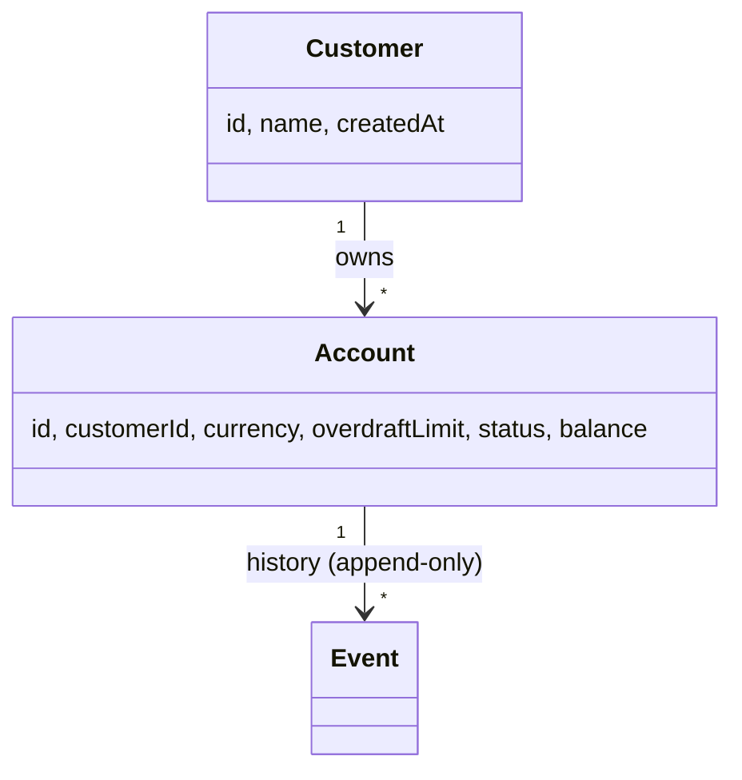

# Teya Ledger

A small Spring Boot 3 / Java 25 service implementing an
**event-sourced money ledger**: customers hold accounts, accounts
have a fixed currency and configurable overdraft limit, and balances
are derived by folding an append-only event stream stored on disk as
YAML. All write endpoints are idempotent.

For the architectural reasoning behind every choice see
[`docs/architecture.md`](docs/architecture.md);
for the build-ordered how-to see
[`docs/implementation.md`](docs/implementation.md).

## Quick-start

```bash
./gradlew test                  # run the suite (~150 tests)
./gradlew check                 # tests + Jacoco coverage gate (M8)
./gradlew bootRun               # run on :8080, data in ./data
./gradlew bootBuildImage        # build the OCI image
docker compose up               # run the image with persistent volume
open http://localhost:8080/swagger-ui.html
```

## API surface

URL nouns are deliberately **singular** (`/account`, `/customer`,
`/deposit`, `/withdrawal`, `/transaction`). All write endpoints
require an `Idempotency-Key` header.

| Method | Path | Purpose |
| --- | --- | --- |
| `POST` | `/customer` | Create a customer |
| `GET` | `/customer/{id}` | Look up a customer |
| `POST` | `/customer/{id}/account` | Open an account (zero balance) |
| `GET` | `/account/{id}` | Current balance + state |
| `POST` | `/account/{id}/deposit` | Deposit money |
| `POST` | `/account/{id}/withdrawal` | Withdraw money |
| `PATCH` | `/account/{id}/overdraft-limit` | Change overdraft |
| `DELETE` | `/account/{id}` | Close (only if balance == 0) |
| `GET` | `/account/{id}/transaction?after=&limit=` | Paginated history |

Full schema served at `/swagger-ui.html` and `/v3/api-docs`.

### Idempotency contract

Every write endpoint requires an `Idempotency-Key` header.

- **Missing/blank** → `400 IDEMPOTENCY_KEY_REQUIRED`.
- **Same key, same request body** → the original response is replayed
  byte-for-byte; no double-charge.
- **Same key, different request body** → `409
  IDEMPOTENCY_KEY_REUSED_WITH_DIFFERENT_REQUEST` (likely a client
  bug; we surface it instead of silently returning a stale response).

The keys are kept in a bounded LRU+TTL in-memory cache (defaults:
10 000 keys, 24h TTL) and intentionally do not survive a process
restart — see [Future improvements](docs/architecture.md#11-future-improvements).

### Error envelope

Every 4xx/5xx response uses the same JSON shape:

```json
{
  "code": "INSUFFICIENT_FUNDS",
  "message": "withdrawal of 5000 exceeds available balance + overdraft (3000)",
  "details": {
    "accountId": "9b1f-…",
    "requestedMinorUnits": 5000,
    "availableMinorUnits": 3000
  },
  "requestId": "f0e8c2b1-…"
}
```

The full code → status mapping lives in
[`docs/architecture.md` §8](docs/architecture.md#8-error-model).

## Domain model



State (balance, status) is **derived** by folding events; the source
of truth is the per-account event stream on disk under
`./data/streams/account-<uuid>.yaml`.

## How to add a new storage adapter

The persistence boundary is the
[`EventStore`](src/main/java/com/teya/ledger/infrastructure/port/EventStore.java)
interface (`append` + `readFrom`). The default is the YAML adapter at
[`YamlEventStore`](src/main/java/com/teya/ledger/infrastructure/yaml/YamlEventStore.java);
the simplest reference adapter is the in-memory one at
[`InMemoryEventStore`](src/main/java/com/teya/ledger/infrastructure/memory/InMemoryEventStore.java)
— ~70 lines.

To add (e.g.) a JDBC adapter:

1. Implement `EventStore` against an `events(stream_id, seq, event_id, type, payload_json, occurred_at)` table with a unique constraint on `(stream_id, seq)` for optimistic concurrency.
2. Add a `@Bean` in [`StorageConfig`](src/main/java/com/teya/ledger/infrastructure/config/StorageConfig.java) gated on `ledger.storage.type=jdbc`.
3. Mirror `YamlEventStoreTest` for adapter coverage; the suite is already structured to be re-run against any `EventStore`.

## Configuration

`src/main/resources/application.yaml` (every property is overridable
via the matching env var):

| Property | Default | Purpose |
| --- | --- | --- |
| `ledger.storage.type` | `yaml` | `yaml` \| `in-memory` — selects the adapter |
| `ledger.storage.yaml.directory` | `./data/streams` | Per-stream YAML files live here |
| `ledger.idempotency.cache-size` | `10000` | Max keys in the in-memory cache |
| `ledger.idempotency.ttl` | `PT24H` | Per-entry TTL |
| `server.port` | `8080` | |

## Future improvements

Captured in
[`docs/architecture.md §11`](docs/architecture.md#11-future-improvements):

- Authentication (header-based fake auth → JWT/OIDC)
- JDBC `EventStore` adapter
- Persistent `IdempotencyStore`
- Metrics + tracing (Micrometer + Prometheus + OTLP)
- Inter-account transfers (two-phase write across two streams)
