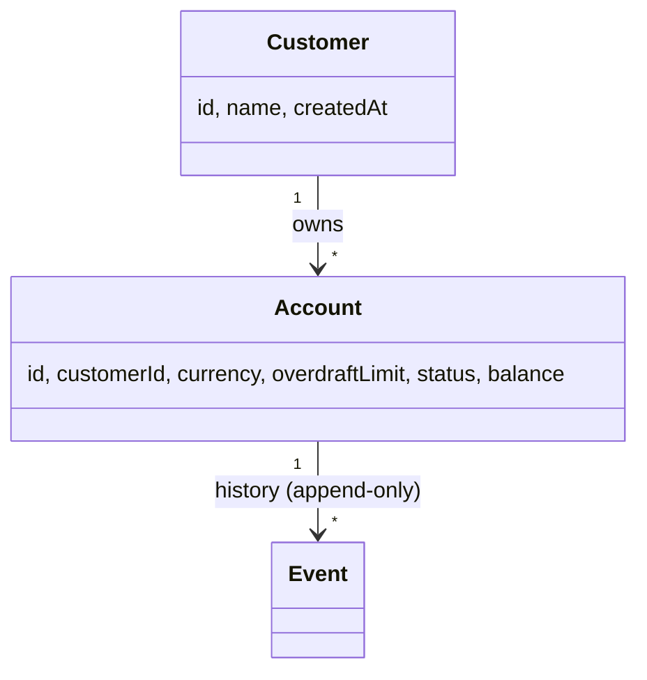

# Teya Ledger

A small Spring Boot 3 / Java 25 service implementing an
**event-sourced money ledger**: customers hold accounts, accounts
have a fixed currency and configurable overdraft limit, and balances
are derived by folding an append-only event stream. Storage is
in-memory by default with an opt-in YAML-on-disk adapter. All write
endpoints are idempotent.

For the architectural reasoning behind every choice see
[`docs/architecture.md`](docs/architecture.md);
for the build-ordered how-to see
[`docs/implementation.md`](docs/implementation.md).

## Storage

The ledger keeps event streams **in memory by default** — accounts and
balances live for the lifetime of the JVM process and reset on
restart. This keeps the local workflow zero-config: no filesystem
permissions, no leftover state between runs, no cleanup.

For persistence across restarts, opt into the YAML adapter — one env
var (or the equivalent property in `application.yaml`):

```bash
LEDGER_STORAGE_TYPE=yaml ./gradlew bootRun
# optionally override the directory (defaults to ./data/streams):
LEDGER_STORAGE_TYPE=yaml \
  LEDGER_STORAGE_YAML_DIRECTORY=./data/streams \
  ./gradlew bootRun
```

```yaml
ledger:
  storage:
    type: yaml          # default: in-memory
    yaml:
      directory: ./data/streams
```

`docker compose up` already does this — it sets
`LEDGER_STORAGE_TYPE=yaml` and bind-mounts `./data` so per-account
streams survive container restarts. On-disk format is one YAML file
per account at `<directory>/account-<uuid>.yaml`.

## Quick-start

```bash
./gradlew test                  # run the suite (~150 tests)
./gradlew check                 # tests + Jacoco coverage gate (M8)
./gradlew bootRun               # run on :8080 (in-memory storage by default)
./gradlew bootBuildImage        # build the OCI image
docker compose up               # run the image with persistent volume
open http://localhost:8080/swagger-ui.html
```

## Usage

End-to-end walk-through against a local server (`./gradlew bootRun`).
Amounts are in **minor units** (pence, cents, …); writes need an
`Idempotency-Key` header (any unique string per logical request — UUIDs
are convenient).

Set the base URL once; later steps reuse `CUSTOMER_ID` and `ACCOUNT_ID`
(paste the `id` field from the previous response into each).

```bash
BASE=http://localhost:8080
```

#### 1. Create a customer

```bash
curl -sS -X POST "$BASE/customer" \
  -H 'Content-Type: application/json' \
  -H "Idempotency-Key: $(uuidgen)" \
  -d '{"name":"Alice"}'
# → 201 {"id":"<customerId>","name":"Alice","createdAt":"…"}
```

#### 2. Open a GBP account with a £100 overdraft

```bash
CUSTOMER_ID=<paste id from step 1>
curl -sS -X POST "$BASE/customer/$CUSTOMER_ID/account" \
  -H 'Content-Type: application/json' \
  -H "Idempotency-Key: $(uuidgen)" \
  -d '{"currency":"GBP","overdraftLimitMinorUnits":10000}'
# → 201 {"id":"<accountId>","customerId":"…","currency":"GBP",
#        "overdraftLimitMinorUnits":10000,"status":"OPEN",
#        "balanceMinorUnits":0}
```

#### 3. Deposit £50.00

```bash
ACCOUNT_ID=<paste id from step 2>
curl -sS -X POST "$BASE/account/$ACCOUNT_ID/deposit" \
  -H 'Content-Type: application/json' \
  -H "Idempotency-Key: $(uuidgen)" \
  -d '{"amountMinorUnits":5000,"currency":"GBP"}'
```

#### 4. Withdraw £20.00

```bash
curl -sS -X POST "$BASE/account/$ACCOUNT_ID/withdrawal" \
  -H 'Content-Type: application/json' \
  -H "Idempotency-Key: $(uuidgen)" \
  -d '{"amountMinorUnits":2000,"currency":"GBP"}'
```

#### 5. Read current balance / state

```bash
curl -sS "$BASE/account/$ACCOUNT_ID"
# → 200 {... "balanceMinorUnits":3000 ...}
```

#### 6. Page through transactions

`after` is the cursor (last seen `seq`); `limit` is bounded to `[1, 200]`.

```bash
curl -sS "$BASE/account/$ACCOUNT_ID/transaction?after=0&limit=50"
```

#### 7. Raise the overdraft cap to £500

```bash
curl -sS -X PATCH "$BASE/account/$ACCOUNT_ID/overdraft-limit" \
  -H 'Content-Type: application/json' \
  -H "Idempotency-Key: $(uuidgen)" \
  -d '{"newLimitMinorUnits":50000}'
```

#### 8. Close the account

The balance must be zero first — `DELETE` returns `422 ACCOUNT_NOT_EMPTY` otherwise.

```bash
curl -sS -X POST "$BASE/account/$ACCOUNT_ID/withdrawal" \
  -H 'Content-Type: application/json' \
  -H "Idempotency-Key: $(uuidgen)" \
  -d '{"amountMinorUnits":3000,"currency":"GBP"}'
curl -sS -X DELETE "$BASE/account/$ACCOUNT_ID" \
  -H "Idempotency-Key: $(uuidgen)"
```

#### 9. Look up the customer at any point

```bash
curl -sS "$BASE/customer/$CUSTOMER_ID"
```

Replaying step 3 with the **same** `Idempotency-Key` returns the original
response byte-for-byte. Replaying it with the same key but a different
body returns `409 IDEMPOTENCY_KEY_REUSED_WITH_DIFFERENT_REQUEST` — see
[Idempotency contract](#idempotency-contract).

## API surface

URL nouns are deliberately **singular** (`/account`, `/customer`,
`/deposit`, `/withdrawal`, `/transaction`). All write endpoints
require an `Idempotency-Key` header.

| Method | Path | Purpose |
| --- | --- | --- |
| `POST` | `/customer` | Create a customer |
| `GET` | `/customer/{id}` | Look up a customer |
| `POST` | `/customer/{id}/account` | Open an account (zero balance) |
| `GET` | `/account/{id}` | Current balance + state |
| `POST` | `/account/{id}/deposit` | Deposit money |
| `POST` | `/account/{id}/withdrawal` | Withdraw money |
| `PATCH` | `/account/{id}/overdraft-limit` | Change overdraft |
| `DELETE` | `/account/{id}` | Close (only if balance == 0) |
| `GET` | `/account/{id}/transaction?after=&limit=` | Paginated history |

Full schema served at `/swagger-ui.html` and `/v3/api-docs` while the
app is running. A checked-in copy lives at
[`docs/openapi.yaml`](docs/openapi.yaml) and is browsable as a live
Swagger-style UI here:

> **[Browse the API (Redocly viewer) ↗](https://redocly.github.io/redoc/?url=https://raw.githubusercontent.com/rspievakc/ledger-project/main/docs/openapi.yaml)**

Re-export with `./gradlew generateOpenApiDocs` — the
[springdoc Gradle plugin](https://github.com/springdoc/springdoc-openapi-gradle-plugin)
forks `bootRun`, fetches `/v3/api-docs.yaml`, and writes the spec back
into `docs/`.

### Idempotency contract

Every write endpoint requires an `Idempotency-Key` header.

- **Missing/blank** → `400 IDEMPOTENCY_KEY_REQUIRED`.
- **Same key, same request body** → the original response is replayed
  byte-for-byte; no double-charge.
- **Same key, different request body** → `409
  IDEMPOTENCY_KEY_REUSED_WITH_DIFFERENT_REQUEST` (likely a client
  bug; we surface it instead of silently returning a stale response).

The keys are kept in a bounded LRU+TTL in-memory cache (defaults:
10 000 keys, 24h TTL) and intentionally do not survive a process
restart — see [Future improvements](docs/architecture.md#11-future-improvements).

### Error envelope

Every 4xx/5xx response uses the same JSON shape:

```json
{
  "code": "INSUFFICIENT_FUNDS",
  "message": "withdrawal of 5000 exceeds available balance + overdraft (3000)",
  "details": {
    "accountId": "9b1f-…",
    "requestedMinorUnits": 5000,
    "availableMinorUnits": 3000
  },
  "requestId": "f0e8c2b1-…"
}
```

The full code → status mapping lives in
[`docs/architecture.md` §8](docs/architecture.md#8-error-model).

## Domain model



State (balance, status) is **derived** by folding events; the source
of truth is the per-account event stream — held in memory by default,
or persisted to `<directory>/account-<uuid>.yaml` when the YAML
adapter is enabled (see [Storage](#storage)).

## How to add a new storage adapter

The persistence boundary is the
[`EventStore`](src/main/java/com/teya/ledger/infrastructure/port/EventStore.java)
interface (`append` + `readFrom`). The default adapter is the
in-memory one at
[`InMemoryEventStore`](src/main/java/com/teya/ledger/infrastructure/memory/InMemoryEventStore.java)
— ~70 lines, also the simplest reference. The on-disk adapter is
[`YamlEventStore`](src/main/java/com/teya/ledger/infrastructure/yaml/YamlEventStore.java)
(opt-in via `ledger.storage.type=yaml`).

To add (e.g.) a JDBC adapter:

1. Implement `EventStore` against an `events(stream_id, seq, event_id, type, payload_json, occurred_at)` table with a unique constraint on `(stream_id, seq)` for optimistic concurrency.
2. Add a `@Bean` in [`StorageConfig`](src/main/java/com/teya/ledger/infrastructure/config/StorageConfig.java) gated on `ledger.storage.type=jdbc`.
3. Mirror `YamlEventStoreTest` for adapter coverage; the suite is already structured to be re-run against any `EventStore`.

## Configuration

`src/main/resources/application.yaml` (every property is overridable
via the matching env var):

| Property | Default | Purpose |
| --- | --- | --- |
| `ledger.storage.type` | `in-memory` | `in-memory` \| `yaml` — selects the adapter |
| `ledger.storage.yaml.directory` | `./data/streams` | Per-stream YAML files live here (only when `type=yaml`) |
| `ledger.idempotency.cache-size` | `10000` | Max keys in the in-memory cache |
| `ledger.idempotency.ttl` | `PT24H` | Per-entry TTL |
| `server.port` | `8080` | |

## Future improvements

Captured in
[`docs/architecture.md §11`](docs/architecture.md#11-future-improvements):

- Authentication (header-based fake auth → JWT/OIDC)
- JDBC `EventStore` adapter
- Persistent `IdempotencyStore`
- Metrics + tracing (Micrometer + Prometheus + OTLP)
- Inter-account transfers (two-phase write across two streams)
