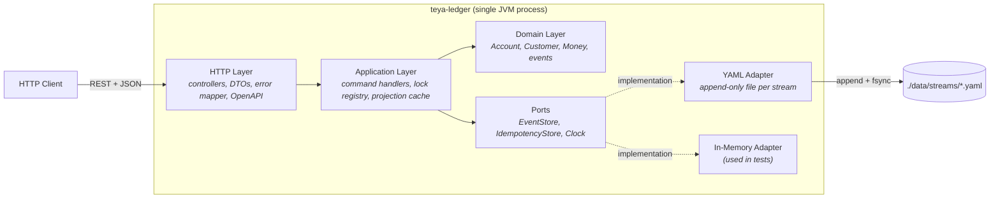
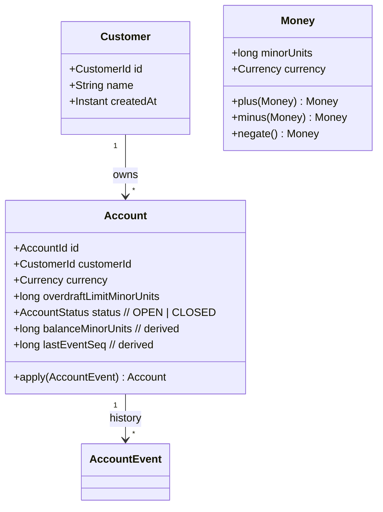
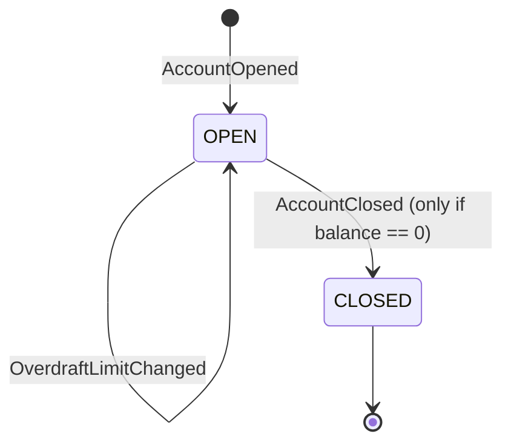
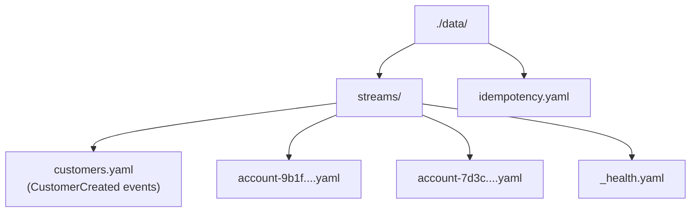
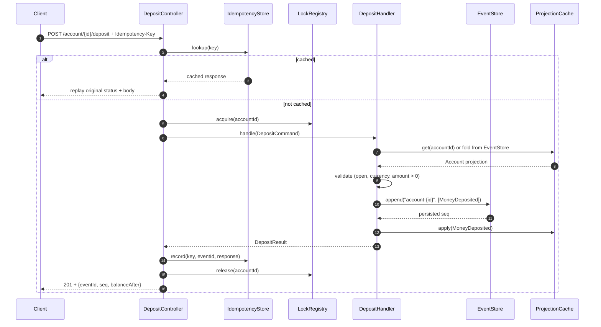

# Teya Ledger — Architecture

This document captures the architectural decisions for the Teya ledger
service: what we built, what we considered, and why we chose what we
chose. It is intended to give a reviewer (or future contributor) the
full reasoning behind each non-trivial decision, not just the conclusion.

For build / run / module layout, see [`implementation.md`](./implementation.md).
For requirements, see [`plan.md`](./plan.md).

---

## 1. High-level overview

A small Spring Boot 3 service (Java 25) that exposes an HTTP API for an
**event-sourced** money ledger. Each customer can hold multiple
accounts; each account has a fixed currency, a configurable overdraft
limit, and a transaction history derived by replaying an append-only
event stream stored on disk as YAML.

Functional scope (from `plan.md`):

- Record money movements (deposits / withdrawals)
- View current balance
- View transaction history
- OpenAPI / Swagger documentation
- Full README
- Full test suite

Non-functional positioning: this is a take-home exercise, so the brief
is optimised for **clarity, correctness, and signalling fintech-domain
awareness** (idempotency, immutable history, money safety) rather than
for production-scale infrastructure.

---

## 2. Layered (hexagonal) architecture

The service is structured as ports & adapters. Three layers; one rule
per layer. Dependencies flow inward only.



**Layer responsibilities:**

| Layer | Knows about | Does NOT know about |
| --- | --- | --- |
| HTTP (`*.api`) | Domain commands & results, DTO shapes, error codes | Storage, file I/O, locks |
| Application (`*.application`) | Domain aggregates, ports, lock primitives | HTTP, JSON, YAML |
| Domain (`*.domain`) | Itself only — pure value objects, aggregates, events | Spring, ports, framework code |
| Infrastructure (`*.infrastructure`) | One port each, plus its serialisation format | Other adapters, HTTP |

### Alternatives considered

- **Flat 3-tier CRUD (controller → service → JPA repository).**
  - *Pros:* Familiar to anyone who has touched a Spring Boot tutorial;
    less code per feature; one less abstraction to maintain.
  - *Cons:* Couples the domain to the persistence framework; makes
    swapping storage adapters painful; no natural seam for an
    event-sourced model.
- **Full CQRS with separate read store.**
  - *Pros:* Reads scale independently of writes; classic event-sourced
    posture.
  - *Cons:* Massive over-engineering for a single-process take-home;
    introduces eventual consistency and a second store to keep in
    sync; reviewers would (correctly) flag it as gold-plating.
- **Chosen: hexagonal / ports & adapters.**
  - *Pros:* Event-sourcing already gives us a clear seam at
    `EventStore`; the layout costs nothing extra and buys trivial
    swap-in of a different storage adapter (which the brief asked
    for); domain stays framework-free and trivially unit-testable.
  - *Cons:* Slightly more files than a flat layout; readers unfamiliar
    with the pattern need a moment to orient.

---

## 3. Domain model



### Account lifecycle



### Domain rules (invariants enforced in command handlers)

- A customer can hold zero or many accounts. There is **no** uniqueness
  constraint on `(customerId, currency)`; a customer may hold multiple
  accounts in the same currency.
- An account has exactly **one currency**, fixed at open time and
  immutable thereafter.
- An account is **always opened with a zero balance**. Any starting
  funds enter via `POST /account/{id}/deposit`. There is no
  "opening balance" event type.
- All deposits and withdrawals must match the account's currency. Any
  mismatch is rejected with `CURRENCY_MISMATCH` — there is no implicit
  FX, and no transfer endpoint in this scope.
- Withdrawals are rejected with `INSUFFICIENT_FUNDS` if
  `balance - amount < -overdraftLimit`.
- Writes against a `CLOSED` account are rejected with `ACCOUNT_CLOSED`.
- An account can only be closed if its balance is exactly zero;
  otherwise `ACCOUNT_NOT_EMPTY`.

### Events

Sealed interfaces, one per aggregate:

`sealed interface AccountEvent`
  - `AccountOpened(accountId, customerId, currency, initialOverdraftLimitMinorUnits, openedAt)`
  - `MoneyDeposited(accountId, amountMinorUnits, currency, occurredAt, idempotencyKey)`
  - `MoneyWithdrawn(accountId, amountMinorUnits, currency, occurredAt, idempotencyKey)`
  - `OverdraftLimitChanged(accountId, newLimitMinorUnits, changedAt)`
  - `AccountClosed(accountId, closedAt)`

`sealed interface CustomerEvent`
  - `CustomerCreated(customerId, name, createdAt)`

Each event is wrapped in a stored envelope when persisted:

```yaml
- seq: 1
  eventId: 7d3c1c3e-...
  type: MoneyDeposited
  occurredAt: 2026-05-06T10:14:23.118Z
  payload:
    accountId: 9b1f-...
    amountMinorUnits: 5000
    currency: GBP
    idempotencyKey: dep-abc-123
```

`seq` is the monotonic per-stream sequence number — also the cursor
used for pagination.

### Why event-sourced (not state-stored)

The ledger **is** an append-only log of facts; balance is just a fold
over those facts. Storing events as the source of truth gives us
auditability, immutability, replay, and a natural fit for the YAML
append-file. Storing balance directly would force us to re-derive
correctness on every withdrawal anyway, while throwing away the
historical record.

### Money model

A `Money` value object: `Money(long minorUnits, Currency currency)`.

#### Alternatives considered

- **`BigDecimal` + currency.** Human-readable but easy to misuse
  (mutable scale, equality gotchas, rounding decisions at every
  operation).
- **Plain `BigDecimal`, single hardcoded currency.** Simplest; throws
  away the chance to demonstrate sound money handling.
- **Chosen: `long minorUnits` + `java.util.Currency`.**
  - *Pros:* No floating-point or rounding ambiguity; what payment
    networks actually use internally; constructor enforces "no mixing
    currencies" at the value-object boundary; equality is trivial.
  - *Cons:* Requires conversion at the API boundary (request/response
    uses decimal strings; internal type is integer); reviewers must
    remember `5000` means £50.00, not £5000.
  - *Range:* a `long` covers ±£92 quadrillion at 2dp — comfortable.

---

## 4. Persistence: the `EventStore` port

The persistence boundary is intentionally minimal:

```java
public interface EventStore {
  // Atomically append events to the named stream. Implementations
  // serialise concurrent appends to the same stream.
  AppendResult append(String streamId, List<EventRecord> events);

  // Read events from `streamId` with sequence > `afterSeq`, up to
  // `limit` records. Implementations may return fewer.
  List<EventRecord> readFrom(String streamId, long afterSeq, int limit);

  // Enumerate every stream id starting with `prefix`. Enables
  // "all accounts for customer X" without a separate index — at the
  // cost of scanning every account stream on each call.
  List<String> listStreams(String prefix);
}
```

A `streamId` maps 1:1 to a YAML file in the default adapter:



An account's full lineage — `AccountOpened`, every deposit, every
withdrawal, overdraft changes, eventual close — lives in a single file
named `account-<accountId>.yaml`. This means "load account state" =
"open one file, fold its events."

### Append semantics

Streams are append-only files of self-delimited YAML documents
(each envelope prefixed with the YAML document separator `---`).
This is the same shape a production write-ahead log uses, scaled
down to a single file per stream.

Appending to a stream:

1. Acquire the per-stream `ReentrantLock`.
2. Read the current `lastSeq` from the in-memory index for this
   stream (initialised on first access by reading the file's last
   valid envelope).
3. Build the new envelopes with `seq = lastSeq + 1, lastSeq + 2, ...`.
4. Open the stream file in `WRITE | CREATE | APPEND` mode.
5. Serialise the new envelopes (with leading `---\n` separators) and
   write them in a single `FileChannel.write`.
6. `force(true)` to fsync the write to disk before reporting success.
7. Update the in-memory `lastSeq` index.
8. Release the lock.

### Crash recovery

Because the underlying append + fsync is not transactional across
multiple envelopes, the tail of a stream file can in principle
contain a partially-written final envelope (a "torn write") if the
process is killed mid-fsync. On startup the YAML adapter validates
each stream by parsing it sequentially; if the last document fails
to parse, it is truncated and `lastSeq` is set to the last valid
envelope's `seq`. No event already reported as successful to a
caller can be lost — the fsync precedes the response.

This is overkill for a take-home but it's the same pattern a
production WAL would use; calling it out explicitly is part of the
fintech signalling.

### Reads

`readFrom(streamId, afterSeq, limit)` opens the file with a shared
file lock (advisory; coordinates with the exclusive-lock append above
so a reader never sees a torn write), parses YAML documents lazily,
skips until `seq > afterSeq`, and returns up to `limit` records.

### Alternatives considered for the storage shape

- **`LedgerSnapshotStore` — `load() / save(state)`.**
  - *Pros:* Trivially simple; one file holds everything.
  - *Cons:* Every adapter rewrites the world on each change; no notion
    of history independent of state; doesn't model what a ledger *is*.
- **`LedgerRepository` — CRUD-style (`findAccount`, `saveAccount`,
  `appendTransaction`, `listTransactions`).**
  - *Pros:* Familiar Spring shape; works with JPA out of the box.
  - *Cons:* Forces the adapter to understand domain types; less
    expressive (you can always derive a snapshot from events, not
    vice versa); doesn't lean into event-sourcing.
- **Chosen: `EventStore` — `append / readFrom`.**
  - *Pros:* Adapters need only understand opaque `EventRecord`s, not
    domain types; ledger-native; the cursor *is* the sequence number
    you already have, so pagination falls out for free; YAML, JDBC,
    Kafka, in-memory are all reasonable adapters under the same port.
  - *Cons:* Domain code has to know how to fold its own events
    (worth it — that's exactly where domain logic belongs).

### Alternatives considered for the storage layout

- **One YAML file for everything.** Simple but every append rewrites
  or seeks past the entire history; loading account 5's state forces
  reading every other account too.
- **One file per event.** Atomic appends become trivial (write a new
  file) but you'd end up with millions of tiny files and slow
  directory listing.
- **Chosen: one file per stream.** Loading account state opens one
  file; appends are O(events being appended), not O(history); files
  remain human-readable for inspection and debugging.

---

## 5. Concurrency

The HTTP server is multi-threaded, but the per-account event log must
be linearisable — otherwise two concurrent withdrawals can each see
"sufficient funds" and both succeed, overdrawing the account.

**Chosen: per-account `ReentrantLock`** held inside the application
layer's `LockRegistry`. The command handler acquires the lock for the
target `accountId`, validates against the freshly-loaded projection,
appends the event, updates the cache, and releases. Different accounts
run in parallel; the same account serialises.



The withdrawal flow is structurally identical; only the validation
step differs (it additionally checks the overdraft constraint and
emits `INSUFFICIENT_FUNDS` on breach).

### Alternatives considered

- **Optimistic concurrency with `expectedVersion`.**
  - *Pros:* Textbook event-sourcing; no locks held across I/O; works
    naturally across multiple writers and processes.
  - *Cons:* Forces retry handling at the API boundary; not observably
    better than locks for a single-JVM process; more code to get
    right.
- **Single global writer thread (command queue).**
  - *Pros:* Trivially correct; no locks at all.
  - *Cons:* Kills parallelism across unrelated accounts; one slow
    storage op blocks every other write.
- **Chosen: per-account `ReentrantLock`.**
  - *Pros:* Right amount of rigour for a single-process take-home;
    safety property is obvious (one lock, one account, no race);
    parallelism preserved across accounts.
  - *Cons:* Locks held across the storage append; would be the wrong
    choice if scaled out to multiple JVMs (in which case we'd switch
    to optimistic concurrency on the storage side).

The lock registry uses a `ConcurrentHashMap<AccountId, ReentrantLock>`
with `computeIfAbsent`; entries are kept for the lifetime of the
process (bounded by the number of accounts ever touched, which for
this service is small).

---

## 6. Idempotency

**Every** write endpoint (`POST /account/{id}/deposit`,
`POST /account/{id}/withdrawal`, `POST /customer`,
`POST /customer/{id}/account`, `PATCH /account/{id}/overdraft-limit`,
`DELETE /account/{id}`) **requires** an `Idempotency-Key` header.
Missing or blank key → `400 IDEMPOTENCY_KEY_REQUIRED`.

The `IdempotencyStore` keeps a bounded in-memory map:

```
key → { eventId, requestHash, responseStatus, responseBody, recordedAt }
```

On lookup:

- **Hit, same `requestHash`** → replay original status + body verbatim.
- **Hit, different `requestHash`** → `409 IDEMPOTENCY_KEY_REUSED_WITH_DIFFERENT_REQUEST`
  (this almost always indicates a client bug and we surface it
  rather than silently returning a stale response — this matches
  Stripe's behaviour).
- **Miss** → execute the command, then record the result keyed by
  `Idempotency-Key`.

`requestHash` is the SHA-256 of the canonical JSON body + the URL path.

### Eviction

`IdempotencyStore` has a configurable `cache-size` (default `10000`)
and `ttl` (default `24h`). Eviction is LRU + TTL; both are bounded so
the store cannot grow unbounded.

The store is itself a port, so a future adapter could persist
idempotency records to YAML or a database. For now it lives only in
memory: a process restart loses idempotency state, which on a
take-home with no traffic is acceptable and is documented.

### Alternatives considered

- **No idempotency.**
  - *Pros:* Simpler; less code.
  - *Cons:* Network retries can double-charge; significant miss for a
    payments-domain reviewer.
- **Server-generated transaction IDs returned to client; client
  deduplicates on read.**
  - *Pros:* Server stays stateless.
  - *Cons:* Pushes the problem to every client; not standard.
- **Chosen: required `Idempotency-Key` header with replay cache.**
  - *Pros:* Real fintech behaviour; small implementation cost; the
    replay-vs-409 split surfaces real client bugs.
  - *Cons:* Clients that forget the header see a 400 — but that is
    the correct teaching signal.

---

## 7. HTTP API

### URL convention: singular nouns

Resource segments are **singular**, not plural. So:

- `POST /customer`, **not** `/customers`
- `POST /customer/{id}/account`, **not** `/customers/{id}/accounts`
- `POST /account/{id}/deposit`, **not** `/accounts/{id}/deposits`

This is a **deliberate departure** from the conventional
plural-collection REST style. Pros: reads naturally as English
("create one account"); fewer string variations to remember; no
inconsistency between the resource name in routes and in code (where
classes are singular). Cons: contradicts most REST guidelines and
many API style guides; reviewers familiar with the convention may
flinch. Reviewers should treat this as an explicit project-level
choice, not an oversight.

### Endpoints

| Method | Path | Purpose |
| --- | --- | --- |
| `POST` | `/customer` | Create a customer. Body: `{name}`. Returns: `{customerId, name, createdAt}`. |
| `GET` | `/customer` | List all customers, oldest first. Unpaginated — folds the shared `customers` stream end-to-end (acceptable at current scale; same scaling caveat as `GET /customer/{customerId}`). |
| `GET` | `/customer/{customerId}` | Fetch a customer. |
| `POST` | `/customer/{customerId}/account` | Open an account. Body: `{currency, overdraftLimitMinorUnits}`. Returns: `{accountId, customerId, currency, overdraftLimitMinorUnits, status, balanceMinorUnits}`. Always opens with `balanceMinorUnits = 0`. |
| `GET` | `/customer/{customerId}/account` | List every account for the customer (closed ones included, distinguished via `status`). Returns `404 CUSTOMER_NOT_FOUND` for an unknown customer. Implemented by enumerating `account-*` streams via `EventStore.listStreams` and filtering on `customerId` — O(total accounts); a dedicated `customer-accounts` index is captured in §11. |
| `GET` | `/account/{accountId}` | Current state: id, customer, currency, overdraft limit, status, balance, last event seq. |
| `POST` | `/account/{accountId}/deposit` | Deposit money. Body: `{amountMinorUnits, currency}`. Returns: `{eventId, seq, balanceAfterMinorUnits}`. |
| `POST` | `/account/{accountId}/withdrawal` | Withdraw money. Body and response same shape as deposit. |
| `PATCH` | `/account/{accountId}/overdraft-limit` | Change overdraft. Body: `{newLimitMinorUnits}`. Emits `OverdraftLimitChanged`. |
| `DELETE` | `/account/{accountId}` | Close the account. Refuses with `ACCOUNT_NOT_EMPTY` unless balance is exactly zero. |
| `GET` | `/account/{accountId}/transaction?after=<seq>&limit=50` | Paginated history; cursor-based on event sequence. Default `limit=50`, max `200`. Response: `{items: [...], nextCursor: <seq or null>}`. |

All write endpoints require `Idempotency-Key`. All endpoints
documented in OpenAPI via `springdoc-openapi-starter-webmvc-ui`,
served at `/swagger-ui.html` and `/v3/api-docs`.

### Pagination

Cursor-based on the per-stream event sequence number.

#### Alternatives considered

- **Offset / limit.** Familiar but unstable under appends (offsets
  shift as events are added) and forces materialising the whole list
  to skip.
- **None — return everything.** Fine for a demo with three
  transactions; bad for an account with thousands.
- **Chosen: cursor = event seq.** The cursor is data we already have
  (seq is the natural sort key); appends never invalidate older
  cursors; pagination round-trips cleanly under concurrent writes.

---

## 8. Error model

A single `@RestControllerAdvice` maps domain exceptions to HTTP
responses with a stable, typed shape:

```json
{
  "code": "INSUFFICIENT_FUNDS",
  "message": "Withdrawal of 5000 GBP exceeds available balance + overdraft (3000 GBP)",
  "details": {
    "accountId": "9b1f...",
    "requestedMinorUnits": 5000,
    "availableMinorUnits": 3000
  },
  "requestId": "f0e8c2b1-..."
}
```

| Code | HTTP | Trigger |
| --- | --- | --- |
| `IDEMPOTENCY_KEY_REQUIRED` | 400 | Header missing/blank on a write |
| `INVALID_REQUEST` | 400 | Bean-validation failure on body shape |
| `INVALID_AMOUNT` | 422 | `amount <= 0` |
| `CURRENCY_MISMATCH` | 422 | Request currency ≠ account currency |
| `INSUFFICIENT_FUNDS` | 422 | Withdrawal would breach `-overdraftLimit` |
| `ACCOUNT_CLOSED` | 422 | Write against a CLOSED account |
| `ACCOUNT_NOT_EMPTY` | 422 | `DELETE /account/{id}` while balance ≠ 0 |
| `CUSTOMER_NOT_FOUND` | 404 | Unknown `customerId` |
| `ACCOUNT_NOT_FOUND` | 404 | Unknown `accountId` |
| `IDEMPOTENCY_KEY_REUSED_WITH_DIFFERENT_REQUEST` | 409 | Same key, different request body |
| `INTERNAL_ERROR` | 500 | Anything uncaught (logged with stack trace + correlation id) |

`INVALID_REQUEST` responses include a `details.violations: [{field, message}]`
array generated from Jakarta Bean Validation.

---

## 9. Cross-cutting concerns

### Logging

SLF4J + Logback. Each request gets a UUID correlation id stored in
MDC under `requestId` and echoed into 4xx/5xx response bodies. By
default no PII (no customer names, no monetary amounts) is logged —
only identifiers, error codes, and durations. A debug-level toggle
opts into payload logging for local development.

### Health

`actuator/health` is exposed. Readiness includes a writable-data-
directory check (the YAML adapter appends a no-op heartbeat to
`data/streams/_health.yaml` and confirms the file is readable).

#### Alternative considered

A pure in-memory readiness check avoids a disk write per probe but
gives a false green if the data volume is mounted read-only or full.
The heartbeat write costs a few bytes and exercises the actual code
path. Worth the trade.

### Configuration

All knobs live in `application.yaml` and are overridable by env var
(see [`implementation.md`](./implementation.md) §5).

---

## 10. Testing posture

Three layers, each pulling its weight (full plan in
[`implementation.md`](./implementation.md) §6):

1. **Unit tests** — pure JUnit 5, no Spring. The bulk of the suite.
   Cover `Money`, `Account.foldFrom`, every command handler with a
   `FakeEventStore`, the `IdempotencyStore` replay rules, and the
   `LockRegistry` parallelism guarantees.
2. **Adapter tests** — `@TempDir`-backed YAML store tests covering
   round-trip, atomic-rename recovery, concurrent appends to
   independent streams, and the `readFrom` boundary semantics.
3. **Integration tests** — `@SpringBootTest` + `MockMvc` walking
   real HTTP scenarios end-to-end with the YAML store on a temp dir.

#### Tested vs. untested (deliberately)

- **Untested by design:** load / perf, mutation testing (PIT),
  contract tests against the OpenAPI doc. Each is documented as out
  of scope for this brief.
- **Coverage gate:** Jacoco enforces ≥ 95% line coverage on
  `*.domain` + `*.application`; no enforced threshold on
  `*.infrastructure` or `*.api` (those are exercised end-to-end by
  integration tests, where a coverage gate has limited value).

---

## 11. Future improvements

Captured here because they were deliberately scoped out, not because
they were forgotten.

### Authentication & authorisation

The current API is open. Two realistic upgrade paths:

1. **Header-based fake auth** (good as an interview-level intermediate
   step). An `X-Customer-Id` header identifies the calling customer;
   a `CustomerScopedFilter` rejects requests targeting accounts the
   header's customer does not own (`403 NOT_YOUR_ACCOUNT`). No real
   identity verification — but the authorisation logic is real and
   testable.
2. **Spring Security + JWT/OIDC** (production-grade). Resource server
   configuration accepts bearer tokens; a `Principal` is mapped to a
   `CustomerId` claim; the same `CustomerScopedFilter` reads from
   `SecurityContext` instead of a header. Roles/scopes can later
   gate admin-only endpoints (e.g., `PATCH overdraft-limit`).

In both cases the domain stays untouched — authorisation lives at the
HTTP boundary.

### Persistence

- A **JDBC `EventStore` adapter** writing to a single `events` table
  (`stream_id, seq, event_id, type, payload_json, occurred_at`) with
  a unique constraint on `(stream_id, seq)` to provide optimistic
  concurrency. Drop-in replacement for the YAML adapter; same port.
- A **persistent `IdempotencyStore`** so idempotency survives
  process restarts.
- A **`customer-accounts` index stream** so `GET /customer/{id}/account`
  scales with the number of *that customer's* accounts rather than
  with the total account count. Today the listing enumerates every
  `account-*` stream and filters; fine at demo scale, wasteful past a
  few thousand accounts.

### Operational

- Metrics via Micrometer + Prometheus (`http.server.requests`,
  `ledger.command.duration`, `ledger.event.appended`).
- Distributed tracing via Micrometer Tracing + OTLP.
- Structured (JSON) logging when running in a container.

### Domain

- Inter-account transfers (would introduce a two-phase write
  spanning two streams; deserves its own design pass).
- Multi-currency accounts via a separate `WalletAccount` aggregate
  that holds balances per currency with explicit FX events.

---

## 12. Quick decision log

For reviewers who want the punchline without reading the full
sections:

| Decision | Chose | Over |
| --- | --- | --- |
| Architecture | Hexagonal / ports & adapters | Flat 3-tier; full CQRS |
| Persistence | YAML append-file per stream (default adapter) | Single snapshot file; one file per event; JDBC |
| Storage port shape | `EventStore.append / readFrom` | `LedgerSnapshotStore`; CRUD `LedgerRepository` |
| Money | `long minorUnits` + `Currency` | `BigDecimal`; single hardcoded currency |
| Concurrency | Per-account `ReentrantLock` | Optimistic with `expectedVersion`; single global writer |
| Idempotency | Required `Idempotency-Key` header + replay cache | None; client-side dedup |
| Auth | None (documented upgrade paths) | Header-based fake auth; Spring Security + JWT |
| URL nouns | Singular (`/account`) | Plural (`/accounts`) |
| Pagination | Cursor on event seq | Offset/limit; none |
| Container | `bootBuildImage` (Cloud Native Buildpacks) | Hand-written multi-stage Dockerfile |
