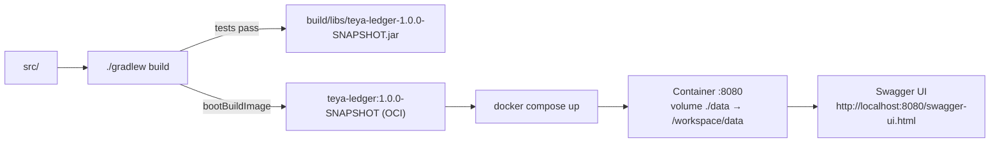
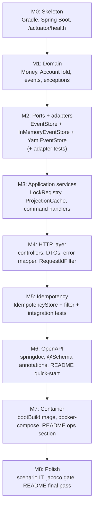

# Teya Ledger — Implementation

This document is the buildable how-to: module layout, dependencies,
build/run commands, container packaging, the test suite layout, and
the order in which the project is built.

For the *why* behind each architectural choice, see
[`architecture.md`](./architecture.md).

---

## 1. Tech stack

| Concern | Choice |
| --- | --- |
| Language | Java 25 |
| Framework | Spring Boot 3.x (3.4+) |
| Build tool | Gradle (Kotlin DSL) |
| Test framework | JUnit 5 (Jupiter) |
| Assertion library | AssertJ |
| HTTP integration tests | `@SpringBootTest` + `MockMvc` |
| OpenAPI / Swagger | `springdoc-openapi-starter-webmvc-ui` |
| YAML serialisation | SnakeYAML (already a Spring transitive) |
| Container image | Spring Boot's `bootBuildImage` (Paketo Buildpacks) |
| Logging | SLF4J + Logback (Spring default) |
| Coverage | Jacoco (Gradle plugin) |

No JPA, no database driver, no Spring Security, no message broker.
Adding any of those is a future-improvement upgrade path documented
in [`architecture.md`](./architecture.md#11-future-improvements).

### Alternative considered: Maven

- *Pros:* More common in enterprise Java; lowest-friction for
  reviewers who haven't used Kotlin DSL.
- *Cons:* The repo already ships a `build.gradle.kts`; switching
  costs lines for no benefit; Gradle's `bootBuildImage` task is the
  cleanest path to a container image.
- **Chosen:** Gradle (Kotlin DSL) — keep the existing toolchain.

---

## 2. Module / package layout

A single Gradle module (no multi-module setup — over-engineering at
this size). Packages reflect the hexagonal layers.

```
teya-ledger-project/
├── build.gradle.kts
├── settings.gradle.kts
├── docker-compose.yml
├── data/                           ← runtime state (volume-mounted)
│   └── streams/
│       ├── customers.yaml
│       └── account-<uuid>.yaml
├── docs/
│   ├── architecture.md
│   ├── implementation.md
│   └── plan.md
├── README.md
└── src/
    ├── main/
    │   ├── java/com/teya/ledger/
    │   │   ├── LedgerApplication.java          ← @SpringBootApplication
    │   │   │
    │   │   ├── api/                            ← HTTP layer
    │   │   │   ├── CustomerController.java
    │   │   │   ├── AccountController.java
    │   │   │   ├── DepositController.java
    │   │   │   ├── WithdrawalController.java
    │   │   │   ├── TransactionController.java
    │   │   │   ├── dto/                        ← request + response records
    │   │   │   ├── error/
    │   │   │   │   ├── GlobalExceptionHandler.java
    │   │   │   │   ├── ErrorCode.java
    │   │   │   │   └── ErrorResponse.java
    │   │   │   └── filter/
    │   │   │       └── RequestIdFilter.java    ← MDC correlation id
    │   │   │
    │   │   ├── application/                    ← command handlers + lock + cache
    │   │   │   ├── CustomerService.java
    │   │   │   ├── AccountService.java
    │   │   │   ├── DepositService.java
    │   │   │   ├── WithdrawalService.java
    │   │   │   ├── TransactionQueryService.java
    │   │   │   ├── LockRegistry.java
    │   │   │   └── ProjectionCache.java
    │   │   │
    │   │   ├── domain/                         ← pure model
    │   │   │   ├── Money.java
    │   │   │   ├── customer/
    │   │   │   │   ├── Customer.java
    │   │   │   │   ├── CustomerId.java
    │   │   │   │   └── CustomerEvent.java       ← sealed
    │   │   │   ├── account/
    │   │   │   │   ├── Account.java
    │   │   │   │   ├── AccountId.java
    │   │   │   │   ├── AccountStatus.java
    │   │   │   │   └── AccountEvent.java        ← sealed
    │   │   │   └── error/                       ← typed domain exceptions
    │   │   │       ├── InsufficientFundsException.java
    │   │   │       ├── CurrencyMismatchException.java
    │   │   │       ├── AccountClosedException.java
    │   │   │       ├── AccountNotEmptyException.java
    │   │   │       ├── AccountNotFoundException.java
    │   │   │       └── CustomerNotFoundException.java
    │   │   │
    │   │   └── infrastructure/                 ← port impls
    │   │       ├── port/
    │   │       │   ├── EventStore.java
    │   │       │   ├── EventRecord.java
    │   │       │   ├── AppendResult.java
    │   │       │   └── IdempotencyStore.java
    │   │       ├── yaml/
    │   │       │   ├── YamlEventStore.java
    │   │       │   ├── YamlEventCodec.java
    │   │       │   └── StreamFileLayout.java
    │   │       ├── memory/
    │   │       │   └── InMemoryEventStore.java
    │   │       ├── idempotency/
    │   │       │   └── InMemoryIdempotencyStore.java
    │   │       └── config/
    │   │           ├── StorageConfig.java       ← @ConditionalOnProperty wiring
    │   │           └── ClockConfig.java
    │   └── resources/
    │       ├── application.yaml
    │       └── logback-spring.xml
    │
    └── test/
        └── java/com/teya/ledger/
            ├── domain/                          ← unit tests, no Spring
            │   ├── MoneyTest.java
            │   ├── account/AccountFoldTest.java
            │   └── ...
            ├── application/                     ← unit tests with fakes
            │   ├── DepositServiceTest.java
            │   ├── WithdrawalServiceTest.java
            │   ├── LockRegistryConcurrencyTest.java
            │   └── ...
            ├── infrastructure/
            │   ├── yaml/YamlEventStoreTest.java
            │   ├── yaml/YamlEventStoreConcurrencyTest.java
            │   └── memory/InMemoryEventStoreTest.java
            ├── api/                             ← @SpringBootTest + MockMvc
            │   ├── CustomerEndpointIT.java
            │   ├── AccountEndpointIT.java
            │   ├── DepositEndpointIT.java
            │   ├── WithdrawalEndpointIT.java
            │   ├── TransactionEndpointIT.java
            │   └── IdempotencyIT.java
            ├── scenario/                        ← end-to-end happy/sad walks
            │   └── EndToEndScenarioIT.java
            └── support/
                ├── FakeClock.java
                └── TestEventRecordBuilder.java
```

The package boundary is enforced socially (and visible in code
review); we don't enforce it with ArchUnit at this scope, though
that would be an obvious next addition.

---

## 3. Build & run flow



### Common commands

```bash
./gradlew test                  # unit + integration tests
./gradlew check                 # tests + jacoco coverage gate
./gradlew bootRun               # run on :8080, data in ./data
./gradlew bootJar               # produce the runnable jar
./gradlew bootBuildImage        # produce the OCI image
docker compose up               # run image with persistent volume
```

### Java 25 toolchain

Pinned in `build.gradle.kts` so contributors don't need a system JDK 25:

```kotlin
java {
  toolchain {
    languageVersion.set(JavaLanguageVersion.of(25))
  }
}
```

Gradle resolves the toolchain automatically (downloads if missing,
via the Foojay resolver plugin if needed).

---

## 4. Container image

### Choice: `bootBuildImage` (Cloud Native Buildpacks)

`./gradlew bootBuildImage` produces an OCI image
`teya-ledger:1.0.0-SNAPSHOT` using the Paketo `builder-jammy-tiny`
base. Result: ≈70 MB image, non-root user, layered jar so an
app-only change pushes only the changed layer.

Configuration in `build.gradle.kts`:

```kotlin
tasks.named<BootBuildImage>("bootBuildImage") {
  imageName.set("teya-ledger:${project.version}")
  builder.set("paketobuildpacks/builder-jammy-tiny")
  environment.set(mapOf(
    "BP_JVM_VERSION" to "25"
  ))
}
```

### Alternative considered: hand-written multi-stage Dockerfile

Using `eclipse-temurin:25-jre-alpine` as the base.

- *Pros:* Full control over the base image (e.g., for CVE patching);
  no buildpack abstraction to debug.
- *Cons:* More lines to maintain; easier to get wrong (root user,
  no layered jar, bloated build context); requires duplicating logic
  (JVM args, healthcheck) that buildpacks already handle.
- **Not chosen** for this project; `bootBuildImage` gives a
  production-grade image with one Gradle task. A `Dockerfile` could
  be added later without touching anything else.

### docker-compose.yml

```yaml
services:
  ledger:
    image: teya-ledger:1.0.0-SNAPSHOT
    ports:
      - "8080:8080"
    volumes:
      - ./data:/workspace/data
    environment:
      LEDGER_STORAGE_TYPE: yaml
      LEDGER_STORAGE_YAML_DIRECTORY: /workspace/data/streams
      LEDGER_IDEMPOTENCY_CACHE_SIZE: 10000
      LEDGER_IDEMPOTENCY_TTL: 24h
```

The `./data` host directory is mounted into the container so the
YAML event streams survive container restarts.

---

## 5. Configuration

`src/main/resources/application.yaml`:

| Property | Default | Purpose |
| --- | --- | --- |
| `ledger.storage.type` | `in-memory` | `in-memory` \| `yaml` — picks the `EventStore` adapter via `@ConditionalOnProperty` |
| `ledger.storage.yaml.directory` | `./data/streams` | Where stream files live (only when `type=yaml`) |
| `ledger.idempotency.cache-size` | `10000` | Max keys in memory; LRU eviction |
| `ledger.idempotency.ttl` | `24h` | Keys expire after this window |
| `server.port` | `8080` | |
| `springdoc.swagger-ui.path` | `/swagger-ui.html` | |
| `management.endpoints.web.exposure.include` | `health,info` | Actuator surface |

Every property is overridable by the standard Spring
`SCREAMING_SNAKE_CASE` env var equivalent (e.g.
`LEDGER_STORAGE_YAML_DIRECTORY`).

A `@ConfigurationProperties("ledger")` record (`LedgerProperties`)
binds these into a typed object consumed by `StorageConfig`.

---

## 6. Test suite organisation

Total test count target: ~80 tests across the three layers. None of
them require Docker, an external database, or network access.

### 6.1 Unit tests (`src/test/java/.../domain` and `.../application`)

Pure JUnit 5 + AssertJ. No Spring context. Use `Clock.fixed(...)`
and `FakeEventStore` (in-memory `Map<String, List<EventRecord>>`).

Key test classes and what they cover:

| Test class | Covers |
| --- | --- |
| `MoneyTest` | Construction, equality including currency, `plus`/`minus`/`negate`, currency-mismatch throws, `Long.MAX_VALUE` boundary |
| `AccountFoldTest` | Every event type folds correctly; out-of-order seq throws; double-apply of the same event throws |
| `CustomerServiceTest` | Create customer, lookup, not-found |
| `AccountServiceTest` | Open account (always zero balance), close (balance==0 only, else `ACCOUNT_NOT_EMPTY`), `OverdraftLimitChanged` |
| `DepositServiceTest` | Happy path; account-not-found; account-closed; currency-mismatch; invalid-amount |
| `WithdrawalServiceTest` | Happy path; within overdraft; breaches overdraft → `INSUFFICIENT_FUNDS`; closed account; currency mismatch |
| `IdempotencyStoreTest` | Hit same body → replay; hit different body → `409`; eviction by LRU and TTL |
| `LockRegistryConcurrencyTest` | Concurrent deposits on different accounts run in parallel (verified via `CountDownLatch`); concurrent deposits on same account serialise |

### 6.2 Adapter tests (`src/test/java/.../infrastructure/yaml`)

`@TempDir` JUnit extension provides a fresh data directory per test.

| Test class | Covers |
| --- | --- |
| `YamlEventStoreTest` | Append + readback round-trip preserves all fields; reading a non-existent stream returns empty; `readFrom` honours `afterSeq` and `limit`; cursor `limit + 1` semantics |
| `YamlEventStoreCrashRecoveryTest` | Orphan `*.tmp.*` files are ignored on restart; partial writes don't corrupt the stream |
| `YamlEventStoreConcurrencyTest` | 8 threads × 8 distinct streams complete with no lost events; concurrent appends to the same stream serialise |
| `InMemoryEventStoreTest` | Same suite as `YamlEventStoreTest` but against the in-memory adapter; ensures the two adapters are interchangeable |

### 6.3 Integration tests (`src/test/java/.../api` and `.../scenario`)

`@SpringBootTest(webEnvironment = RANDOM_PORT)` + `MockMvc` +
`@TempDir` for the data directory, with
`spring.config.additional-location` pointing at a test
`application.yaml` that sets `ledger.storage.yaml.directory` to the
temp dir.

| Test class | Covers |
| --- | --- |
| `CustomerEndpointIT` | `POST /customer`, `GET /customer/{id}`, validation errors |
| `AccountEndpointIT` | `POST /customer/{id}/account` opens at zero balance; `GET /account/{id}`; `DELETE /account/{id}` requires balance==0; `PATCH /account/{id}/overdraft-limit` |
| `DepositEndpointIT` | Happy path + every domain failure mapped to its HTTP code |
| `WithdrawalEndpointIT` | Happy path + overdraft + insufficient funds |
| `TransactionEndpointIT` | Cursor pagination across multiple pages; `nextCursor` correctness |
| `IdempotencyIT` | Missing key → 400; replay returns identical response; reused-with-different-body → 409 |
| `EndToEndScenarioIT` | Open customer → open two GBP accounts → deposits on each → reject cross-currency withdrawal → list paginated history → reject close on non-zero balance → withdraw to zero → close succeeds |

### 6.4 Coverage gate

Jacoco enforces ≥ 95% line coverage on `com.teya.ledger.domain` and
`com.teya.ledger.application`. No enforced threshold on `api` or
`infrastructure` packages — those are exercised end-to-end by
integration tests, where a coverage gate has limited value.

### 6.5 What's deliberately not tested

- Load / performance — out of scope for a take-home.
- Mutation testing (PIT) — would be nice; the strict per-rule unit
  tests cover both branches of each domain rule.
- OpenAPI contract tests — the doc is generated from the controllers
  by springdoc, so it can't drift.

---

## 7. Implementation order (milestones)

The order is chosen so each milestone leaves the build green and the
project demoable. Each milestone is small enough to land in a single
commit.



### M0 — Skeleton

- Update `build.gradle.kts`: Spring Boot plugin, dependency
  management, Java 25 toolchain, springdoc, jacoco, the dependencies
  listed in §1.
- Replace `org.example.Main` with
  `com.teya.ledger.LedgerApplication`.
- Move package root to `com.teya.ledger`.
- Add `application.yaml`.
- Smoke test: `./gradlew bootRun`, hit `/actuator/health` returns `UP`.

### M1 — Domain

- `Money` value object with full arithmetic + tests (the full
  `MoneyTest` suite must pass before moving on).
- `CustomerId`, `AccountId` newtypes.
- `Customer`, `Account` aggregates with `apply(event)` folds.
- Sealed `CustomerEvent`, `AccountEvent` hierarchies.
- Typed domain exceptions in `domain.error`.

### M2 — Ports + adapters

- `EventStore`, `IdempotencyStore`, `EventRecord`, `AppendResult`
  interfaces under `infrastructure.port`.
- `InMemoryEventStore` adapter — the simplest correct implementation,
  used in unit tests.
- `YamlEventStore` adapter with the atomic-rename append, lock-per-
  stream, and recovery semantics from
  [`architecture.md`](./architecture.md#5-persistence-the-eventstore-port).
- The full adapter test suite (§6.2) must be green before M3.

### M3 — Application services

- `LockRegistry` (per-account `ReentrantLock`).
- `ProjectionCache` (in-memory, invalidated on append).
- `CustomerService`, `AccountService`, `DepositService`,
  `WithdrawalService`, `TransactionQueryService`.
- Unit tests against `FakeEventStore` for every service.

### M4 — HTTP layer

- Controllers for each resource (singular nouns!).
- Request/response DTOs as records, with Jakarta Bean Validation.
- `GlobalExceptionHandler` mapping each domain exception to the
  HTTP code from
  [`architecture.md`](./architecture.md#8-error-model).
- `RequestIdFilter` populating MDC.
- Endpoint integration tests (§6.3).

### M5 — Idempotency

- `InMemoryIdempotencyStore` with LRU + TTL eviction.
- An interceptor or shared base in the controllers that handles
  lookup + record around every write endpoint.
- `IdempotencyIT` covering missing key, replay, and 409 on body
  mismatch.

### M6 — OpenAPI

- Add springdoc dependency.
- `@Tag`, `@Operation`, `@Schema`, `@ApiResponses` on every
  controller and DTO.
- Gradle task to dump `build/openapi.yaml` (handy for diffing in CI
  later).
- README quick-start section.

### M7 — Container

- `bootBuildImage` configured in `build.gradle.kts`.
- `docker-compose.yml` as in §4.
- README "Run with Docker" section.

### M8 — Polish

- `EndToEndScenarioIT`.
- Jacoco coverage gate enabled.
- Final README pass: API table, link to Swagger UI, link to
  `architecture.md`, link to `implementation.md`, "How to add a
  storage adapter" mini-guide.

---

## 8. Dependency cheat-sheet

`build.gradle.kts` (excerpt — illustrative, exact versions to be
chosen at implementation time within the Spring Boot BOM):

```kotlin
plugins {
  java
  id("org.springframework.boot") version "3.4.0"
  id("io.spring.dependency-management") version "1.1.6"
  jacoco
}

java {
  toolchain { languageVersion.set(JavaLanguageVersion.of(25)) }
}

dependencies {
  implementation("org.springframework.boot:spring-boot-starter-web")
  implementation("org.springframework.boot:spring-boot-starter-actuator")
  implementation("org.springframework.boot:spring-boot-starter-validation")
  implementation("org.springdoc:springdoc-openapi-starter-webmvc-ui:2.6.0")
  // SnakeYAML comes transitively via spring-boot-starter

  testImplementation("org.springframework.boot:spring-boot-starter-test")
  testImplementation("org.assertj:assertj-core")
  // JUnit 5 ships inside spring-boot-starter-test
}

tasks.test {
  useJUnitPlatform()
  finalizedBy(tasks.jacocoTestReport)
}

jacoco {
  toolVersion = "0.8.12"
}

tasks.jacocoTestCoverageVerification {
  violationRules {
    rule {
      element = "PACKAGE"
      includes = listOf(
        "com.teya.ledger.domain",
        "com.teya.ledger.application"
      )
      limit { minimum = "0.95".toBigDecimal() }
    }
  }
}

tasks.check { dependsOn(tasks.jacocoTestCoverageVerification) }
```

---

## 9. README outline (what gets generated in M8)

1. **What it is** — one-paragraph description.
2. **Quick-start** — the command block from §3.
3. **API overview** — table of endpoints (singular!), idempotency
   note, link to Swagger UI.
4. **Domain model** — one Mermaid diagram + a few sentences on
   customer/account/event-sourcing.
5. **Architecture cheat-sheet** — link to
   [`architecture.md`](./architecture.md).
6. **How to add a storage adapter** — link to the `EventStore`
   interface and a 30-line walkthrough using `InMemoryEventStore`
   as the reference.
7. **Future improvements** — link to the section in
   [`architecture.md`](./architecture.md#11-future-improvements).
