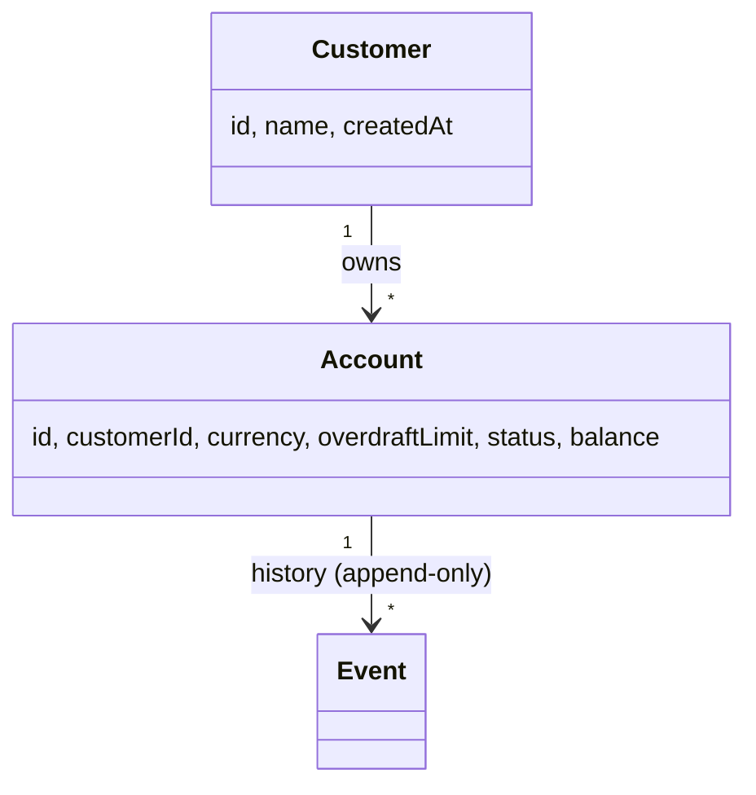

# Teya Ledger Implementation Plan

> **For agentic workers:** REQUIRED SUB-SKILL: Use superpowers:subagent-driven-development (recommended) or superpowers:executing-plans to implement this plan task-by-task. Steps use checkbox (`- [ ]`) syntax for tracking.

**Goal:** Build a Spring Boot 3 / Java 25 event-sourced ledger service with deposits, withdrawals, balance queries, paginated history, idempotent writes, OpenAPI docs, YAML-file persistence, and an OCI container image.

**Architecture:** Hexagonal layout (`api` → `application` → `domain`, with `infrastructure` adapters behind ports). Event-sourced: each account is a stream of events on disk; balances are derived projections. Per-account `ReentrantLock` for write linearisability. Required `Idempotency-Key` header on all writes.

**Tech Stack:** Java 25, Spring Boot 3.4, Gradle (Kotlin DSL), JUnit 5, AssertJ, springdoc-openapi 2.6, SnakeYAML, Jacoco. Container via `bootBuildImage` (Paketo Buildpacks).

**Spec:** [`docs/superpowers/specs/2026-05-06-teya-ledger-design.md`](../specs/2026-05-06-teya-ledger-design.md)
**Architecture:** [`docs/architecture.md`](../../architecture.md)
**Implementation reference:** [`docs/implementation.md`](../../implementation.md)

---

## Milestone overview

| M | Theme | Tasks |
| --- | --- | --- |
| M0 | Skeleton (Gradle + Spring Boot + actuator) | 0.1 – 0.3 |
| M1 | Domain model (Money, Account, events, exceptions) | 1.1 – 1.10 |
| M2 | Ports + storage adapters | 2.1 – 2.8 |
| M3 | Application services (locks, cache, command handlers) | 3.1 – 3.7 |
| M4 | HTTP layer (controllers, DTOs, error mapper) | 4.1 – 4.10 |
| M5 | Idempotency interceptor wiring | 5.1 – 5.4 |
| M6 | OpenAPI / springdoc + README quick-start | 6.1 – 6.3 |
| M7 | Container image + docker-compose | 7.1 – 7.3 |
| M8 | Polish (scenario IT, jacoco gate, README final pass) | 8.1 – 8.3 |

**Review checkpoints (per spec §7):**
- After M2: every adapter test must be green before any service code is written.
- After M5: every endpoint must have at least one passing IT before OpenAPI annotations are added.

---

## Conventions used in this plan

- All paths are relative to repo root (`/Users/rodrigo/projects/teya-ledger-project/`).
- Java package root: `com.teya.ledger`.
- `./gradlew` is invoked from repo root.
- `Run:` lines show the exact command to run; `Expected:` lines show what success looks like.
- Every commit is a small, named unit of work — see the commit message in step 5 of each task.
- Doc comments (`/** ... */`) are required on every public class, record, and method per global rules.

## Milestone 0 — Skeleton

Goal: a Spring Boot 3 / Java 25 process that boots, exposes
`/actuator/health`, and produces a green `./gradlew test` (with no
tests yet). Replaces the existing `org.example.Main`.

### Task 0.1: Update `build.gradle.kts` with Spring Boot, Java 25, deps

**Files:**
- Modify: `build.gradle.kts` (full replacement)
- Modify: `settings.gradle.kts` (add Foojay toolchain resolver plugin)

- [ ] **Step 1: Update `settings.gradle.kts` for toolchain auto-provisioning**

```kotlin
plugins {
    id("org.gradle.toolchains.foojay-resolver-convention") version "0.8.0"
}

rootProject.name = "teya-ledger-project"
```

- [ ] **Step 2: Replace `build.gradle.kts` wholesale**

```kotlin
import org.springframework.boot.gradle.tasks.bundling.BootBuildImage

plugins {
    java
    id("org.springframework.boot") version "3.5.14"
    id("io.spring.dependency-management") version "1.1.7"
    jacoco
}

group = "com.teya"
version = "1.0.0-SNAPSHOT"

java {
    toolchain {
        languageVersion.set(JavaLanguageVersion.of(25))
    }
}

repositories {
    mavenCentral()
}

dependencies {
    implementation("org.springframework.boot:spring-boot-starter-web")
    implementation("org.springframework.boot:spring-boot-starter-actuator")
    implementation("org.springframework.boot:spring-boot-starter-validation")
    implementation("org.springdoc:springdoc-openapi-starter-webmvc-ui:2.8.6")

    testImplementation("org.springframework.boot:spring-boot-starter-test")
    testImplementation("org.assertj:assertj-core")
}

tasks.test {
    useJUnitPlatform()
    finalizedBy(tasks.jacocoTestReport)
}

jacoco {
    toolVersion = "0.8.14"
}

tasks.named<BootBuildImage>("bootBuildImage") {
    imageName.set("teya-ledger:${project.version}")
    builder.set("paketobuildpacks/builder-jammy-tiny")
    environment.set(
        mapOf(
            "BP_JVM_VERSION" to "25"
        )
    )
}
```

- [ ] **Step 3: Verify Gradle resolves cleanly**

Run: `./gradlew --refresh-dependencies dependencies --configuration runtimeClasspath > /tmp/gradle-deps.txt 2>&1; tail -5 /tmp/gradle-deps.txt`
Expected: ends with `BUILD SUCCESSFUL`. The Spring Boot, springdoc, and validation jars appear in the dependency tree.

- [ ] **Step 4: Verify the existing `Main.java` still compiles (smoke check)**

Run: `./gradlew compileJava`
Expected: `BUILD SUCCESSFUL`. (We will replace `Main.java` in the next task.)

- [ ] **Step 5: Commit**

```bash
git add build.gradle.kts settings.gradle.kts
git commit -m "build: spring boot 3.4 + java 25 + jacoco + springdoc"
```

---

### Task 0.2: Replace `Main.java` with `LedgerApplication.java`

**Files:**
- Delete: `src/main/java/org/example/Main.java`
- Create: `src/main/java/com/teya/ledger/LedgerApplication.java`
- Create: `src/main/resources/application.yaml`

- [ ] **Step 1: Delete the placeholder `Main.java`**

Run: `rm src/main/java/org/example/Main.java && rmdir src/main/java/org/example`
Expected: no output. `find src/main/java -type f` returns nothing.

- [ ] **Step 2: Create `LedgerApplication.java`**

`src/main/java/com/teya/ledger/LedgerApplication.java`:

```java
package com.teya.ledger;

import org.springframework.boot.SpringApplication;
import org.springframework.boot.autoconfigure.SpringBootApplication;

/**
 * Entry point for the Teya ledger HTTP service.
 *
 * <p>Boots Spring Boot's embedded web server and wires up the
 * controllers, services, and storage adapters defined under
 * {@code com.teya.ledger.*}.
 */
@SpringBootApplication
public class LedgerApplication {

    /**
     * Standard Java {@code main} entry point.
     *
     * @param args command-line arguments forwarded to Spring Boot.
     */
    public static void main(String[] args) {
        SpringApplication.run(LedgerApplication.class, args);
    }
}
```

- [ ] **Step 3: Create `application.yaml`**

`src/main/resources/application.yaml`:

```yaml
server:
  port: 8080

spring:
  application:
    name: teya-ledger

management:
  endpoints:
    web:
      exposure:
        include:
          - health
          - info

springdoc:
  swagger-ui:
    path: /swagger-ui.html

ledger:
  storage:
    type: yaml
    yaml:
      directory: ./data/streams
  idempotency:
    cache-size: 10000
    ttl: PT24H
```

- [ ] **Step 4: Verify boot**

Run: `./gradlew bootRun --args='--server.port=18080' &`, sleep 15, then `curl -sf http://localhost:18080/actuator/health`. Then `pkill -f 'bootRun'`.
Expected: response `{"status":"UP"}` (or similar). The boot logs show `LedgerApplication` started.

- [ ] **Step 5: Commit**

```bash
git add src/main/java/com/teya/ledger/LedgerApplication.java src/main/resources/application.yaml
git rm src/main/java/org/example/Main.java
git commit -m "feat: introduce LedgerApplication entry point + application.yaml"
```

---

### Task 0.3: Smoke test for application boot

**Files:**
- Create: `src/test/java/com/teya/ledger/LedgerApplicationTest.java`

- [ ] **Step 1: Write the failing test**

`src/test/java/com/teya/ledger/LedgerApplicationTest.java`:

```java
package com.teya.ledger;

import org.junit.jupiter.api.Test;
import org.springframework.boot.test.context.SpringBootTest;

/**
 * Sanity test that confirms the Spring application context loads.
 *
 * <p>If this test fails, every other Spring-based integration test
 * will also fail. Keep it cheap and dependency-free.
 */
@SpringBootTest
class LedgerApplicationTest {

    @Test
    void contextLoads() {
        // Intentionally empty: success is the context loading without throwing.
    }
}
```

- [ ] **Step 2: Run the test, verify it passes**

Run: `./gradlew test --tests com.teya.ledger.LedgerApplicationTest`
Expected: `BUILD SUCCESSFUL`. (For this skeleton task there is no failing-then-passing TDD cycle: success means Spring Boot's autoconfiguration works.)

- [ ] **Step 3: Commit**

```bash
git add src/test/java/com/teya/ledger/LedgerApplicationTest.java
git commit -m "test: spring context loads"
```

## Milestone 1 — Domain model

Goal: pure-Java domain layer (`com.teya.ledger.domain.*`) with `Money`,
`CustomerId`, `AccountId`, `AccountStatus`, sealed `CustomerEvent` /
`AccountEvent` hierarchies, `Customer` / `Account` aggregates with
event-folding, and typed domain exceptions. No Spring, no I/O.

### Task 1.1: `Money` value object — happy-path tests + impl

**Files:**
- Create: `src/main/java/com/teya/ledger/domain/Money.java`
- Create: `src/test/java/com/teya/ledger/domain/MoneyTest.java`

- [ ] **Step 1: Write the failing test class**

`src/test/java/com/teya/ledger/domain/MoneyTest.java`:

```java
package com.teya.ledger.domain;

import org.junit.jupiter.api.Test;

import java.util.Currency;

import static org.assertj.core.api.Assertions.assertThat;
import static org.assertj.core.api.Assertions.assertThatThrownBy;

class MoneyTest {

    private static final Currency GBP = Currency.getInstance("GBP");
    private static final Currency EUR = Currency.getInstance("EUR");

    @Test
    void constructs_with_minor_units_and_currency() {
        Money m = new Money(5_00L, GBP);
        assertThat(m.minorUnits()).isEqualTo(500L);
        assertThat(m.currency()).isEqualTo(GBP);
    }

    @Test
    void zero_constructs_for_any_currency() {
        Money m = Money.zero(GBP);
        assertThat(m.minorUnits()).isZero();
        assertThat(m.currency()).isEqualTo(GBP);
    }

    @Test
    void plus_adds_minor_units_when_currencies_match() {
        Money a = new Money(100L, GBP);
        Money b = new Money(250L, GBP);
        assertThat(a.plus(b)).isEqualTo(new Money(350L, GBP));
    }

    @Test
    void minus_subtracts_minor_units_when_currencies_match() {
        Money a = new Money(500L, GBP);
        Money b = new Money(150L, GBP);
        assertThat(a.minus(b)).isEqualTo(new Money(350L, GBP));
    }

    @Test
    void negate_flips_sign_and_keeps_currency() {
        Money m = new Money(123L, GBP);
        assertThat(m.negate()).isEqualTo(new Money(-123L, GBP));
    }

    @Test
    void plus_rejects_currency_mismatch() {
        Money gbp = new Money(100L, GBP);
        Money eur = new Money(100L, EUR);
        assertThatThrownBy(() -> gbp.plus(eur))
            .isInstanceOf(IllegalArgumentException.class)
            .hasMessageContaining("GBP")
            .hasMessageContaining("EUR");
    }

    @Test
    void minus_rejects_currency_mismatch() {
        Money gbp = new Money(100L, GBP);
        Money eur = new Money(100L, EUR);
        assertThatThrownBy(() -> gbp.minus(eur))
            .isInstanceOf(IllegalArgumentException.class);
    }

    @Test
    void compare_to_orders_by_minor_units_when_currencies_match() {
        Money a = new Money(100L, GBP);
        Money b = new Money(200L, GBP);
        assertThat(a.compareTo(b)).isNegative();
        assertThat(b.compareTo(a)).isPositive();
        assertThat(a.compareTo(new Money(100L, GBP))).isZero();
    }

    @Test
    void compare_to_rejects_currency_mismatch() {
        Money gbp = new Money(100L, GBP);
        Money eur = new Money(100L, EUR);
        assertThatThrownBy(() -> gbp.compareTo(eur))
            .isInstanceOf(IllegalArgumentException.class);
    }

    @Test
    void plus_rejects_overflow() {
        Money max = new Money(Long.MAX_VALUE, GBP);
        Money one = new Money(1L, GBP);
        assertThatThrownBy(() -> max.plus(one))
            .isInstanceOf(ArithmeticException.class);
    }

    @Test
    void requires_non_null_currency() {
        assertThatThrownBy(() -> new Money(100L, null))
            .isInstanceOf(NullPointerException.class);
    }

    @Test
    void equals_includes_currency() {
        Money gbp100 = new Money(100L, GBP);
        Money eur100 = new Money(100L, EUR);
        assertThat(gbp100).isNotEqualTo(eur100);
    }
}
```

- [ ] **Step 2: Run the test, verify it fails**

Run: `./gradlew test --tests com.teya.ledger.domain.MoneyTest`
Expected: `BUILD FAILED`, compile errors referencing `Money` class not found.

- [ ] **Step 3: Implement `Money`**

`src/main/java/com/teya/ledger/domain/Money.java`:

```java
package com.teya.ledger.domain;

import java.util.Currency;
import java.util.Objects;

/**
 * An immutable money value: a signed integer count of minor units in a
 * specific currency. {@code 5_00} GBP means £5.00; {@code -1} JPY means
 * ¥-1. Using integer minor units rather than {@code BigDecimal} avoids
 * any rounding ambiguity and matches the convention used by payment
 * processors.
 *
 * <p>Arithmetic methods refuse to mix currencies: {@code GBP.plus(EUR)}
 * throws an {@link IllegalArgumentException}. The same rule applies to
 * {@link #compareTo}.
 *
 * @param minorUnits signed integer count of the currency's minor unit
 *                   (e.g., pence for GBP, cents for USD).
 * @param currency   the ISO currency; must be non-null.
 */
public record Money(long minorUnits, Currency currency) implements Comparable<Money> {

    /**
     * Compact constructor enforcing a non-null currency.
     */
    public Money {
        Objects.requireNonNull(currency, "currency must not be null");
    }

    /**
     * Returns a zero-valued {@link Money} in the given currency.
     *
     * @param currency the ISO currency.
     * @return {@code Money(0, currency)}.
     */
    public static Money zero(Currency currency) {
        return new Money(0L, currency);
    }

    /**
     * Returns this plus {@code other}.
     *
     * @param other addend.
     * @return new {@link Money} with the summed minor units.
     * @throws IllegalArgumentException if currencies differ.
     * @throws ArithmeticException      on long overflow.
     */
    public Money plus(Money other) {
        requireSameCurrency(other);
        return new Money(Math.addExact(this.minorUnits, other.minorUnits), currency);
    }

    /**
     * Returns this minus {@code other}.
     *
     * @param other subtrahend.
     * @return new {@link Money} with the difference of minor units.
     * @throws IllegalArgumentException if currencies differ.
     * @throws ArithmeticException      on long overflow.
     */
    public Money minus(Money other) {
        requireSameCurrency(other);
        return new Money(Math.subtractExact(this.minorUnits, other.minorUnits), currency);
    }

    /**
     * Returns the additive inverse.
     *
     * @return new {@link Money} with negated minor units.
     */
    public Money negate() {
        return new Money(Math.negateExact(this.minorUnits), currency);
    }

    /**
     * Compares two {@link Money} values by minor units.
     *
     * @param other the other money value.
     * @return as per {@link Comparable#compareTo}.
     * @throws IllegalArgumentException if currencies differ.
     */
    @Override
    public int compareTo(Money other) {
        requireSameCurrency(other);
        return Long.compare(this.minorUnits, other.minorUnits);
    }

    private void requireSameCurrency(Money other) {
        if (!this.currency.equals(other.currency)) {
            throw new IllegalArgumentException(
                "currency mismatch: " + this.currency.getCurrencyCode()
                    + " vs " + other.currency.getCurrencyCode());
        }
    }
}
```

- [ ] **Step 4: Run the test, verify it passes**

Run: `./gradlew test --tests com.teya.ledger.domain.MoneyTest`
Expected: `BUILD SUCCESSFUL`. All 12 tests pass.

- [ ] **Step 5: Commit**

```bash
git add src/main/java/com/teya/ledger/domain/Money.java src/test/java/com/teya/ledger/domain/MoneyTest.java
git commit -m "feat(domain): Money value object with currency-safe arithmetic"
```

---

### Task 1.2: `CustomerId` and `AccountId` newtypes

**Files:**
- Create: `src/main/java/com/teya/ledger/domain/customer/CustomerId.java`
- Create: `src/main/java/com/teya/ledger/domain/account/AccountId.java`
- Create: `src/test/java/com/teya/ledger/domain/customer/CustomerIdTest.java`
- Create: `src/test/java/com/teya/ledger/domain/account/AccountIdTest.java`

- [ ] **Step 1: Write the failing tests**

`src/test/java/com/teya/ledger/domain/customer/CustomerIdTest.java`:

```java
package com.teya.ledger.domain.customer;

import org.junit.jupiter.api.Test;

import java.util.UUID;

import static org.assertj.core.api.Assertions.assertThat;
import static org.assertj.core.api.Assertions.assertThatThrownBy;

class CustomerIdTest {

    @Test
    void wraps_a_uuid() {
        UUID uuid = UUID.randomUUID();
        CustomerId id = new CustomerId(uuid);
        assertThat(id.value()).isEqualTo(uuid);
    }

    @Test
    void parses_from_string() {
        UUID uuid = UUID.randomUUID();
        CustomerId id = CustomerId.of(uuid.toString());
        assertThat(id.value()).isEqualTo(uuid);
    }

    @Test
    void rejects_null() {
        assertThatThrownBy(() -> new CustomerId(null))
            .isInstanceOf(NullPointerException.class);
    }

    @Test
    void random_generates_unique_ids() {
        assertThat(CustomerId.random()).isNotEqualTo(CustomerId.random());
    }

    @Test
    void to_string_is_uuid_string() {
        UUID uuid = UUID.randomUUID();
        assertThat(new CustomerId(uuid)).hasToString(uuid.toString());
    }
}
```

`src/test/java/com/teya/ledger/domain/account/AccountIdTest.java`:

```java
package com.teya.ledger.domain.account;

import org.junit.jupiter.api.Test;

import java.util.UUID;

import static org.assertj.core.api.Assertions.assertThat;
import static org.assertj.core.api.Assertions.assertThatThrownBy;

class AccountIdTest {

    @Test
    void wraps_a_uuid() {
        UUID uuid = UUID.randomUUID();
        AccountId id = new AccountId(uuid);
        assertThat(id.value()).isEqualTo(uuid);
    }

    @Test
    void parses_from_string() {
        UUID uuid = UUID.randomUUID();
        AccountId id = AccountId.of(uuid.toString());
        assertThat(id.value()).isEqualTo(uuid);
    }

    @Test
    void rejects_null() {
        assertThatThrownBy(() -> new AccountId(null))
            .isInstanceOf(NullPointerException.class);
    }

    @Test
    void random_generates_unique_ids() {
        assertThat(AccountId.random()).isNotEqualTo(AccountId.random());
    }

    @Test
    void to_string_is_uuid_string() {
        UUID uuid = UUID.randomUUID();
        assertThat(new AccountId(uuid)).hasToString(uuid.toString());
    }
}
```

- [ ] **Step 2: Run, verify fail**

Run: `./gradlew test --tests 'com.teya.ledger.domain.*.CustomerIdTest' --tests 'com.teya.ledger.domain.*.AccountIdTest'`
Expected: compile errors — types not found.

- [ ] **Step 3: Implement both**

`src/main/java/com/teya/ledger/domain/customer/CustomerId.java`:

```java
package com.teya.ledger.domain.customer;

import java.util.Objects;
import java.util.UUID;

/**
 * Type-safe identifier for a customer. A thin wrapper around
 * {@link UUID} that prevents accidental mixing with other id types
 * (e.g., {@code AccountId}) at compile time.
 *
 * @param value the underlying UUID; must be non-null.
 */
public record CustomerId(UUID value) {

    /** Compact constructor enforcing non-null. */
    public CustomerId {
        Objects.requireNonNull(value, "value must not be null");
    }

    /**
     * Parses a {@link CustomerId} from a UUID string.
     *
     * @param raw a UUID string.
     * @return new {@link CustomerId}.
     */
    public static CustomerId of(String raw) {
        return new CustomerId(UUID.fromString(raw));
    }

    /**
     * @return a freshly-generated random {@link CustomerId}.
     */
    public static CustomerId random() {
        return new CustomerId(UUID.randomUUID());
    }

    @Override
    public String toString() {
        return value.toString();
    }
}
```

`src/main/java/com/teya/ledger/domain/account/AccountId.java`:

```java
package com.teya.ledger.domain.account;

import java.util.Objects;
import java.util.UUID;

/**
 * Type-safe identifier for an account. A thin wrapper around
 * {@link UUID} that prevents accidental mixing with other id types
 * (e.g., {@code CustomerId}) at compile time.
 *
 * @param value the underlying UUID; must be non-null.
 */
public record AccountId(UUID value) {

    /** Compact constructor enforcing non-null. */
    public AccountId {
        Objects.requireNonNull(value, "value must not be null");
    }

    /**
     * Parses an {@link AccountId} from a UUID string.
     *
     * @param raw a UUID string.
     * @return new {@link AccountId}.
     */
    public static AccountId of(String raw) {
        return new AccountId(UUID.fromString(raw));
    }

    /**
     * @return a freshly-generated random {@link AccountId}.
     */
    public static AccountId random() {
        return new AccountId(UUID.randomUUID());
    }

    @Override
    public String toString() {
        return value.toString();
    }
}
```

- [ ] **Step 4: Run, verify pass**

Run: `./gradlew test --tests 'com.teya.ledger.domain.customer.CustomerIdTest' --tests 'com.teya.ledger.domain.account.AccountIdTest'`
Expected: `BUILD SUCCESSFUL`, 10 tests pass.

- [ ] **Step 5: Commit**

```bash
git add src/main/java/com/teya/ledger/domain/customer/CustomerId.java \
        src/main/java/com/teya/ledger/domain/account/AccountId.java \
        src/test/java/com/teya/ledger/domain/customer/CustomerIdTest.java \
        src/test/java/com/teya/ledger/domain/account/AccountIdTest.java
git commit -m "feat(domain): CustomerId and AccountId newtypes"
```

### Task 1.3: `AccountStatus` enum

**Files:**
- Create: `src/main/java/com/teya/ledger/domain/account/AccountStatus.java`

- [ ] **Step 1: Create the enum (no test needed for a 2-value enum; coverage comes via `Account` tests)**

`src/main/java/com/teya/ledger/domain/account/AccountStatus.java`:

```java
package com.teya.ledger.domain.account;

/**
 * Lifecycle state of an {@link Account}.
 *
 * <ul>
 *   <li>{@link #OPEN}: the account accepts deposits, withdrawals, and overdraft changes.</li>
 *   <li>{@link #CLOSED}: terminal state; no further mutations are accepted.</li>
 * </ul>
 */
public enum AccountStatus {
    OPEN,
    CLOSED
}
```

- [ ] **Step 2: Verify compilation**

Run: `./gradlew compileJava`
Expected: `BUILD SUCCESSFUL`.

- [ ] **Step 3: Commit**

```bash
git add src/main/java/com/teya/ledger/domain/account/AccountStatus.java
git commit -m "feat(domain): AccountStatus enum"
```

---

### Task 1.4: `CustomerEvent` sealed hierarchy

**Files:**
- Create: `src/main/java/com/teya/ledger/domain/customer/CustomerEvent.java`

- [ ] **Step 1: Create the sealed interface and `CustomerCreated` record**

`src/main/java/com/teya/ledger/domain/customer/CustomerEvent.java`:

```java
package com.teya.ledger.domain.customer;

import java.time.Instant;
import java.util.Objects;

/**
 * The set of events that can ever happen to a customer aggregate.
 * Sealed so the compiler enforces exhaustive {@code switch}
 * expressions over the event types in folds and projections.
 */
public sealed interface CustomerEvent {

    /**
     * @return the {@link CustomerId} this event applies to.
     */
    CustomerId customerId();

    /**
     * @return the wall-clock instant the event was recorded.
     */
    Instant occurredAt();

    /**
     * Emitted exactly once per customer when the customer is created.
     *
     * @param customerId the new customer's id.
     * @param name       the customer's display name.
     * @param occurredAt event timestamp.
     */
    record CustomerCreated(
        CustomerId customerId,
        String name,
        Instant occurredAt
    ) implements CustomerEvent {

        /** Compact constructor enforcing non-null + non-blank name. */
        public CustomerCreated {
            Objects.requireNonNull(customerId, "customerId");
            Objects.requireNonNull(name, "name");
            if (name.isBlank()) {
                throw new IllegalArgumentException("name must not be blank");
            }
            Objects.requireNonNull(occurredAt, "occurredAt");
        }
    }
}
```

- [ ] **Step 2: Verify compilation**

Run: `./gradlew compileJava`
Expected: `BUILD SUCCESSFUL`.

- [ ] **Step 3: Commit**

```bash
git add src/main/java/com/teya/ledger/domain/customer/CustomerEvent.java
git commit -m "feat(domain): CustomerEvent sealed hierarchy"
```

---

### Task 1.5: `AccountEvent` sealed hierarchy

**Files:**
- Create: `src/main/java/com/teya/ledger/domain/account/AccountEvent.java`

- [ ] **Step 1: Create the sealed interface and all five event records**

`src/main/java/com/teya/ledger/domain/account/AccountEvent.java`:

```java
package com.teya.ledger.domain.account;

import com.teya.ledger.domain.customer.CustomerId;

import java.time.Instant;
import java.util.Currency;
import java.util.Objects;

/**
 * The set of events that can ever happen to an account aggregate.
 * Sealed so the compiler enforces exhaustive {@code switch}
 * expressions over the event types in {@link Account#apply}.
 */
public sealed interface AccountEvent {

    /**
     * @return the {@link AccountId} this event applies to.
     */
    AccountId accountId();

    /**
     * @return the wall-clock instant the event was recorded.
     */
    Instant occurredAt();

    /**
     * Emitted exactly once per account when the account is opened.
     *
     * @param accountId                   new account's id.
     * @param customerId                  owner.
     * @param currency                    fixed for the life of the account.
     * @param initialOverdraftLimitMinorUnits {@code >= 0}.
     * @param occurredAt                  event timestamp.
     */
    record AccountOpened(
        AccountId accountId,
        CustomerId customerId,
        Currency currency,
        long initialOverdraftLimitMinorUnits,
        Instant occurredAt
    ) implements AccountEvent {
        public AccountOpened {
            Objects.requireNonNull(accountId, "accountId");
            Objects.requireNonNull(customerId, "customerId");
            Objects.requireNonNull(currency, "currency");
            if (initialOverdraftLimitMinorUnits < 0) {
                throw new IllegalArgumentException(
                    "initialOverdraftLimitMinorUnits must be >= 0");
            }
            Objects.requireNonNull(occurredAt, "occurredAt");
        }
    }

    /**
     * Emitted on every successful deposit.
     */
    record MoneyDeposited(
        AccountId accountId,
        long amountMinorUnits,
        Currency currency,
        Instant occurredAt,
        String idempotencyKey
    ) implements AccountEvent {
        public MoneyDeposited {
            Objects.requireNonNull(accountId, "accountId");
            if (amountMinorUnits <= 0) {
                throw new IllegalArgumentException("amountMinorUnits must be > 0");
            }
            Objects.requireNonNull(currency, "currency");
            Objects.requireNonNull(occurredAt, "occurredAt");
            Objects.requireNonNull(idempotencyKey, "idempotencyKey");
        }
    }

    /**
     * Emitted on every successful withdrawal.
     */
    record MoneyWithdrawn(
        AccountId accountId,
        long amountMinorUnits,
        Currency currency,
        Instant occurredAt,
        String idempotencyKey
    ) implements AccountEvent {
        public MoneyWithdrawn {
            Objects.requireNonNull(accountId, "accountId");
            if (amountMinorUnits <= 0) {
                throw new IllegalArgumentException("amountMinorUnits must be > 0");
            }
            Objects.requireNonNull(currency, "currency");
            Objects.requireNonNull(occurredAt, "occurredAt");
            Objects.requireNonNull(idempotencyKey, "idempotencyKey");
        }
    }

    /**
     * Emitted whenever the account's overdraft limit is changed.
     *
     * @param newLimitMinorUnits {@code >= 0}.
     */
    record OverdraftLimitChanged(
        AccountId accountId,
        long newLimitMinorUnits,
        Instant occurredAt
    ) implements AccountEvent {
        public OverdraftLimitChanged {
            Objects.requireNonNull(accountId, "accountId");
            if (newLimitMinorUnits < 0) {
                throw new IllegalArgumentException(
                    "newLimitMinorUnits must be >= 0");
            }
            Objects.requireNonNull(occurredAt, "occurredAt");
        }
    }

    /**
     * Emitted exactly once when the account is closed. Subsequent
     * events on the same stream are programming errors.
     */
    record AccountClosed(
        AccountId accountId,
        Instant occurredAt
    ) implements AccountEvent {
        public AccountClosed {
            Objects.requireNonNull(accountId, "accountId");
            Objects.requireNonNull(occurredAt, "occurredAt");
        }
    }
}
```

- [ ] **Step 2: Verify compilation**

Run: `./gradlew compileJava`
Expected: `BUILD SUCCESSFUL`.

- [ ] **Step 3: Commit**

```bash
git add src/main/java/com/teya/ledger/domain/account/AccountEvent.java
git commit -m "feat(domain): AccountEvent sealed hierarchy with all five event records"
```

### Task 1.6: `Customer` aggregate

**Files:**
- Create: `src/main/java/com/teya/ledger/domain/customer/Customer.java`
- Create: `src/test/java/com/teya/ledger/domain/customer/CustomerTest.java`

- [ ] **Step 1: Write failing test**

`src/test/java/com/teya/ledger/domain/customer/CustomerTest.java`:

```java
package com.teya.ledger.domain.customer;

import org.junit.jupiter.api.Test;

import java.time.Instant;

import static org.assertj.core.api.Assertions.assertThat;
import static org.assertj.core.api.Assertions.assertThatThrownBy;

class CustomerTest {

    @Test
    void folds_from_customer_created_event() {
        CustomerId id = CustomerId.random();
        Instant ts = Instant.parse("2026-05-06T10:00:00Z");
        Customer c = Customer.foldFrom(java.util.List.of(
            new CustomerEvent.CustomerCreated(id, "Alice", ts)
        ));
        assertThat(c.id()).isEqualTo(id);
        assertThat(c.name()).isEqualTo("Alice");
        assertThat(c.createdAt()).isEqualTo(ts);
    }

    @Test
    void fold_rejects_empty_event_list() {
        assertThatThrownBy(() -> Customer.foldFrom(java.util.List.of()))
            .isInstanceOf(IllegalStateException.class)
            .hasMessageContaining("no events");
    }

    /**
     * The Customer.apply switch is exhaustive over the sealed CustomerEvent
     * hierarchy. As long as CustomerCreated is the only permitted variant,
     * there is no way to "fold a non-CustomerCreated as the first event" —
     * the type system refuses to construct one. This test fails if a new
     * variant is added, which is the right pressure: whoever extends
     * CustomerEvent must come back here and decide whether the new variant
     * is allowed as a first event or whether the fold needs an additional
     * guard.
     */
    @Test
    void sealed_hierarchy_has_only_one_variant_so_first_event_check_is_unnecessary() {
        assertThat(CustomerEvent.class.getPermittedSubclasses())
            .as("CustomerEvent permitted subtypes — extending requires "
                + "revisiting Customer.foldFrom and this test")
            .containsExactly(CustomerEvent.CustomerCreated.class);
    }
}
```

- [ ] **Step 2: Run, verify fail**

Run: `./gradlew test --tests com.teya.ledger.domain.customer.CustomerTest`
Expected: compile errors — `Customer` not found.

- [ ] **Step 3: Implement `Customer`**

`src/main/java/com/teya/ledger/domain/customer/Customer.java`:

```java
package com.teya.ledger.domain.customer;

import java.time.Instant;
import java.util.List;
import java.util.Objects;

/**
 * Customer aggregate, reconstituted by folding {@link CustomerEvent}s
 * from the customer event stream.
 *
 * <p>Customers are minimal in this scope: created once, then immutable.
 * Records are deliberately immutable; future state changes will return
 * new instances.
 *
 * @param id        the customer's stable identifier.
 * @param name      display name; non-blank.
 * @param createdAt instant the customer was created.
 */
public record Customer(CustomerId id, String name, Instant createdAt) {

    public Customer {
        Objects.requireNonNull(id, "id");
        Objects.requireNonNull(name, "name");
        if (name.isBlank()) {
            throw new IllegalArgumentException("name must not be blank");
        }
        Objects.requireNonNull(createdAt, "createdAt");
    }

    /**
     * Reconstitutes a {@link Customer} from its event stream.
     *
     * @param events ordered, non-empty list of events for one customer.
     * @return the projected customer.
     * @throws IllegalStateException if {@code events} is empty.
     */
    public static Customer foldFrom(List<CustomerEvent> events) {
        if (events.isEmpty()) {
            throw new IllegalStateException("cannot fold customer from no events");
        }
        Customer current = null;
        for (CustomerEvent event : events) {
            current = apply(current, event);
        }
        return current;
    }

    private static Customer apply(Customer current, CustomerEvent event) {
        return switch (event) {
            case CustomerEvent.CustomerCreated created -> new Customer(
                created.customerId(), created.name(), created.occurredAt());
        };
    }
}
```

- [ ] **Step 4: Run, verify pass**

Run: `./gradlew test --tests com.teya.ledger.domain.customer.CustomerTest`
Expected: `BUILD SUCCESSFUL`, 3 tests pass.

- [ ] **Step 5: Commit**

```bash
git add src/main/java/com/teya/ledger/domain/customer/Customer.java \
        src/test/java/com/teya/ledger/domain/customer/CustomerTest.java
git commit -m "feat(domain): Customer aggregate with foldFrom"
```

---

### Task 1.7: `Account` aggregate — folding + balance projection

**Files:**
- Create: `src/main/java/com/teya/ledger/domain/account/Account.java`
- Create: `src/test/java/com/teya/ledger/domain/account/AccountFoldTest.java`

- [ ] **Step 1: Write failing test**

`src/test/java/com/teya/ledger/domain/account/AccountFoldTest.java`:

```java
package com.teya.ledger.domain.account;

import com.teya.ledger.domain.customer.CustomerId;
import org.junit.jupiter.api.Test;

import java.time.Instant;
import java.util.Currency;
import java.util.List;

import static org.assertj.core.api.Assertions.assertThat;
import static org.assertj.core.api.Assertions.assertThatThrownBy;

class AccountFoldTest {

    private static final Currency GBP = Currency.getInstance("GBP");
    private final AccountId accountId = AccountId.random();
    private final CustomerId customerId = CustomerId.random();
    private final Instant t0 = Instant.parse("2026-05-06T10:00:00Z");

    @Test
    void account_opens_with_zero_balance() {
        Account a = fold(opened(0L));
        assertThat(a.id()).isEqualTo(accountId);
        assertThat(a.customerId()).isEqualTo(customerId);
        assertThat(a.currency()).isEqualTo(GBP);
        assertThat(a.balanceMinorUnits()).isZero();
        assertThat(a.overdraftLimitMinorUnits()).isZero();
        assertThat(a.status()).isEqualTo(AccountStatus.OPEN);
    }

    @Test
    void deposit_increases_balance() {
        Account a = fold(
            opened(0L),
            new AccountEvent.MoneyDeposited(accountId, 5_00L, GBP, t0.plusSeconds(1), "k1")
        );
        assertThat(a.balanceMinorUnits()).isEqualTo(500L);
    }

    @Test
    void withdrawal_decreases_balance() {
        Account a = fold(
            opened(0L),
            new AccountEvent.MoneyDeposited(accountId, 10_00L, GBP, t0.plusSeconds(1), "k1"),
            new AccountEvent.MoneyWithdrawn(accountId, 3_00L, GBP, t0.plusSeconds(2), "k2")
        );
        assertThat(a.balanceMinorUnits()).isEqualTo(700L);
    }

    @Test
    void overdraft_change_updates_limit() {
        Account a = fold(
            opened(0L),
            new AccountEvent.OverdraftLimitChanged(accountId, 50_00L, t0.plusSeconds(1))
        );
        assertThat(a.overdraftLimitMinorUnits()).isEqualTo(5000L);
    }

    @Test
    void close_moves_status_to_closed() {
        Account a = fold(
            opened(0L),
            new AccountEvent.AccountClosed(accountId, t0.plusSeconds(1))
        );
        assertThat(a.status()).isEqualTo(AccountStatus.CLOSED);
    }

    @Test
    void initial_overdraft_persisted_from_open_event() {
        Account a = fold(opened(20_00L));
        assertThat(a.overdraftLimitMinorUnits()).isEqualTo(2000L);
    }

    @Test
    void fold_rejects_empty_list() {
        assertThatThrownBy(() -> Account.foldFrom(List.of()))
            .isInstanceOf(IllegalStateException.class)
            .hasMessageContaining("no events");
    }

    @Test
    void fold_rejects_first_event_other_than_opened() {
        assertThatThrownBy(() -> Account.foldFrom(List.of(
            new AccountEvent.MoneyDeposited(accountId, 100L, GBP, t0, "k")
        ))).isInstanceOf(IllegalStateException.class)
           .hasMessageContaining("AccountOpened");
    }

    @Test
    void fold_rejects_event_after_closed() {
        assertThatThrownBy(() -> Account.foldFrom(List.of(
            opened(0L),
            new AccountEvent.AccountClosed(accountId, t0.plusSeconds(1)),
            new AccountEvent.MoneyDeposited(accountId, 100L, GBP, t0.plusSeconds(2), "k")
        ))).isInstanceOf(IllegalStateException.class)
           .hasMessageContaining("CLOSED");
    }

    private AccountEvent.AccountOpened opened(long initialOverdraftLimit) {
        return new AccountEvent.AccountOpened(
            accountId, customerId, GBP, initialOverdraftLimit, t0);
    }

    private Account fold(AccountEvent... events) {
        return Account.foldFrom(List.of(events));
    }
}
```

- [ ] **Step 2: Run, verify fail**

Run: `./gradlew test --tests com.teya.ledger.domain.account.AccountFoldTest`
Expected: compile errors — `Account` not found.

- [ ] **Step 3: Implement `Account`**

`src/main/java/com/teya/ledger/domain/account/Account.java`:

```java
package com.teya.ledger.domain.account;

import com.teya.ledger.domain.customer.CustomerId;

import java.time.Instant;
import java.util.Currency;
import java.util.List;
import java.util.Objects;

/**
 * Account aggregate, reconstituted by folding {@link AccountEvent}s
 * from the per-account event stream.
 *
 * <p>State (balance, overdraft limit, status) is derived; the source
 * of truth is the event stream. Each application of an event returns
 * a new immutable instance.
 *
 * @param id                          the account's stable identifier.
 * @param customerId                  owning customer.
 * @param currency                    fixed at open time.
 * @param balanceMinorUnits           current balance in minor units.
 * @param overdraftLimitMinorUnits    permitted negative balance, {@code >= 0}.
 * @param status                      lifecycle state.
 * @param openedAt                    when the account was opened.
 * @param lastEventOccurredAt         when the most recent event was recorded.
 */
public record Account(
    AccountId id,
    CustomerId customerId,
    Currency currency,
    long balanceMinorUnits,
    long overdraftLimitMinorUnits,
    AccountStatus status,
    Instant openedAt,
    Instant lastEventOccurredAt
) {

    public Account {
        Objects.requireNonNull(id);
        Objects.requireNonNull(customerId);
        Objects.requireNonNull(currency);
        Objects.requireNonNull(status);
        Objects.requireNonNull(openedAt);
        Objects.requireNonNull(lastEventOccurredAt);
        if (overdraftLimitMinorUnits < 0) {
            throw new IllegalArgumentException("overdraftLimitMinorUnits must be >= 0");
        }
    }

    /**
     * Reconstitutes an {@link Account} from its event stream.
     *
     * @param events non-empty, ordered list of events for one account.
     *               First event must be {@link AccountEvent.AccountOpened};
     *               no events are permitted after {@link AccountEvent.AccountClosed}.
     * @return the projected account state.
     */
    public static Account foldFrom(List<AccountEvent> events) {
        if (events.isEmpty()) {
            throw new IllegalStateException("cannot fold account from no events");
        }
        Account current = null;
        for (AccountEvent event : events) {
            current = (current == null) ? open(event) : current.apply(event);
        }
        return current;
    }

    private static Account open(AccountEvent first) {
        if (!(first instanceof AccountEvent.AccountOpened opened)) {
            throw new IllegalStateException(
                "first event must be AccountOpened, got " + first.getClass().getSimpleName());
        }
        return new Account(
            opened.accountId(),
            opened.customerId(),
            opened.currency(),
            0L,
            opened.initialOverdraftLimitMinorUnits(),
            AccountStatus.OPEN,
            opened.occurredAt(),
            opened.occurredAt()
        );
    }

    /**
     * Returns a new {@link Account} with {@code event} applied.
     *
     * @param event the next event in this account's stream.
     * @return projected state after the event.
     * @throws IllegalStateException if the account is already CLOSED.
     */
    public Account apply(AccountEvent event) {
        if (status == AccountStatus.CLOSED) {
            throw new IllegalStateException(
                "cannot apply " + event.getClass().getSimpleName() + " to CLOSED account");
        }
        return switch (event) {
            case AccountEvent.AccountOpened ignored -> throw new IllegalStateException(
                "AccountOpened applied twice");
            case AccountEvent.MoneyDeposited deposited -> withBalance(
                Math.addExact(balanceMinorUnits, deposited.amountMinorUnits()),
                deposited.occurredAt());
            case AccountEvent.MoneyWithdrawn withdrawn -> withBalance(
                Math.subtractExact(balanceMinorUnits, withdrawn.amountMinorUnits()),
                withdrawn.occurredAt());
            case AccountEvent.OverdraftLimitChanged changed -> new Account(
                id, customerId, currency, balanceMinorUnits,
                changed.newLimitMinorUnits(), status, openedAt, changed.occurredAt());
            case AccountEvent.AccountClosed closed -> new Account(
                id, customerId, currency, balanceMinorUnits, overdraftLimitMinorUnits,
                AccountStatus.CLOSED, openedAt, closed.occurredAt());
        };
    }

    private Account withBalance(long newBalance, Instant occurredAt) {
        return new Account(
            id, customerId, currency, newBalance, overdraftLimitMinorUnits,
            status, openedAt, occurredAt);
    }
}
```

- [ ] **Step 4: Run, verify pass**

Run: `./gradlew test --tests com.teya.ledger.domain.account.AccountFoldTest`
Expected: `BUILD SUCCESSFUL`, 9 tests pass.

- [ ] **Step 5: Commit**

```bash
git add src/main/java/com/teya/ledger/domain/account/Account.java \
        src/test/java/com/teya/ledger/domain/account/AccountFoldTest.java
git commit -m "feat(domain): Account aggregate with event folding"
```

### Task 1.8: Domain exceptions

**Files:**
- Create: `src/main/java/com/teya/ledger/domain/error/DomainException.java`
- Create: `src/main/java/com/teya/ledger/domain/error/InsufficientFundsException.java`
- Create: `src/main/java/com/teya/ledger/domain/error/CurrencyMismatchException.java`
- Create: `src/main/java/com/teya/ledger/domain/error/InvalidAmountException.java`
- Create: `src/main/java/com/teya/ledger/domain/error/AccountClosedException.java`
- Create: `src/main/java/com/teya/ledger/domain/error/AccountNotEmptyException.java`
- Create: `src/main/java/com/teya/ledger/domain/error/AccountNotFoundException.java`
- Create: `src/main/java/com/teya/ledger/domain/error/CustomerNotFoundException.java`

- [ ] **Step 1: Create the abstract base**

`src/main/java/com/teya/ledger/domain/error/DomainException.java`:

```java
package com.teya.ledger.domain.error;

import java.util.Map;

/**
 * Base type for every typed domain failure raised by the application
 * layer. The HTTP layer's {@code GlobalExceptionHandler} maps each
 * concrete subclass to a stable {@code ErrorCode} and HTTP status.
 *
 * <p>{@link #details()} carries machine-readable context surfaced to
 * the API client (e.g., {@code requestedMinorUnits}).
 */
public abstract class DomainException extends RuntimeException {

    private final transient Map<String, Object> details;

    protected DomainException(String message, Map<String, Object> details) {
        super(message);
        this.details = Map.copyOf(details);
    }

    public Map<String, Object> details() {
        return details;
    }
}
```

- [ ] **Step 2: Create concrete exceptions**

`src/main/java/com/teya/ledger/domain/error/InsufficientFundsException.java`:

```java
package com.teya.ledger.domain.error;

import com.teya.ledger.domain.account.AccountId;

import java.util.Map;

public final class InsufficientFundsException extends DomainException {
    public InsufficientFundsException(AccountId accountId,
                                      long requestedMinorUnits,
                                      long availableMinorUnits) {
        super(
            "withdrawal of " + requestedMinorUnits
                + " exceeds available balance + overdraft (" + availableMinorUnits + ")",
            Map.of(
                "accountId", accountId.toString(),
                "requestedMinorUnits", requestedMinorUnits,
                "availableMinorUnits", availableMinorUnits
            )
        );
    }
}
```

`src/main/java/com/teya/ledger/domain/error/CurrencyMismatchException.java`:

```java
package com.teya.ledger.domain.error;

import com.teya.ledger.domain.account.AccountId;

import java.util.Currency;
import java.util.Map;

public final class CurrencyMismatchException extends DomainException {
    public CurrencyMismatchException(AccountId accountId,
                                     Currency accountCurrency,
                                     Currency requestCurrency) {
        super(
            "request currency " + requestCurrency.getCurrencyCode()
                + " does not match account currency " + accountCurrency.getCurrencyCode(),
            Map.of(
                "accountId", accountId.toString(),
                "accountCurrency", accountCurrency.getCurrencyCode(),
                "requestCurrency", requestCurrency.getCurrencyCode()
            )
        );
    }
}
```

`src/main/java/com/teya/ledger/domain/error/InvalidAmountException.java`:

```java
package com.teya.ledger.domain.error;

import java.util.Map;

public final class InvalidAmountException extends DomainException {
    public InvalidAmountException(long amountMinorUnits) {
        super(
            "amount must be > 0; got " + amountMinorUnits,
            Map.of("amountMinorUnits", amountMinorUnits)
        );
    }
}
```

`src/main/java/com/teya/ledger/domain/error/AccountClosedException.java`:

```java
package com.teya.ledger.domain.error;

import com.teya.ledger.domain.account.AccountId;

import java.util.Map;

public final class AccountClosedException extends DomainException {
    public AccountClosedException(AccountId accountId) {
        super(
            "account " + accountId + " is closed",
            Map.of("accountId", accountId.toString())
        );
    }
}
```

`src/main/java/com/teya/ledger/domain/error/AccountNotEmptyException.java`:

```java
package com.teya.ledger.domain.error;

import com.teya.ledger.domain.account.AccountId;

import java.util.Map;

public final class AccountNotEmptyException extends DomainException {
    public AccountNotEmptyException(AccountId accountId, long balanceMinorUnits) {
        super(
            "account " + accountId + " cannot be closed: balance is " + balanceMinorUnits,
            Map.of(
                "accountId", accountId.toString(),
                "balanceMinorUnits", balanceMinorUnits
            )
        );
    }
}
```

`src/main/java/com/teya/ledger/domain/error/AccountNotFoundException.java`:

```java
package com.teya.ledger.domain.error;

import com.teya.ledger.domain.account.AccountId;

import java.util.Map;

public final class AccountNotFoundException extends DomainException {
    public AccountNotFoundException(AccountId accountId) {
        super(
            "account " + accountId + " not found",
            Map.of("accountId", accountId.toString())
        );
    }
}
```

`src/main/java/com/teya/ledger/domain/error/CustomerNotFoundException.java`:

```java
package com.teya.ledger.domain.error;

import com.teya.ledger.domain.customer.CustomerId;

import java.util.Map;

public final class CustomerNotFoundException extends DomainException {
    public CustomerNotFoundException(CustomerId customerId) {
        super(
            "customer " + customerId + " not found",
            Map.of("customerId", customerId.toString())
        );
    }
}
```

- [ ] **Step 3: Verify compilation**

Run: `./gradlew compileJava`
Expected: `BUILD SUCCESSFUL`.

- [ ] **Step 4: Commit**

```bash
git add src/main/java/com/teya/ledger/domain/error/
git commit -m "feat(domain): typed domain exceptions for every error code"
```

---

### Task 1.9: Verify all M1 tests pass together

- [ ] **Step 1: Run the full domain test set**

Run: `./gradlew test --tests 'com.teya.ledger.domain.*'`
Expected: `BUILD SUCCESSFUL`, all tests from MoneyTest, CustomerIdTest, AccountIdTest, CustomerTest, AccountFoldTest pass (~30 tests).

- [ ] **Step 2: Tag the milestone**

```bash
git tag m1-domain-complete
```

## Milestone 2 — Ports + storage adapters

Goal: define the `EventStore` and `IdempotencyStore` ports, ship the
`InMemoryEventStore` and `YamlEventStore` adapters with full
adapter-test coverage including crash recovery and concurrency.

**Checkpoint after M2:** all adapter tests green before any service
code (M3) is written.

### Task 2.1: `EventRecord`, `AppendResult`, `EventStore` port

**Files:**
- Create: `src/main/java/com/teya/ledger/infrastructure/port/EventRecord.java`
- Create: `src/main/java/com/teya/ledger/infrastructure/port/AppendResult.java`
- Create: `src/main/java/com/teya/ledger/infrastructure/port/EventStore.java`

- [ ] **Step 1: `EventRecord`**

`src/main/java/com/teya/ledger/infrastructure/port/EventRecord.java`:

```java
package com.teya.ledger.infrastructure.port;

import java.time.Instant;
import java.util.Map;
import java.util.Objects;
import java.util.UUID;

/**
 * The on-the-wire shape of a stored event. Adapters read and write
 * {@link EventRecord}s; the domain layer is responsible for mapping
 * between these and the typed event records (e.g., {@code AccountEvent}).
 *
 * <p>{@code seq} is assigned by the store on append.
 *
 * @param seq        per-stream monotonic sequence number, assigned by the store.
 * @param eventId    a globally-unique id for this record.
 * @param type       discriminator (e.g., {@code "MoneyDeposited"}).
 * @param occurredAt event timestamp.
 * @param payload    event-specific fields, JSON-friendly types only.
 */
public record EventRecord(
    long seq,
    UUID eventId,
    String type,
    Instant occurredAt,
    Map<String, Object> payload
) {

    public EventRecord {
        Objects.requireNonNull(eventId);
        Objects.requireNonNull(type);
        Objects.requireNonNull(occurredAt);
        Objects.requireNonNull(payload);
        payload = Map.copyOf(payload);
    }

    /**
     * Constructs an unsequenced record for an append operation; the
     * store assigns {@code seq} during {@link EventStore#append}.
     */
    public static EventRecord unsequenced(UUID eventId, String type,
                                          Instant occurredAt, Map<String, Object> payload) {
        return new EventRecord(0L, eventId, type, occurredAt, payload);
    }
}
```

- [ ] **Step 2: `AppendResult`**

`src/main/java/com/teya/ledger/infrastructure/port/AppendResult.java`:

```java
package com.teya.ledger.infrastructure.port;

import java.util.List;

/**
 * Outcome of a successful {@link EventStore#append} call.
 *
 * @param firstSeq the {@code seq} assigned to the first event in the batch.
 * @param lastSeq  the {@code seq} assigned to the last event in the batch.
 * @param records  the records as persisted (with assigned sequences).
 */
public record AppendResult(long firstSeq, long lastSeq, List<EventRecord> records) {

    public AppendResult {
        if (lastSeq < firstSeq) {
            throw new IllegalArgumentException("lastSeq must be >= firstSeq");
        }
        records = List.copyOf(records);
    }
}
```

- [ ] **Step 3: `EventStore` interface**

`src/main/java/com/teya/ledger/infrastructure/port/EventStore.java`:

```java
package com.teya.ledger.infrastructure.port;

import java.util.List;

/**
 * The persistence port for the event-sourced ledger.
 *
 * <p>Implementations must guarantee:
 * <ul>
 *   <li>Appends to the same {@code streamId} are serialised so
 *       sequence numbers are dense and monotonic.</li>
 *   <li>Appends are durable before the call returns (e.g., {@code fsync}
 *       on a file-backed adapter).</li>
 *   <li>{@link #readFrom} returns events with {@code seq > afterSeq}, in
 *       ascending {@code seq} order, never including a torn or
 *       partially-written record.</li>
 *   <li>Streams are independent: a slow append on stream A must not
 *       block reads or appends on stream B.</li>
 * </ul>
 */
public interface EventStore {

    /**
     * Atomically appends {@code events} to {@code streamId}.
     *
     * <p>The store assigns dense, monotonic sequence numbers starting
     * at {@code currentLastSeq + 1}.
     *
     * @param streamId logical stream identifier (e.g., {@code "account-<uuid>"}).
     * @param events   one or more unsequenced {@link EventRecord}s.
     * @return the assigned sequences and persisted records.
     */
    AppendResult append(String streamId, List<EventRecord> events);

    /**
     * Reads up to {@code limit} records from {@code streamId} with
     * {@code seq > afterSeq}.
     *
     * @param streamId logical stream identifier.
     * @param afterSeq exclusive lower bound; pass {@code 0} to start from the beginning.
     * @param limit    maximum number of records to return; must be {@code > 0}.
     * @return ordered list, possibly empty if no more events exist.
     */
    List<EventRecord> readFrom(String streamId, long afterSeq, int limit);
}
```

- [ ] **Step 4: Verify compilation**

Run: `./gradlew compileJava`
Expected: `BUILD SUCCESSFUL`.

- [ ] **Step 5: Commit**

```bash
git add src/main/java/com/teya/ledger/infrastructure/port/
git commit -m "feat(infra): EventStore port + EventRecord + AppendResult"
```

---

### Task 2.2: `IdempotencyStore` port

**Files:**
- Create: `src/main/java/com/teya/ledger/infrastructure/port/IdempotencyStore.java`

- [ ] **Step 1: Create the interface**

`src/main/java/com/teya/ledger/infrastructure/port/IdempotencyStore.java`:

```java
package com.teya.ledger.infrastructure.port;

import java.util.Optional;

/**
 * Bounded cache of idempotency-key → cached-response mappings.
 *
 * <p>Implementations must be thread-safe and must enforce the
 * configured maximum size and TTL.
 */
public interface IdempotencyStore {

    /**
     * Looks up a previously-recorded response by key.
     *
     * @param key idempotency key from the inbound HTTP header.
     * @return the cached entry, or empty if none.
     */
    Optional<Entry> lookup(String key);

    /**
     * Records a freshly-completed response for replay on future requests
     * with the same key.
     *
     * @param key          idempotency key.
     * @param requestHash  SHA-256 over canonicalised request body + path.
     * @param responseStatus HTTP status code.
     * @param responseBody serialised response body (JSON string).
     */
    void record(String key, String requestHash, int responseStatus, String responseBody);

    /**
     * Cached entry — returned by {@link #lookup}.
     *
     * @param requestHash    SHA-256 of the original request.
     * @param responseStatus HTTP status code of the original response.
     * @param responseBody   serialised body of the original response.
     */
    record Entry(String requestHash, int responseStatus, String responseBody) {
    }
}
```

- [ ] **Step 2: Verify compilation**

Run: `./gradlew compileJava`
Expected: `BUILD SUCCESSFUL`.

- [ ] **Step 3: Commit**

```bash
git add src/main/java/com/teya/ledger/infrastructure/port/IdempotencyStore.java
git commit -m "feat(infra): IdempotencyStore port"
```

---

### Task 2.3: `InMemoryEventStore` adapter + tests

**Files:**
- Create: `src/main/java/com/teya/ledger/infrastructure/memory/InMemoryEventStore.java`
- Create: `src/test/java/com/teya/ledger/infrastructure/memory/InMemoryEventStoreTest.java`

- [ ] **Step 1: Write failing tests**

`src/test/java/com/teya/ledger/infrastructure/memory/InMemoryEventStoreTest.java`:

```java
package com.teya.ledger.infrastructure.memory;

import com.teya.ledger.infrastructure.port.AppendResult;
import com.teya.ledger.infrastructure.port.EventRecord;
import com.teya.ledger.infrastructure.port.EventStore;
import org.junit.jupiter.api.BeforeEach;
import org.junit.jupiter.api.Test;

import java.time.Instant;
import java.util.List;
import java.util.Map;
import java.util.UUID;

import static org.assertj.core.api.Assertions.assertThat;
import static org.assertj.core.api.Assertions.assertThatThrownBy;

class InMemoryEventStoreTest {

    private EventStore store;

    @BeforeEach
    void setUp() {
        store = new InMemoryEventStore();
    }

    @Test
    void append_assigns_sequential_seqs_starting_at_one() {
        AppendResult result = store.append("s1", List.of(
            unseq("E1"), unseq("E2"), unseq("E3")
        ));
        assertThat(result.firstSeq()).isEqualTo(1L);
        assertThat(result.lastSeq()).isEqualTo(3L);
        assertThat(result.records())
            .extracting(EventRecord::seq)
            .containsExactly(1L, 2L, 3L);
    }

    @Test
    void second_append_continues_seq() {
        store.append("s1", List.of(unseq("E1")));
        AppendResult second = store.append("s1", List.of(unseq("E2")));
        assertThat(second.firstSeq()).isEqualTo(2L);
        assertThat(second.lastSeq()).isEqualTo(2L);
    }

    @Test
    void streams_are_independent() {
        store.append("s1", List.of(unseq("E1"), unseq("E2")));
        AppendResult result = store.append("s2", List.of(unseq("E1")));
        assertThat(result.firstSeq()).isEqualTo(1L);
    }

    @Test
    void read_from_empty_stream_returns_empty() {
        assertThat(store.readFrom("missing", 0L, 10)).isEmpty();
    }

    @Test
    void read_from_returns_after_cursor() {
        store.append("s1", List.of(unseq("E1"), unseq("E2"), unseq("E3")));
        List<EventRecord> tail = store.readFrom("s1", 1L, 10);
        assertThat(tail).extracting(EventRecord::seq).containsExactly(2L, 3L);
    }

    @Test
    void read_from_honours_limit() {
        store.append("s1", List.of(unseq("E1"), unseq("E2"), unseq("E3")));
        List<EventRecord> page = store.readFrom("s1", 0L, 2);
        assertThat(page).hasSize(2);
        assertThat(page).extracting(EventRecord::seq).containsExactly(1L, 2L);
    }

    @Test
    void append_rejects_empty_list() {
        assertThatThrownBy(() -> store.append("s1", List.of()))
            .isInstanceOf(IllegalArgumentException.class);
    }

    @Test
    void read_rejects_non_positive_limit() {
        assertThatThrownBy(() -> store.readFrom("s1", 0L, 0))
            .isInstanceOf(IllegalArgumentException.class);
    }

    @Test
    void read_rejects_negative_after() {
        assertThatThrownBy(() -> store.readFrom("s1", -1L, 10))
            .isInstanceOf(IllegalArgumentException.class);
    }

    private EventRecord unseq(String type) {
        return EventRecord.unsequenced(
            UUID.randomUUID(), type, Instant.now(), Map.of("dummy", true));
    }
}
```

- [ ] **Step 2: Run, verify fail**

Run: `./gradlew test --tests com.teya.ledger.infrastructure.memory.InMemoryEventStoreTest`
Expected: compile errors — `InMemoryEventStore` not found.

- [ ] **Step 3: Implement `InMemoryEventStore`**

`src/main/java/com/teya/ledger/infrastructure/memory/InMemoryEventStore.java`:

```java
package com.teya.ledger.infrastructure.memory;

import com.teya.ledger.infrastructure.port.AppendResult;
import com.teya.ledger.infrastructure.port.EventRecord;
import com.teya.ledger.infrastructure.port.EventStore;

import java.util.ArrayList;
import java.util.List;
import java.util.Map;
import java.util.concurrent.ConcurrentHashMap;
import java.util.concurrent.locks.ReentrantLock;

/**
 * Process-local {@link EventStore} backed by per-stream {@link ArrayList}s.
 *
 * <p>Used in unit tests and (optionally) at runtime via
 * {@code ledger.storage.type=in-memory}. Holds events for the lifetime
 * of the process; restarts lose all state.
 *
 * <p>Concurrency: a single {@link ReentrantLock} per stream guards both
 * writes and reads. Different streams run in parallel.
 */
public final class InMemoryEventStore implements EventStore {

    private final Map<String, List<EventRecord>> streams = new ConcurrentHashMap<>();
    private final Map<String, ReentrantLock> locks = new ConcurrentHashMap<>();

    @Override
    public AppendResult append(String streamId, List<EventRecord> events) {
        if (events.isEmpty()) {
            throw new IllegalArgumentException("events must not be empty");
        }
        ReentrantLock lock = locks.computeIfAbsent(streamId, k -> new ReentrantLock());
        lock.lock();
        try {
            List<EventRecord> stream = streams.computeIfAbsent(
                streamId, k -> new ArrayList<>());
            long firstSeq = stream.size() + 1L;
            List<EventRecord> assigned = new ArrayList<>(events.size());
            for (int i = 0; i < events.size(); i++) {
                EventRecord src = events.get(i);
                assigned.add(new EventRecord(
                    firstSeq + i, src.eventId(), src.type(),
                    src.occurredAt(), src.payload()));
            }
            stream.addAll(assigned);
            return new AppendResult(firstSeq, firstSeq + assigned.size() - 1L, assigned);
        } finally {
            lock.unlock();
        }
    }

    @Override
    public List<EventRecord> readFrom(String streamId, long afterSeq, int limit) {
        if (afterSeq < 0L) {
            throw new IllegalArgumentException("afterSeq must be >= 0");
        }
        if (limit <= 0) {
            throw new IllegalArgumentException("limit must be > 0");
        }
        if (!streams.containsKey(streamId)) {
            return List.of();
        }
        ReentrantLock lock = locks.computeIfAbsent(streamId, k -> new ReentrantLock());
        lock.lock();
        try {
            List<EventRecord> stream = streams.get(streamId);
            if (stream == null) {
                return List.of();
            }
            int from = (int) Math.min(afterSeq, stream.size());
            int to = Math.min(stream.size(), from + limit);
            return List.copyOf(stream.subList(from, to));
        } finally {
            lock.unlock();
        }
    }
}
```

- [ ] **Step 4: Run, verify pass**

Run: `./gradlew test --tests com.teya.ledger.infrastructure.memory.InMemoryEventStoreTest`
Expected: `BUILD SUCCESSFUL`, 9 tests pass.

- [ ] **Step 5: Commit**

```bash
git add src/main/java/com/teya/ledger/infrastructure/memory/InMemoryEventStore.java \
        src/test/java/com/teya/ledger/infrastructure/memory/InMemoryEventStoreTest.java
git commit -m "feat(infra): InMemoryEventStore adapter"
```

### Task 2.4: `YamlEventStore` — layout, codec, basic append/read

**Files:**
- Create: `src/main/java/com/teya/ledger/infrastructure/yaml/StreamFileLayout.java`
- Create: `src/main/java/com/teya/ledger/infrastructure/yaml/YamlEventCodec.java`
- Create: `src/main/java/com/teya/ledger/infrastructure/yaml/YamlEventStore.java`
- Create: `src/test/java/com/teya/ledger/infrastructure/yaml/YamlEventStoreTest.java`

- [ ] **Step 1: Write failing tests**

`src/test/java/com/teya/ledger/infrastructure/yaml/YamlEventStoreTest.java`:

```java
package com.teya.ledger.infrastructure.yaml;

import com.teya.ledger.infrastructure.port.AppendResult;
import com.teya.ledger.infrastructure.port.EventRecord;
import com.teya.ledger.infrastructure.port.EventStore;
import org.junit.jupiter.api.BeforeEach;
import org.junit.jupiter.api.Test;
import org.junit.jupiter.api.io.TempDir;

import java.nio.file.Path;
import java.time.Instant;
import java.util.List;
import java.util.Map;
import java.util.UUID;

import static org.assertj.core.api.Assertions.assertThat;
import static org.assertj.core.api.Assertions.assertThatThrownBy;

class YamlEventStoreTest {

    @TempDir
    Path tempDir;

    private EventStore store;

    @BeforeEach
    void setUp() {
        store = new YamlEventStore(tempDir);
    }

    @Test
    void append_then_read_roundtrips_all_fields() {
        UUID eventId = UUID.randomUUID();
        Instant ts = Instant.parse("2026-05-06T10:14:23.118Z");
        Map<String, Object> payload = Map.of(
            "accountId", "9b1f-uuid",
            "amountMinorUnits", 5000L,
            "currency", "GBP",
            "idempotencyKey", "dep-abc-123"
        );
        AppendResult appended = store.append("account-9b1f", List.of(
            new EventRecord(0L, eventId, "MoneyDeposited", ts, payload)
        ));
        assertThat(appended.firstSeq()).isEqualTo(1L);

        List<EventRecord> read = store.readFrom("account-9b1f", 0L, 10);
        assertThat(read).hasSize(1);
        EventRecord r = read.get(0);
        assertThat(r.seq()).isEqualTo(1L);
        assertThat(r.eventId()).isEqualTo(eventId);
        assertThat(r.type()).isEqualTo("MoneyDeposited");
        assertThat(r.occurredAt()).isEqualTo(ts);
        assertThat(r.payload())
            .containsEntry("accountId", "9b1f-uuid")
            .containsEntry("amountMinorUnits", 5000L)
            .containsEntry("currency", "GBP")
            .containsEntry("idempotencyKey", "dep-abc-123");
    }

    @Test
    void second_append_continues_seq() {
        store.append("s", List.of(rec("E1")));
        AppendResult second = store.append("s", List.of(rec("E2")));
        assertThat(second.firstSeq()).isEqualTo(2L);
    }

    @Test
    void read_from_returns_empty_for_unknown_stream() {
        assertThat(store.readFrom("missing", 0L, 10)).isEmpty();
    }

    @Test
    void read_from_honours_after_and_limit() {
        store.append("s", List.of(rec("E1"), rec("E2"), rec("E3"), rec("E4")));
        List<EventRecord> page = store.readFrom("s", 1L, 2);
        assertThat(page).extracting(EventRecord::seq).containsExactly(2L, 3L);
    }

    @Test
    void append_persists_across_store_recreation() {
        store.append("s", List.of(rec("E1"), rec("E2")));
        EventStore fresh = new YamlEventStore(tempDir);
        AppendResult third = fresh.append("s", List.of(rec("E3")));
        assertThat(third.firstSeq()).isEqualTo(3L);
        List<EventRecord> all = fresh.readFrom("s", 0L, 100);
        assertThat(all).extracting(EventRecord::type).containsExactly("E1", "E2", "E3");
    }

    @Test
    void append_rejects_empty_list() {
        assertThatThrownBy(() -> store.append("s", List.of()))
            .isInstanceOf(IllegalArgumentException.class);
    }

    @Test
    void writes_one_file_per_stream() {
        store.append("account-a", List.of(rec("E1")));
        store.append("account-b", List.of(rec("E1")));
        assertThat(tempDir.resolve("account-a.yaml")).exists();
        assertThat(tempDir.resolve("account-b.yaml")).exists();
    }

    private EventRecord rec(String type) {
        return new EventRecord(
            0L, UUID.randomUUID(), type,
            Instant.parse("2026-05-06T10:00:00Z"),
            Map.of("k", "v"));
    }
}
```

- [ ] **Step 2: Run, verify fail**

Run: `./gradlew test --tests com.teya.ledger.infrastructure.yaml.YamlEventStoreTest`
Expected: compile errors — `YamlEventStore` not found.

- [ ] **Step 3: Implement `StreamFileLayout`**

`src/main/java/com/teya/ledger/infrastructure/yaml/StreamFileLayout.java`:

```java
package com.teya.ledger.infrastructure.yaml;

import java.nio.file.Path;
import java.util.Objects;
import java.util.regex.Pattern;

/**
 * Maps logical {@code streamId}s to YAML file paths under a root
 * directory. Validates ids to prevent path traversal.
 */
final class StreamFileLayout {

    private static final Pattern SAFE_STREAM_ID =
        Pattern.compile("[A-Za-z0-9._\\-]+");

    private final Path root;

    StreamFileLayout(Path root) {
        this.root = Objects.requireNonNull(root);
    }

    Path fileFor(String streamId) {
        if (!SAFE_STREAM_ID.matcher(streamId).matches()) {
            throw new IllegalArgumentException(
                "streamId must match " + SAFE_STREAM_ID.pattern() + ", got: " + streamId);
        }
        return root.resolve(streamId + ".yaml");
    }

    Path root() {
        return root;
    }
}
```

- [ ] **Step 4: Implement `YamlEventCodec`**

`src/main/java/com/teya/ledger/infrastructure/yaml/YamlEventCodec.java`:

```java
package com.teya.ledger.infrastructure.yaml;

import com.teya.ledger.infrastructure.port.EventRecord;
import org.yaml.snakeyaml.DumperOptions;
import org.yaml.snakeyaml.LoaderOptions;
import org.yaml.snakeyaml.Yaml;
import org.yaml.snakeyaml.constructor.SafeConstructor;
import org.yaml.snakeyaml.representer.Representer;

import java.time.Instant;
import java.util.LinkedHashMap;
import java.util.Map;
import java.util.UUID;

/**
 * Serialises {@link EventRecord}s to YAML documents and back. Each
 * record is written as a single mapping prefixed by the YAML document
 * separator {@code ---}, allowing a stream file to be parsed
 * incrementally and a torn final document to be detected and
 * truncated on recovery.
 */
final class YamlEventCodec {

    private final Yaml yaml;

    YamlEventCodec() {
        DumperOptions dump = new DumperOptions();
        dump.setExplicitStart(true);
        dump.setDefaultFlowStyle(DumperOptions.FlowStyle.BLOCK);
        Representer representer = new Representer(dump);
        LoaderOptions load = new LoaderOptions();
        load.setAllowDuplicateKeys(false);
        this.yaml = new Yaml(new SafeConstructor(load), representer, dump);
    }

    /**
     * Serialises a sequenced record to a single YAML document.
     */
    String encode(EventRecord record) {
        Map<String, Object> mapping = new LinkedHashMap<>();
        mapping.put("seq", record.seq());
        mapping.put("eventId", record.eventId().toString());
        mapping.put("type", record.type());
        mapping.put("occurredAt", record.occurredAt().toString());
        mapping.put("payload", new LinkedHashMap<>(record.payload()));
        return yaml.dump(mapping);
    }

    /**
     * Decodes a single mapping (one YAML document) into an
     * {@link EventRecord}. Returns {@code null} if the mapping is
     * structurally incomplete (a torn write at the file tail).
     */
    EventRecord decode(Map<String, Object> mapping) {
        if (mapping == null) {
            return null;
        }
        Object seq = mapping.get("seq");
        Object eventId = mapping.get("eventId");
        Object type = mapping.get("type");
        Object occurredAt = mapping.get("occurredAt");
        Object payload = mapping.get("payload");
        if (seq == null || eventId == null || type == null
            || occurredAt == null || payload == null) {
            return null;
        }
        @SuppressWarnings("unchecked")
        Map<String, Object> payloadMap = (Map<String, Object>) payload;
        return new EventRecord(
            ((Number) seq).longValue(),
            UUID.fromString(eventId.toString()),
            type.toString(),
            Instant.parse(occurredAt.toString()),
            payloadMap
        );
    }

    Iterable<Object> loadAll(String text) {
        return yaml.loadAll(text);
    }
}
```

- [ ] **Step 5: Implement `YamlEventStore`**

`src/main/java/com/teya/ledger/infrastructure/yaml/YamlEventStore.java`:

```java
package com.teya.ledger.infrastructure.yaml;

import com.teya.ledger.infrastructure.port.AppendResult;
import com.teya.ledger.infrastructure.port.EventRecord;
import com.teya.ledger.infrastructure.port.EventStore;

import java.io.IOException;
import java.io.UncheckedIOException;
import java.nio.charset.StandardCharsets;
import java.nio.file.Files;
import java.nio.file.Path;
import java.nio.file.StandardOpenOption;
import java.util.ArrayList;
import java.util.List;
import java.util.Map;
import java.util.concurrent.ConcurrentHashMap;
import java.util.concurrent.locks.ReentrantLock;

/**
 * File-backed {@link EventStore} that writes one append-only YAML
 * document per event under a per-stream file. Each append is
 * fsync'd before returning, so any record reported as persisted
 * survives a process crash. A torn final document (write killed
 * before fsync completed) is detected on read and ignored, since the
 * caller never saw it succeed.
 *
 * <p>Concurrency model: per-stream {@link ReentrantLock}s — different
 * streams run in parallel; the same stream serialises.
 */
public final class YamlEventStore implements EventStore {

    private final StreamFileLayout layout;
    private final YamlEventCodec codec = new YamlEventCodec();
    private final Map<String, ReentrantLock> streamLocks = new ConcurrentHashMap<>();
    private final Map<String, Long> lastSeqs = new ConcurrentHashMap<>();

    public YamlEventStore(Path root) {
        this.layout = new StreamFileLayout(root);
        try {
            Files.createDirectories(root);
        } catch (IOException e) {
            throw new UncheckedIOException("failed to create stream root: " + root, e);
        }
    }

    @Override
    public AppendResult append(String streamId, List<EventRecord> events) {
        if (events.isEmpty()) {
            throw new IllegalArgumentException("events must not be empty");
        }
        ReentrantLock lock = streamLocks.computeIfAbsent(streamId, k -> new ReentrantLock());
        lock.lock();
        try {
            long lastSeq = lastSeqs.computeIfAbsent(streamId, this::loadLastSeq);
            long firstSeq = lastSeq + 1L;
            List<EventRecord> assigned = new ArrayList<>(events.size());
            StringBuilder buf = new StringBuilder();
            for (int i = 0; i < events.size(); i++) {
                EventRecord src = events.get(i);
                EventRecord seq = new EventRecord(
                    firstSeq + i, src.eventId(), src.type(),
                    src.occurredAt(), src.payload());
                assigned.add(seq);
                buf.append(codec.encode(seq));
            }
            writeAtomicAppend(streamId, buf.toString());
            long newLast = firstSeq + events.size() - 1L;
            lastSeqs.put(streamId, newLast);
            return new AppendResult(firstSeq, newLast, assigned);
        } finally {
            lock.unlock();
        }
    }

    @Override
    public List<EventRecord> readFrom(String streamId, long afterSeq, int limit) {
        if (afterSeq < 0L) {
            throw new IllegalArgumentException("afterSeq must be >= 0");
        }
        if (limit <= 0) {
            throw new IllegalArgumentException("limit must be > 0");
        }
        Path file = layout.fileFor(streamId);
        if (!Files.exists(file)) {
            return List.of();
        }
        ReentrantLock lock = streamLocks.computeIfAbsent(streamId, k -> new ReentrantLock());
        lock.lock();
        try {
            List<EventRecord> all = readAllRecords(file);
            List<EventRecord> page = new ArrayList<>();
            for (EventRecord r : all) {
                if (r.seq() <= afterSeq) {
                    continue;
                }
                page.add(r);
                if (page.size() >= limit) {
                    break;
                }
            }
            return List.copyOf(page);
        } finally {
            lock.unlock();
        }
    }

    private long loadLastSeq(String streamId) {
        Path file = layout.fileFor(streamId);
        if (!Files.exists(file)) {
            return 0L;
        }
        long last = 0L;
        for (EventRecord r : readAllRecords(file)) {
            if (r.seq() > last) {
                last = r.seq();
            }
        }
        return last;
    }

    private List<EventRecord> readAllRecords(Path file) {
        String text;
        try {
            text = Files.readString(file, StandardCharsets.UTF_8);
        } catch (IOException e) {
            throw new UncheckedIOException("failed to read " + file, e);
        }
        List<EventRecord> records = new ArrayList<>();
        for (Object doc : codec.loadAll(text)) {
            if (!(doc instanceof Map<?, ?> mapping)) {
                continue;
            }
            @SuppressWarnings("unchecked")
            EventRecord rec = codec.decode((Map<String, Object>) mapping);
            if (rec != null) {
                records.add(rec);
            }
            // null = torn write at tail; ignore. See class javadoc.
        }
        return records;
    }

    private void writeAtomicAppend(String streamId, String chunk) {
        Path file = layout.fileFor(streamId);
        byte[] bytes = chunk.getBytes(StandardCharsets.UTF_8);
        try (var ch = java.nio.channels.FileChannel.open(
            file,
            StandardOpenOption.WRITE,
            StandardOpenOption.CREATE,
            StandardOpenOption.APPEND
        )) {
            ch.write(java.nio.ByteBuffer.wrap(bytes));
            ch.force(true);
        } catch (IOException e) {
            throw new UncheckedIOException("failed to append to " + file, e);
        }
    }
}
```

- [ ] **Step 6: Run, verify pass**

Run: `./gradlew test --tests com.teya.ledger.infrastructure.yaml.YamlEventStoreTest`
Expected: `BUILD SUCCESSFUL`, 7 tests pass.

- [ ] **Step 7: Commit**

```bash
git add src/main/java/com/teya/ledger/infrastructure/yaml/ \
        src/test/java/com/teya/ledger/infrastructure/yaml/YamlEventStoreTest.java
git commit -m "feat(infra): YamlEventStore with append-only per-stream files"
```

### Task 2.5: `YamlEventStore` — concurrency tests

**Files:**
- Create: `src/test/java/com/teya/ledger/infrastructure/yaml/YamlEventStoreConcurrencyTest.java`

- [ ] **Step 1: Write the test**

`src/test/java/com/teya/ledger/infrastructure/yaml/YamlEventStoreConcurrencyTest.java`:

```java
package com.teya.ledger.infrastructure.yaml;

import com.teya.ledger.infrastructure.port.EventRecord;
import com.teya.ledger.infrastructure.port.EventStore;
import org.junit.jupiter.api.BeforeEach;
import org.junit.jupiter.api.Test;
import org.junit.jupiter.api.io.TempDir;

import java.nio.file.Path;
import java.time.Instant;
import java.util.List;
import java.util.Map;
import java.util.UUID;
import java.util.concurrent.CountDownLatch;
import java.util.concurrent.ExecutorService;
import java.util.concurrent.Executors;
import java.util.concurrent.TimeUnit;
import java.util.concurrent.atomic.AtomicInteger;

import static org.assertj.core.api.Assertions.assertThat;

class YamlEventStoreConcurrencyTest {

    @TempDir
    Path tempDir;

    private EventStore store;

    @BeforeEach
    void setUp() {
        store = new YamlEventStore(tempDir);
    }

    @Test
    void appends_to_distinct_streams_run_in_parallel_without_interference()
        throws InterruptedException {
        int streamCount = 8;
        int eventsPerStream = 200;
        ExecutorService pool = Executors.newFixedThreadPool(streamCount);
        CountDownLatch start = new CountDownLatch(1);
        CountDownLatch done = new CountDownLatch(streamCount);
        AtomicInteger failures = new AtomicInteger();
        for (int s = 0; s < streamCount; s++) {
            String streamId = "s" + s;
            pool.submit(() -> {
                try {
                    start.await();
                    for (int i = 0; i < eventsPerStream; i++) {
                        store.append(streamId, List.of(rec("E" + i)));
                    }
                } catch (Exception e) {
                    failures.incrementAndGet();
                } finally {
                    done.countDown();
                }
            });
        }
        start.countDown();
        assertThat(done.await(30, TimeUnit.SECONDS)).isTrue();
        pool.shutdown();
        assertThat(failures.get()).isZero();
        for (int s = 0; s < streamCount; s++) {
            List<EventRecord> all = store.readFrom("s" + s, 0L, eventsPerStream + 10);
            assertThat(all).hasSize(eventsPerStream);
            for (int i = 0; i < eventsPerStream; i++) {
                assertThat(all.get(i).seq()).isEqualTo(i + 1L);
            }
        }
    }

    @Test
    void concurrent_appends_to_same_stream_serialise_with_dense_seqs()
        throws InterruptedException {
        int threads = 16;
        int eventsPerThread = 100;
        ExecutorService pool = Executors.newFixedThreadPool(threads);
        CountDownLatch start = new CountDownLatch(1);
        CountDownLatch done = new CountDownLatch(threads);
        for (int t = 0; t < threads; t++) {
            pool.submit(() -> {
                try {
                    start.await();
                    for (int i = 0; i < eventsPerThread; i++) {
                        store.append("hot", List.of(rec("E")));
                    }
                } catch (Exception ignored) {
                    // recorded by missing events below
                } finally {
                    done.countDown();
                }
            });
        }
        start.countDown();
        assertThat(done.await(30, TimeUnit.SECONDS)).isTrue();
        pool.shutdown();

        List<EventRecord> all = store.readFrom("hot", 0L, threads * eventsPerThread + 10);
        assertThat(all).hasSize(threads * eventsPerThread);
        for (int i = 0; i < all.size(); i++) {
            assertThat(all.get(i).seq()).isEqualTo(i + 1L);
        }
    }

    private EventRecord rec(String type) {
        return new EventRecord(
            0L, UUID.randomUUID(), type,
            Instant.parse("2026-05-06T10:00:00Z"),
            Map.of("k", "v"));
    }
}
```

- [ ] **Step 2: Run, verify pass**

Run: `./gradlew test --tests com.teya.ledger.infrastructure.yaml.YamlEventStoreConcurrencyTest`
Expected: `BUILD SUCCESSFUL`, 2 tests pass.

- [ ] **Step 3: Commit**

```bash
git add src/test/java/com/teya/ledger/infrastructure/yaml/YamlEventStoreConcurrencyTest.java
git commit -m "test(infra): YamlEventStore concurrency — distinct + same-stream"
```

---

### Task 2.6: `YamlEventStore` — crash-recovery test

**Files:**
- Create: `src/test/java/com/teya/ledger/infrastructure/yaml/YamlEventStoreCrashRecoveryTest.java`

- [ ] **Step 1: Write the test**

`src/test/java/com/teya/ledger/infrastructure/yaml/YamlEventStoreCrashRecoveryTest.java`:

```java
package com.teya.ledger.infrastructure.yaml;

import com.teya.ledger.infrastructure.port.AppendResult;
import com.teya.ledger.infrastructure.port.EventRecord;
import com.teya.ledger.infrastructure.port.EventStore;
import org.junit.jupiter.api.Test;
import org.junit.jupiter.api.io.TempDir;

import java.nio.charset.StandardCharsets;
import java.nio.file.Files;
import java.nio.file.Path;
import java.nio.file.StandardOpenOption;
import java.time.Instant;
import java.util.List;
import java.util.Map;
import java.util.UUID;

import static org.assertj.core.api.Assertions.assertThat;

class YamlEventStoreCrashRecoveryTest {

    @TempDir
    Path tempDir;

    @Test
    void torn_final_document_is_ignored_on_read() throws Exception {
        EventStore writer = new YamlEventStore(tempDir);
        writer.append("s", List.of(rec("E1"), rec("E2")));

        // Simulate a crash mid-write by appending an incomplete YAML document.
        Path file = tempDir.resolve("s.yaml");
        Files.write(
            file,
            "---\nseq: 3\neventId: ".getBytes(StandardCharsets.UTF_8),
            StandardOpenOption.APPEND);

        EventStore fresh = new YamlEventStore(tempDir);
        List<EventRecord> all = fresh.readFrom("s", 0L, 100);
        assertThat(all).extracting(EventRecord::seq).containsExactly(1L, 2L);

        // A subsequent append continues from seq 3, overwriting the torn tail
        // from the perspective of the next reader.
        AppendResult next = fresh.append("s", List.of(rec("E3")));
        assertThat(next.firstSeq()).isEqualTo(3L);
    }

    @Test
    void empty_file_is_treated_as_empty_stream() throws Exception {
        Files.createFile(tempDir.resolve("s.yaml"));
        EventStore store = new YamlEventStore(tempDir);
        assertThat(store.readFrom("s", 0L, 10)).isEmpty();
        AppendResult appended = store.append("s", List.of(rec("E1")));
        assertThat(appended.firstSeq()).isEqualTo(1L);
    }

    private EventRecord rec(String type) {
        return new EventRecord(
            0L, UUID.randomUUID(), type,
            Instant.parse("2026-05-06T10:00:00Z"),
            Map.of("k", "v"));
    }
}
```

- [ ] **Step 2: Run, verify pass**

Run: `./gradlew test --tests com.teya.ledger.infrastructure.yaml.YamlEventStoreCrashRecoveryTest`
Expected: `BUILD SUCCESSFUL`, 2 tests pass. (If the torn-document test fails because SnakeYAML throws on partial input, the codec or store needs to swallow `YAMLException` at read time and stop at the last well-formed document. Update `YamlEventStore.readAllRecords` to wrap the iteration in try/catch and break on the first parse failure if needed.)

- [ ] **Step 3: Commit**

```bash
git add src/test/java/com/teya/ledger/infrastructure/yaml/YamlEventStoreCrashRecoveryTest.java
git commit -m "test(infra): YamlEventStore crash recovery — torn doc + empty file"
```

---

### Task 2.7: `InMemoryIdempotencyStore` adapter + tests

**Files:**
- Create: `src/main/java/com/teya/ledger/infrastructure/idempotency/InMemoryIdempotencyStore.java`
- Create: `src/test/java/com/teya/ledger/infrastructure/idempotency/InMemoryIdempotencyStoreTest.java`

- [ ] **Step 1: Write failing tests**

`src/test/java/com/teya/ledger/infrastructure/idempotency/InMemoryIdempotencyStoreTest.java`:

```java
package com.teya.ledger.infrastructure.idempotency;

import com.teya.ledger.infrastructure.port.IdempotencyStore;
import org.junit.jupiter.api.Test;

import java.time.Clock;
import java.time.Duration;
import java.time.Instant;
import java.time.ZoneOffset;
import java.util.Optional;
import java.util.concurrent.atomic.AtomicReference;

import static org.assertj.core.api.Assertions.assertThat;

class InMemoryIdempotencyStoreTest {

    @Test
    void records_then_looks_up_an_entry() {
        IdempotencyStore store = new InMemoryIdempotencyStore(
            10, Duration.ofHours(1), Clock.systemUTC());
        store.record("k1", "hashA", 201, "{\"ok\":true}");
        Optional<IdempotencyStore.Entry> found = store.lookup("k1");
        assertThat(found).isPresent();
        assertThat(found.get().requestHash()).isEqualTo("hashA");
        assertThat(found.get().responseStatus()).isEqualTo(201);
        assertThat(found.get().responseBody()).isEqualTo("{\"ok\":true}");
    }

    @Test
    void lookup_returns_empty_for_unknown_key() {
        IdempotencyStore store = new InMemoryIdempotencyStore(
            10, Duration.ofHours(1), Clock.systemUTC());
        assertThat(store.lookup("missing")).isEmpty();
    }

    @Test
    void overwrites_when_same_key_recorded_again() {
        IdempotencyStore store = new InMemoryIdempotencyStore(
            10, Duration.ofHours(1), Clock.systemUTC());
        store.record("k1", "hashA", 201, "first");
        store.record("k1", "hashA", 201, "second");
        assertThat(store.lookup("k1").orElseThrow().responseBody()).isEqualTo("second");
    }

    @Test
    void evicts_least_recently_used_when_size_exceeded() {
        IdempotencyStore store = new InMemoryIdempotencyStore(
            2, Duration.ofHours(1), Clock.systemUTC());
        store.record("k1", "h", 200, "v1");
        store.record("k2", "h", 200, "v2");
        // Bump k1 to most-recent
        store.lookup("k1");
        store.record("k3", "h", 200, "v3"); // evicts k2 (LRU)
        assertThat(store.lookup("k1")).isPresent();
        assertThat(store.lookup("k2")).isEmpty();
        assertThat(store.lookup("k3")).isPresent();
    }

    @Test
    void expires_entries_past_ttl() {
        AtomicReference<Instant> now = new AtomicReference<>(Instant.parse("2026-05-06T10:00:00Z"));
        Clock clock = Clock.fixed(now.get(), ZoneOffset.UTC);
        // Wrap so we can advance time by allocating a new InMemory store via a clock supplier.
        // Simpler: advance via a mutable clock implementation.
        IdempotencyStore store = new InMemoryIdempotencyStore(
            10, Duration.ofMinutes(5), new MutableClock(now));
        store.record("k1", "h", 200, "v");
        now.set(now.get().plus(Duration.ofMinutes(4)));
        assertThat(store.lookup("k1")).isPresent();
        now.set(now.get().plus(Duration.ofMinutes(2))); // total +6m, past TTL
        assertThat(store.lookup("k1")).isEmpty();
    }

    /** Test-only mutable clock for TTL expiry assertions. */
    private static final class MutableClock extends Clock {
        private final AtomicReference<Instant> now;

        MutableClock(AtomicReference<Instant> now) {
            this.now = now;
        }

        @Override
        public java.time.ZoneId getZone() {
            return ZoneOffset.UTC;
        }

        @Override
        public Clock withZone(java.time.ZoneId zone) {
            return this;
        }

        @Override
        public Instant instant() {
            return now.get();
        }
    }
}
```

- [ ] **Step 2: Run, verify fail**

Run: `./gradlew test --tests com.teya.ledger.infrastructure.idempotency.InMemoryIdempotencyStoreTest`
Expected: compile errors — `InMemoryIdempotencyStore` not found.

- [ ] **Step 3: Implement `InMemoryIdempotencyStore`**

`src/main/java/com/teya/ledger/infrastructure/idempotency/InMemoryIdempotencyStore.java`:

```java
package com.teya.ledger.infrastructure.idempotency;

import com.teya.ledger.infrastructure.port.IdempotencyStore;

import java.time.Clock;
import java.time.Duration;
import java.time.Instant;
import java.util.Iterator;
import java.util.LinkedHashMap;
import java.util.Map;
import java.util.Objects;
import java.util.Optional;

/**
 * Bounded LRU + TTL implementation of {@link IdempotencyStore}.
 *
 * <p>Entries past {@code ttl} are removed lazily on lookup and
 * eagerly when the size cap is breached. Synchronised for simplicity;
 * traffic on this store is one access per write request.
 */
public final class InMemoryIdempotencyStore implements IdempotencyStore {

    private final int maxSize;
    private final Duration ttl;
    private final Clock clock;
    private final LinkedHashMap<String, Stored> entries;

    public InMemoryIdempotencyStore(int maxSize, Duration ttl, Clock clock) {
        if (maxSize <= 0) {
            throw new IllegalArgumentException("maxSize must be > 0");
        }
        this.maxSize = maxSize;
        this.ttl = Objects.requireNonNull(ttl);
        this.clock = Objects.requireNonNull(clock);
        this.entries = new LinkedHashMap<>(16, 0.75f, true);
    }

    @Override
    public synchronized Optional<Entry> lookup(String key) {
        Stored s = entries.get(key);
        if (s == null) {
            return Optional.empty();
        }
        if (isExpired(s)) {
            entries.remove(key);
            return Optional.empty();
        }
        return Optional.of(s.toEntry());
    }

    @Override
    public synchronized void record(String key, String requestHash,
                                    int responseStatus, String responseBody) {
        Objects.requireNonNull(key, "key");
        Objects.requireNonNull(requestHash, "requestHash");
        Objects.requireNonNull(responseBody, "responseBody");
        purgeExpired();
        entries.put(key, new Stored(requestHash, responseStatus, responseBody, clock.instant()));
        while (entries.size() > maxSize) {
            Iterator<String> it = entries.keySet().iterator();
            it.next();
            it.remove();
        }
    }

    private void purgeExpired() {
        Iterator<Map.Entry<String, Stored>> it = entries.entrySet().iterator();
        while (it.hasNext()) {
            if (isExpired(it.next().getValue())) {
                it.remove();
            }
        }
    }

    private boolean isExpired(Stored s) {
        return Duration.between(s.recordedAt, clock.instant()).compareTo(ttl) > 0;
    }

    private record Stored(String requestHash, int responseStatus,
                          String responseBody, Instant recordedAt) {
        Entry toEntry() {
            return new Entry(requestHash, responseStatus, responseBody);
        }
    }
}
```

- [ ] **Step 4: Run, verify pass**

Run: `./gradlew test --tests com.teya.ledger.infrastructure.idempotency.InMemoryIdempotencyStoreTest`
Expected: `BUILD SUCCESSFUL`, 5 tests pass.

- [ ] **Step 5: Commit**

```bash
git add src/main/java/com/teya/ledger/infrastructure/idempotency/InMemoryIdempotencyStore.java \
        src/test/java/com/teya/ledger/infrastructure/idempotency/InMemoryIdempotencyStoreTest.java
git commit -m "feat(infra): InMemoryIdempotencyStore with LRU + TTL"
```

---

### Task 2.8: M2 verification + checkpoint tag

- [ ] **Step 1: Run all infrastructure tests**

Run: `./gradlew test --tests 'com.teya.ledger.infrastructure.*'`
Expected: `BUILD SUCCESSFUL`. All M2 tests pass (~25 tests).

- [ ] **Step 2: Run the entire test suite to confirm no regressions**

Run: `./gradlew test`
Expected: `BUILD SUCCESSFUL`. M0 + M1 + M2 all green together.

- [ ] **Step 3: Tag the checkpoint**

```bash
git tag m2-adapters-complete
```

**Review checkpoint:** Adapter tests must be 100% green here. M3
will start using these adapters in service code; if anything is
flaky, fix it before continuing.

## Milestone 3 — Application services

Goal: the application layer that ties the domain to the ports —
`EventEnvelopeMapper` for typed-event ↔ `EventRecord` conversion,
`LockRegistry`, `ProjectionCache`, and one command handler per
write/read use case.

### Task 3.0: `EventEnvelopeMapper` — typed events ↔ `EventRecord`

**Files:**
- Create: `src/main/java/com/teya/ledger/application/EventEnvelopeMapper.java`
- Create: `src/test/java/com/teya/ledger/application/EventEnvelopeMapperTest.java`

- [ ] **Step 1: Write failing test**

`src/test/java/com/teya/ledger/application/EventEnvelopeMapperTest.java`:

```java
package com.teya.ledger.application;

import com.teya.ledger.domain.account.AccountEvent;
import com.teya.ledger.domain.account.AccountId;
import com.teya.ledger.domain.customer.CustomerEvent;
import com.teya.ledger.domain.customer.CustomerId;
import com.teya.ledger.infrastructure.port.EventRecord;
import org.junit.jupiter.api.Test;

import java.time.Instant;
import java.util.Currency;

import static org.assertj.core.api.Assertions.assertThat;

class EventEnvelopeMapperTest {

    private static final Currency GBP = Currency.getInstance("GBP");
    private final EventEnvelopeMapper mapper = new EventEnvelopeMapper();
    private final Instant ts = Instant.parse("2026-05-06T10:00:00Z");

    @Test
    void roundtrips_account_opened() {
        AccountId accountId = AccountId.random();
        CustomerId customerId = CustomerId.random();
        AccountEvent.AccountOpened original =
            new AccountEvent.AccountOpened(accountId, customerId, GBP, 1000L, ts);

        EventRecord rec = mapper.toRecord(original);
        assertThat(rec.type()).isEqualTo("AccountOpened");

        AccountEvent decoded = mapper.toAccountEvent(rec);
        assertThat(decoded).isEqualTo(original);
    }

    @Test
    void roundtrips_money_deposited() {
        AccountId accountId = AccountId.random();
        AccountEvent.MoneyDeposited original =
            new AccountEvent.MoneyDeposited(accountId, 5_00L, GBP, ts, "k1");

        EventRecord rec = mapper.toRecord(original);
        AccountEvent decoded = mapper.toAccountEvent(rec);
        assertThat(decoded).isEqualTo(original);
    }

    @Test
    void roundtrips_money_withdrawn() {
        AccountId accountId = AccountId.random();
        AccountEvent.MoneyWithdrawn original =
            new AccountEvent.MoneyWithdrawn(accountId, 3_00L, GBP, ts, "k2");

        EventRecord rec = mapper.toRecord(original);
        AccountEvent decoded = mapper.toAccountEvent(rec);
        assertThat(decoded).isEqualTo(original);
    }

    @Test
    void roundtrips_overdraft_limit_changed() {
        AccountId accountId = AccountId.random();
        AccountEvent.OverdraftLimitChanged original =
            new AccountEvent.OverdraftLimitChanged(accountId, 50_00L, ts);

        EventRecord rec = mapper.toRecord(original);
        AccountEvent decoded = mapper.toAccountEvent(rec);
        assertThat(decoded).isEqualTo(original);
    }

    @Test
    void roundtrips_account_closed() {
        AccountId accountId = AccountId.random();
        AccountEvent.AccountClosed original =
            new AccountEvent.AccountClosed(accountId, ts);

        EventRecord rec = mapper.toRecord(original);
        AccountEvent decoded = mapper.toAccountEvent(rec);
        assertThat(decoded).isEqualTo(original);
    }

    @Test
    void roundtrips_customer_created() {
        CustomerId customerId = CustomerId.random();
        CustomerEvent.CustomerCreated original =
            new CustomerEvent.CustomerCreated(customerId, "Alice", ts);

        EventRecord rec = mapper.toRecord(original);
        CustomerEvent decoded = mapper.toCustomerEvent(rec);
        assertThat(decoded).isEqualTo(original);
    }
}
```

- [ ] **Step 2: Run, verify fail**

Run: `./gradlew test --tests com.teya.ledger.application.EventEnvelopeMapperTest`
Expected: compile errors — `EventEnvelopeMapper` not found.

- [ ] **Step 3: Implement `EventEnvelopeMapper`**

`src/main/java/com/teya/ledger/application/EventEnvelopeMapper.java`:

```java
package com.teya.ledger.application;

import com.teya.ledger.domain.account.AccountEvent;
import com.teya.ledger.domain.account.AccountId;
import com.teya.ledger.domain.customer.CustomerEvent;
import com.teya.ledger.domain.customer.CustomerId;
import com.teya.ledger.infrastructure.port.EventRecord;
import org.springframework.stereotype.Component;

import java.time.Instant;
import java.util.Currency;
import java.util.LinkedHashMap;
import java.util.Map;
import java.util.UUID;

/**
 * Bridges typed domain events ({@link AccountEvent}, {@link CustomerEvent})
 * to the opaque {@link EventRecord} format the {@code EventStore} port
 * persists, and back.
 *
 * <p>The {@code type} discriminator and {@code payload} keys are part
 * of the persisted contract: changing them would break replay against
 * existing event files. Add new event types and version fields if the
 * schema needs to evolve.
 */
@Component
public class EventEnvelopeMapper {

    /** Convert an {@link AccountEvent} into an unsequenced {@link EventRecord}. */
    public EventRecord toRecord(AccountEvent event) {
        return switch (event) {
            case AccountEvent.AccountOpened e -> EventRecord.unsequenced(
                UUID.randomUUID(), "AccountOpened", e.occurredAt(),
                ordered(
                    "accountId", e.accountId().toString(),
                    "customerId", e.customerId().toString(),
                    "currency", e.currency().getCurrencyCode(),
                    "initialOverdraftLimitMinorUnits", e.initialOverdraftLimitMinorUnits()
                ));
            case AccountEvent.MoneyDeposited e -> EventRecord.unsequenced(
                UUID.randomUUID(), "MoneyDeposited", e.occurredAt(),
                ordered(
                    "accountId", e.accountId().toString(),
                    "amountMinorUnits", e.amountMinorUnits(),
                    "currency", e.currency().getCurrencyCode(),
                    "idempotencyKey", e.idempotencyKey()
                ));
            case AccountEvent.MoneyWithdrawn e -> EventRecord.unsequenced(
                UUID.randomUUID(), "MoneyWithdrawn", e.occurredAt(),
                ordered(
                    "accountId", e.accountId().toString(),
                    "amountMinorUnits", e.amountMinorUnits(),
                    "currency", e.currency().getCurrencyCode(),
                    "idempotencyKey", e.idempotencyKey()
                ));
            case AccountEvent.OverdraftLimitChanged e -> EventRecord.unsequenced(
                UUID.randomUUID(), "OverdraftLimitChanged", e.occurredAt(),
                ordered(
                    "accountId", e.accountId().toString(),
                    "newLimitMinorUnits", e.newLimitMinorUnits()
                ));
            case AccountEvent.AccountClosed e -> EventRecord.unsequenced(
                UUID.randomUUID(), "AccountClosed", e.occurredAt(),
                ordered("accountId", e.accountId().toString()));
        };
    }

    /** Convert a {@link CustomerEvent} into an unsequenced {@link EventRecord}. */
    public EventRecord toRecord(CustomerEvent event) {
        return switch (event) {
            case CustomerEvent.CustomerCreated e -> EventRecord.unsequenced(
                UUID.randomUUID(), "CustomerCreated", e.occurredAt(),
                ordered(
                    "customerId", e.customerId().toString(),
                    "name", e.name()
                ));
        };
    }

    /** Decode an {@link EventRecord} back into an {@link AccountEvent}. */
    public AccountEvent toAccountEvent(EventRecord rec) {
        Map<String, Object> p = rec.payload();
        Instant ts = rec.occurredAt();
        AccountId accountId = AccountId.of(p.get("accountId").toString());
        return switch (rec.type()) {
            case "AccountOpened" -> new AccountEvent.AccountOpened(
                accountId,
                CustomerId.of(p.get("customerId").toString()),
                Currency.getInstance(p.get("currency").toString()),
                ((Number) p.get("initialOverdraftLimitMinorUnits")).longValue(),
                ts);
            case "MoneyDeposited" -> new AccountEvent.MoneyDeposited(
                accountId,
                ((Number) p.get("amountMinorUnits")).longValue(),
                Currency.getInstance(p.get("currency").toString()),
                ts,
                p.get("idempotencyKey").toString());
            case "MoneyWithdrawn" -> new AccountEvent.MoneyWithdrawn(
                accountId,
                ((Number) p.get("amountMinorUnits")).longValue(),
                Currency.getInstance(p.get("currency").toString()),
                ts,
                p.get("idempotencyKey").toString());
            case "OverdraftLimitChanged" -> new AccountEvent.OverdraftLimitChanged(
                accountId,
                ((Number) p.get("newLimitMinorUnits")).longValue(),
                ts);
            case "AccountClosed" -> new AccountEvent.AccountClosed(accountId, ts);
            default -> throw new IllegalStateException("unknown account event type: " + rec.type());
        };
    }

    /** Decode an {@link EventRecord} back into a {@link CustomerEvent}. */
    public CustomerEvent toCustomerEvent(EventRecord rec) {
        Map<String, Object> p = rec.payload();
        return switch (rec.type()) {
            case "CustomerCreated" -> new CustomerEvent.CustomerCreated(
                CustomerId.of(p.get("customerId").toString()),
                p.get("name").toString(),
                rec.occurredAt());
            default -> throw new IllegalStateException("unknown customer event type: " + rec.type());
        };
    }

    private static Map<String, Object> ordered(Object... kvs) {
        Map<String, Object> m = new LinkedHashMap<>();
        for (int i = 0; i < kvs.length; i += 2) {
            m.put(kvs[i].toString(), kvs[i + 1]);
        }
        return m;
    }
}
```

- [ ] **Step 4: Run, verify pass**

Run: `./gradlew test --tests com.teya.ledger.application.EventEnvelopeMapperTest`
Expected: `BUILD SUCCESSFUL`, 6 tests pass.

- [ ] **Step 5: Commit**

```bash
git add src/main/java/com/teya/ledger/application/EventEnvelopeMapper.java \
        src/test/java/com/teya/ledger/application/EventEnvelopeMapperTest.java
git commit -m "feat(app): EventEnvelopeMapper bridging typed events and EventRecord"
```

### Task 3.1: `LockRegistry` + concurrency test

**Files:**
- Create: `src/main/java/com/teya/ledger/application/LockRegistry.java`
- Create: `src/test/java/com/teya/ledger/application/LockRegistryTest.java`

- [ ] **Step 1: Write failing test**

`src/test/java/com/teya/ledger/application/LockRegistryTest.java`:

```java
package com.teya.ledger.application;

import com.teya.ledger.domain.account.AccountId;
import org.junit.jupiter.api.Test;

import java.util.concurrent.CountDownLatch;
import java.util.concurrent.ExecutorService;
import java.util.concurrent.Executors;
import java.util.concurrent.TimeUnit;
import java.util.concurrent.atomic.AtomicInteger;
import java.util.concurrent.locks.ReentrantLock;

import static org.assertj.core.api.Assertions.assertThat;

class LockRegistryTest {

    @Test
    void same_account_returns_the_same_lock_instance() {
        LockRegistry reg = new LockRegistry();
        AccountId id = AccountId.random();
        ReentrantLock l1 = reg.lockFor(id);
        ReentrantLock l2 = reg.lockFor(id);
        assertThat(l1).isSameAs(l2);
    }

    @Test
    void different_accounts_get_different_locks() {
        LockRegistry reg = new LockRegistry();
        assertThat(reg.lockFor(AccountId.random()))
            .isNotSameAs(reg.lockFor(AccountId.random()));
    }

    @Test
    void same_account_serialises_concurrent_critical_sections()
        throws InterruptedException {
        LockRegistry reg = new LockRegistry();
        AccountId id = AccountId.random();
        AtomicInteger inside = new AtomicInteger();
        AtomicInteger maxInside = new AtomicInteger();
        int threads = 16;
        ExecutorService pool = Executors.newFixedThreadPool(threads);
        CountDownLatch start = new CountDownLatch(1);
        CountDownLatch done = new CountDownLatch(threads);
        for (int i = 0; i < threads; i++) {
            pool.submit(() -> {
                try {
                    start.await();
                    ReentrantLock lock = reg.lockFor(id);
                    lock.lock();
                    try {
                        int now = inside.incrementAndGet();
                        maxInside.accumulateAndGet(now, Math::max);
                        Thread.sleep(2);
                        inside.decrementAndGet();
                    } finally {
                        lock.unlock();
                    }
                } catch (InterruptedException e) {
                    Thread.currentThread().interrupt();
                } finally {
                    done.countDown();
                }
            });
        }
        start.countDown();
        assertThat(done.await(10, TimeUnit.SECONDS)).isTrue();
        pool.shutdown();
        assertThat(maxInside.get())
            .as("at most one thread inside the critical section at a time")
            .isEqualTo(1);
    }

    @Test
    void distinct_accounts_run_in_parallel() throws InterruptedException {
        LockRegistry reg = new LockRegistry();
        int n = 8;
        AccountId[] ids = new AccountId[n];
        for (int i = 0; i < n; i++) ids[i] = AccountId.random();
        ExecutorService pool = Executors.newFixedThreadPool(n);
        CountDownLatch insideLatch = new CountDownLatch(n);
        CountDownLatch release = new CountDownLatch(1);
        CountDownLatch done = new CountDownLatch(n);
        for (int i = 0; i < n; i++) {
            AccountId id = ids[i];
            pool.submit(() -> {
                ReentrantLock lock = reg.lockFor(id);
                lock.lock();
                try {
                    insideLatch.countDown();
                    release.await();
                } catch (InterruptedException e) {
                    Thread.currentThread().interrupt();
                } finally {
                    lock.unlock();
                    done.countDown();
                }
            });
        }
        // All n threads acquire their distinct locks at once.
        assertThat(insideLatch.await(5, TimeUnit.SECONDS)).isTrue();
        release.countDown();
        assertThat(done.await(5, TimeUnit.SECONDS)).isTrue();
        pool.shutdown();
    }
}
```

- [ ] **Step 2: Run, verify fail**

Run: `./gradlew test --tests com.teya.ledger.application.LockRegistryTest`
Expected: compile errors — `LockRegistry` not found.

- [ ] **Step 3: Implement `LockRegistry`**

`src/main/java/com/teya/ledger/application/LockRegistry.java`:

```java
package com.teya.ledger.application;

import com.teya.ledger.domain.account.AccountId;
import org.springframework.stereotype.Component;

import java.util.concurrent.ConcurrentHashMap;
import java.util.concurrent.ConcurrentMap;
import java.util.concurrent.locks.ReentrantLock;

/**
 * Per-account {@link ReentrantLock} registry. Command handlers
 * acquire {@code lockFor(accountId)} for the duration of
 * {@code load → validate → append → cache update}, ensuring writes
 * to the same account are linearisable while writes to distinct
 * accounts run in parallel.
 *
 * <p>Locks are kept for the lifetime of the process; the number of
 * accounts ever touched is bounded by the small problem size.
 */
@Component
public class LockRegistry {

    private final ConcurrentMap<AccountId, ReentrantLock> locks = new ConcurrentHashMap<>();

    /**
     * @param accountId account whose write critical section is being entered.
     * @return the singleton lock for that account.
     */
    public ReentrantLock lockFor(AccountId accountId) {
        return locks.computeIfAbsent(accountId, k -> new ReentrantLock());
    }
}
```

- [ ] **Step 4: Run, verify pass**

Run: `./gradlew test --tests com.teya.ledger.application.LockRegistryTest`
Expected: `BUILD SUCCESSFUL`, 4 tests pass.

- [ ] **Step 5: Commit**

```bash
git add src/main/java/com/teya/ledger/application/LockRegistry.java \
        src/test/java/com/teya/ledger/application/LockRegistryTest.java
git commit -m "feat(app): per-account LockRegistry"
```

### Task 3.2: `ProjectionCache` — cached `Account` snapshots

**Files:**
- Create: `src/main/java/com/teya/ledger/application/ProjectionCache.java`
- Create: `src/test/java/com/teya/ledger/application/ProjectionCacheTest.java`

- [ ] **Step 1: Write failing test**

`src/test/java/com/teya/ledger/application/ProjectionCacheTest.java`:

```java
package com.teya.ledger.application;

import com.teya.ledger.domain.account.Account;
import com.teya.ledger.domain.account.AccountEvent;
import com.teya.ledger.domain.account.AccountId;
import com.teya.ledger.domain.account.AccountStatus;
import com.teya.ledger.domain.customer.CustomerId;
import com.teya.ledger.infrastructure.memory.InMemoryEventStore;
import com.teya.ledger.infrastructure.port.EventStore;
import org.junit.jupiter.api.BeforeEach;
import org.junit.jupiter.api.Test;

import java.time.Instant;
import java.util.Currency;
import java.util.List;
import java.util.Optional;

import static org.assertj.core.api.Assertions.assertThat;

class ProjectionCacheTest {

    private static final Currency GBP = Currency.getInstance("GBP");
    private final EventEnvelopeMapper mapper = new EventEnvelopeMapper();
    private EventStore store;
    private ProjectionCache cache;
    private final AccountId accountId = AccountId.random();
    private final CustomerId customerId = CustomerId.random();
    private final Instant t0 = Instant.parse("2026-05-06T10:00:00Z");

    @BeforeEach
    void setUp() {
        store = new InMemoryEventStore();
        cache = new ProjectionCache(store, mapper);
    }

    @Test
    void load_returns_empty_for_unknown_account() {
        Optional<Account> a = cache.load(accountId);
        assertThat(a).isEmpty();
    }

    @Test
    void load_folds_events_from_store() {
        appendOpened();
        appendDeposit(5_00L, "k1");
        Account a = cache.load(accountId).orElseThrow();
        assertThat(a.balanceMinorUnits()).isEqualTo(500L);
        assertThat(a.status()).isEqualTo(AccountStatus.OPEN);
    }

    @Test
    void second_load_uses_cached_value_without_re_reading() {
        appendOpened();
        Account first = cache.load(accountId).orElseThrow();
        // Mutate the store directly bypassing apply() — cached value should still
        // reflect the previous projection (we did not invalidate).
        store.append(streamId(), List.of(
            mapper.toRecord(new AccountEvent.MoneyDeposited(
                accountId, 100L, GBP, t0.plusSeconds(5), "k_bypass"))));
        Account cached = cache.load(accountId).orElseThrow();
        assertThat(cached).isEqualTo(first);
        assertThat(cached.balanceMinorUnits()).isZero();
    }

    @Test
    void apply_advances_the_cached_projection() {
        appendOpened();
        cache.load(accountId);
        AccountEvent.MoneyDeposited deposit = new AccountEvent.MoneyDeposited(
            accountId, 250L, GBP, t0.plusSeconds(1), "k1");
        cache.apply(accountId, deposit);
        Account updated = cache.load(accountId).orElseThrow();
        assertThat(updated.balanceMinorUnits()).isEqualTo(250L);
    }

    @Test
    void invalidate_forces_reload_from_store() {
        appendOpened();
        cache.load(accountId);
        store.append(streamId(), List.of(
            mapper.toRecord(new AccountEvent.MoneyDeposited(
                accountId, 700L, GBP, t0.plusSeconds(2), "k2"))));
        cache.invalidate(accountId);
        Account reloaded = cache.load(accountId).orElseThrow();
        assertThat(reloaded.balanceMinorUnits()).isEqualTo(700L);
    }

    private String streamId() {
        return "account-" + accountId;
    }

    private void appendOpened() {
        store.append(streamId(), List.of(
            mapper.toRecord(new AccountEvent.AccountOpened(
                accountId, customerId, GBP, 0L, t0))));
    }

    private void appendDeposit(long amount, String key) {
        store.append(streamId(), List.of(
            mapper.toRecord(new AccountEvent.MoneyDeposited(
                accountId, amount, GBP, t0.plusSeconds(1), key))));
    }
}
```

- [ ] **Step 2: Run, verify fail**

Run: `./gradlew test --tests com.teya.ledger.application.ProjectionCacheTest`
Expected: compile errors — `ProjectionCache` not found.

- [ ] **Step 3: Implement `ProjectionCache`**

`src/main/java/com/teya/ledger/application/ProjectionCache.java`:

```java
package com.teya.ledger.application;

import com.teya.ledger.domain.account.Account;
import com.teya.ledger.domain.account.AccountEvent;
import com.teya.ledger.domain.account.AccountId;
import com.teya.ledger.infrastructure.port.EventRecord;
import com.teya.ledger.infrastructure.port.EventStore;
import org.springframework.stereotype.Component;

import java.util.ArrayList;
import java.util.List;
import java.util.Optional;
import java.util.concurrent.ConcurrentHashMap;
import java.util.concurrent.ConcurrentMap;

/**
 * In-memory cache of {@link Account} projections, keyed by account id.
 *
 * <p>Cache entries are only mutated by callers holding the per-account
 * lock from {@link LockRegistry}, so all reads/writes within that
 * critical section see a consistent view. Callers that bypass the
 * lock (e.g., a read-only query) must call {@link #invalidate} to
 * force a reload after any external change.
 */
@Component
public class ProjectionCache {

    private static final int PAGE_SIZE = 200;

    private final EventStore eventStore;
    private final EventEnvelopeMapper mapper;
    private final ConcurrentMap<AccountId, Account> snapshots = new ConcurrentHashMap<>();

    public ProjectionCache(EventStore eventStore, EventEnvelopeMapper mapper) {
        this.eventStore = eventStore;
        this.mapper = mapper;
    }

    /**
     * Returns the current projection for {@code accountId}, folding from
     * the store if the cache is cold. Returns {@code Optional.empty()}
     * if the account stream contains no events.
     */
    public Optional<Account> load(AccountId accountId) {
        Account cached = snapshots.get(accountId);
        if (cached != null) {
            return Optional.of(cached);
        }
        List<AccountEvent> events = readAll(accountId);
        if (events.isEmpty()) {
            return Optional.empty();
        }
        Account folded = Account.foldFrom(events);
        snapshots.put(accountId, folded);
        return Optional.of(folded);
    }

    /**
     * Applies a freshly-appended event to the cached projection so the
     * next {@link #load} returns the post-event state without going to
     * the store.
     */
    public void apply(AccountId accountId, AccountEvent event) {
        snapshots.compute(accountId, (k, prior) -> {
            if (prior == null) {
                return Account.foldFrom(readAll(accountId));
            }
            return prior.apply(event);
        });
    }

    /**
     * Drops the cached projection for {@code accountId}; the next
     * {@link #load} will re-read events from the store.
     */
    public void invalidate(AccountId accountId) {
        snapshots.remove(accountId);
    }

    private List<AccountEvent> readAll(AccountId accountId) {
        String streamId = "account-" + accountId;
        List<AccountEvent> events = new ArrayList<>();
        long after = 0L;
        while (true) {
            List<EventRecord> page = eventStore.readFrom(streamId, after, PAGE_SIZE);
            if (page.isEmpty()) {
                break;
            }
            for (EventRecord rec : page) {
                events.add(mapper.toAccountEvent(rec));
                after = rec.seq();
            }
            if (page.size() < PAGE_SIZE) {
                break;
            }
        }
        return events;
    }
}
```

- [ ] **Step 4: Run, verify pass**

Run: `./gradlew test --tests com.teya.ledger.application.ProjectionCacheTest`
Expected: `BUILD SUCCESSFUL`, 5 tests pass.

- [ ] **Step 5: Commit**

```bash
git add src/main/java/com/teya/ledger/application/ProjectionCache.java \
        src/test/java/com/teya/ledger/application/ProjectionCacheTest.java
git commit -m "feat(app): ProjectionCache for Account snapshots"
```

### Task 3.3: `CustomerService` — create + lookup

**Files:**
- Create: `src/main/java/com/teya/ledger/application/CustomerService.java`
- Create: `src/test/java/com/teya/ledger/application/CustomerServiceTest.java`

- [ ] **Step 1: Write failing test**

`src/test/java/com/teya/ledger/application/CustomerServiceTest.java`:

```java
package com.teya.ledger.application;

import com.teya.ledger.domain.customer.Customer;
import com.teya.ledger.domain.customer.CustomerId;
import com.teya.ledger.domain.error.CustomerNotFoundException;
import com.teya.ledger.infrastructure.memory.InMemoryEventStore;
import com.teya.ledger.infrastructure.port.EventStore;
import org.junit.jupiter.api.BeforeEach;
import org.junit.jupiter.api.Test;

import java.time.Clock;
import java.time.Instant;
import java.time.ZoneOffset;

import static org.assertj.core.api.Assertions.assertThat;
import static org.assertj.core.api.Assertions.assertThatThrownBy;

class CustomerServiceTest {

    private final Instant fixedNow = Instant.parse("2026-05-06T10:00:00Z");
    private final Clock clock = Clock.fixed(fixedNow, ZoneOffset.UTC);
    private CustomerService service;

    @BeforeEach
    void setUp() {
        EventStore store = new InMemoryEventStore();
        EventEnvelopeMapper mapper = new EventEnvelopeMapper();
        service = new CustomerService(store, mapper, clock);
    }

    @Test
    void create_returns_a_customer_with_assigned_id_and_clock_time() {
        Customer c = service.create("Alice");
        assertThat(c.name()).isEqualTo("Alice");
        assertThat(c.createdAt()).isEqualTo(fixedNow);
        assertThat(c.id()).isNotNull();
    }

    @Test
    void created_customer_can_be_looked_up_by_id() {
        Customer c = service.create("Alice");
        Customer fetched = service.find(c.id());
        assertThat(fetched).isEqualTo(c);
    }

    @Test
    void find_throws_when_customer_does_not_exist() {
        CustomerId unknown = CustomerId.random();
        assertThatThrownBy(() -> service.find(unknown))
            .isInstanceOf(CustomerNotFoundException.class);
    }

    @Test
    void create_rejects_blank_name() {
        assertThatThrownBy(() -> service.create(""))
            .isInstanceOf(IllegalArgumentException.class);
        assertThatThrownBy(() -> service.create("   "))
            .isInstanceOf(IllegalArgumentException.class);
    }
}
```

- [ ] **Step 2: Run, verify fail**

Run: `./gradlew test --tests com.teya.ledger.application.CustomerServiceTest`
Expected: compile errors — `CustomerService` not found.

- [ ] **Step 3: Implement `CustomerService`**

`src/main/java/com/teya/ledger/application/CustomerService.java`:

```java
package com.teya.ledger.application;

import com.teya.ledger.domain.customer.Customer;
import com.teya.ledger.domain.customer.CustomerEvent;
import com.teya.ledger.domain.customer.CustomerId;
import com.teya.ledger.domain.error.CustomerNotFoundException;
import com.teya.ledger.infrastructure.port.EventRecord;
import com.teya.ledger.infrastructure.port.EventStore;
import org.springframework.stereotype.Service;

import java.time.Clock;
import java.util.ArrayList;
import java.util.List;

/**
 * Application service for customer operations.
 *
 * <p>Customers live in a single shared stream {@code "customers"} so a
 * full lookup folds the entire stream. Acceptable at this scope; a
 * customer-per-stream layout is a future optimisation if customer
 * counts grow.
 */
@Service
public class CustomerService {

    private static final String STREAM = "customers";
    private static final int PAGE_SIZE = 200;

    private final EventStore eventStore;
    private final EventEnvelopeMapper mapper;
    private final Clock clock;

    public CustomerService(EventStore eventStore, EventEnvelopeMapper mapper, Clock clock) {
        this.eventStore = eventStore;
        this.mapper = mapper;
        this.clock = clock;
    }

    /**
     * Creates a new customer and appends a {@link CustomerEvent.CustomerCreated}.
     *
     * @param name display name; must be non-blank.
     * @return the newly created customer.
     */
    public Customer create(String name) {
        if (name == null || name.isBlank()) {
            throw new IllegalArgumentException("name must not be blank");
        }
        CustomerId id = CustomerId.random();
        CustomerEvent.CustomerCreated event =
            new CustomerEvent.CustomerCreated(id, name, clock.instant());
        eventStore.append(STREAM, List.of(mapper.toRecord(event)));
        return new Customer(id, name, event.occurredAt());
    }

    /**
     * Looks up a customer by id.
     *
     * @param id customer id.
     * @return the customer.
     * @throws CustomerNotFoundException if no customer with that id exists.
     */
    public Customer find(CustomerId id) {
        for (CustomerEvent ev : readAllCustomerEvents()) {
            if (ev instanceof CustomerEvent.CustomerCreated created
                && created.customerId().equals(id)) {
                return new Customer(created.customerId(), created.name(), created.occurredAt());
            }
        }
        throw new CustomerNotFoundException(id);
    }

    private List<CustomerEvent> readAllCustomerEvents() {
        List<CustomerEvent> all = new ArrayList<>();
        long after = 0L;
        while (true) {
            List<EventRecord> page = eventStore.readFrom(STREAM, after, PAGE_SIZE);
            if (page.isEmpty()) break;
            for (EventRecord rec : page) {
                all.add(mapper.toCustomerEvent(rec));
                after = rec.seq();
            }
            if (page.size() < PAGE_SIZE) break;
        }
        return all;
    }
}
```

- [ ] **Step 4: Run, verify pass**

Run: `./gradlew test --tests com.teya.ledger.application.CustomerServiceTest`
Expected: `BUILD SUCCESSFUL`, 4 tests pass.

- [ ] **Step 5: Commit**

```bash
git add src/main/java/com/teya/ledger/application/CustomerService.java \
        src/test/java/com/teya/ledger/application/CustomerServiceTest.java
git commit -m "feat(app): CustomerService — create + find"
```

### Task 3.4: `AccountService` — open, find, change overdraft, close

**Files:**
- Create: `src/main/java/com/teya/ledger/application/AccountService.java`
- Create: `src/test/java/com/teya/ledger/application/AccountServiceTest.java`

- [ ] **Step 1: Write failing test**

`src/test/java/com/teya/ledger/application/AccountServiceTest.java`:

```java
package com.teya.ledger.application;

import com.teya.ledger.domain.account.Account;
import com.teya.ledger.domain.account.AccountEvent;
import com.teya.ledger.domain.account.AccountId;
import com.teya.ledger.domain.account.AccountStatus;
import com.teya.ledger.domain.customer.Customer;
import com.teya.ledger.domain.error.AccountClosedException;
import com.teya.ledger.domain.error.AccountNotEmptyException;
import com.teya.ledger.domain.error.AccountNotFoundException;
import com.teya.ledger.infrastructure.memory.InMemoryEventStore;
import com.teya.ledger.infrastructure.port.EventStore;
import org.junit.jupiter.api.BeforeEach;
import org.junit.jupiter.api.Test;

import java.time.Clock;
import java.time.Instant;
import java.time.ZoneOffset;
import java.util.Currency;
import java.util.List;

import static org.assertj.core.api.Assertions.assertThat;
import static org.assertj.core.api.Assertions.assertThatThrownBy;

class AccountServiceTest {

    private static final Currency GBP = Currency.getInstance("GBP");
    private final Instant now = Instant.parse("2026-05-06T10:00:00Z");
    private final Clock clock = Clock.fixed(now, ZoneOffset.UTC);
    private CustomerService customers;
    private AccountService accounts;
    private EventStore store;
    private EventEnvelopeMapper mapper;

    @BeforeEach
    void setUp() {
        store = new InMemoryEventStore();
        mapper = new EventEnvelopeMapper();
        customers = new CustomerService(store, mapper, clock);
        ProjectionCache cache = new ProjectionCache(store, mapper);
        accounts = new AccountService(store, mapper, cache, new LockRegistry(), customers, clock);
    }

    @Test
    void open_creates_account_with_zero_balance() {
        Customer alice = customers.create("Alice");
        Account a = accounts.open(alice.id(), GBP, 1_000L);
        assertThat(a.balanceMinorUnits()).isZero();
        assertThat(a.overdraftLimitMinorUnits()).isEqualTo(1_000L);
        assertThat(a.currency()).isEqualTo(GBP);
        assertThat(a.status()).isEqualTo(AccountStatus.OPEN);
    }

    @Test
    void open_rejects_unknown_customer() {
        assertThatThrownBy(() -> accounts.open(
            com.teya.ledger.domain.customer.CustomerId.random(), GBP, 0L))
            .isInstanceOf(com.teya.ledger.domain.error.CustomerNotFoundException.class);
    }

    @Test
    void find_returns_current_state() {
        Customer alice = customers.create("Alice");
        Account opened = accounts.open(alice.id(), GBP, 0L);
        Account fetched = accounts.find(opened.id());
        assertThat(fetched).isEqualTo(opened);
    }

    @Test
    void find_throws_for_unknown_account() {
        assertThatThrownBy(() -> accounts.find(AccountId.random()))
            .isInstanceOf(AccountNotFoundException.class);
    }

    @Test
    void change_overdraft_emits_event_and_updates_state() {
        Customer alice = customers.create("Alice");
        Account opened = accounts.open(alice.id(), GBP, 0L);
        Account updated = accounts.changeOverdraft(opened.id(), 5_000L);
        assertThat(updated.overdraftLimitMinorUnits()).isEqualTo(5_000L);
    }

    @Test
    void change_overdraft_rejects_closed_account() {
        Customer alice = customers.create("Alice");
        Account opened = accounts.open(alice.id(), GBP, 0L);
        accounts.close(opened.id());
        assertThatThrownBy(() -> accounts.changeOverdraft(opened.id(), 1L))
            .isInstanceOf(AccountClosedException.class);
    }

    @Test
    void close_succeeds_when_balance_is_zero() {
        Customer alice = customers.create("Alice");
        Account opened = accounts.open(alice.id(), GBP, 0L);
        Account closed = accounts.close(opened.id());
        assertThat(closed.status()).isEqualTo(AccountStatus.CLOSED);
    }

    @Test
    void close_rejects_non_zero_balance() {
        Customer alice = customers.create("Alice");
        Account opened = accounts.open(alice.id(), GBP, 0L);
        // Inject a deposit directly (DepositService not yet built; the contract
        // we're testing is purely on AccountService.close).
        store.append("account-" + opened.id(), List.of(
            mapper.toRecord(new AccountEvent.MoneyDeposited(
                opened.id(), 1L, GBP, now.plusSeconds(1), "k"))));
        // Bypass the cache so close re-reads.
        new ProjectionCache(store, mapper).invalidate(opened.id());
        assertThatThrownBy(() -> accounts.close(opened.id()))
            .isInstanceOf(AccountNotEmptyException.class);
    }
}
```

> Note: the last test's "bypass + reload" pattern is awkward because
> we depend on a sibling `ProjectionCache` instance for cleanliness;
> in the real flow `DepositService` (Task 3.5) would update the cache
> in lock step. Acceptable test smell at this scope.

- [ ] **Step 2: Run, verify fail**

Run: `./gradlew test --tests com.teya.ledger.application.AccountServiceTest`
Expected: compile errors — `AccountService` not found.

- [ ] **Step 3: Implement `AccountService`**

`src/main/java/com/teya/ledger/application/AccountService.java`:

```java
package com.teya.ledger.application;

import com.teya.ledger.domain.account.Account;
import com.teya.ledger.domain.account.AccountEvent;
import com.teya.ledger.domain.account.AccountId;
import com.teya.ledger.domain.customer.CustomerId;
import com.teya.ledger.domain.error.AccountClosedException;
import com.teya.ledger.domain.error.AccountNotEmptyException;
import com.teya.ledger.domain.error.AccountNotFoundException;
import com.teya.ledger.infrastructure.port.EventStore;
import org.springframework.stereotype.Service;

import java.time.Clock;
import java.util.Currency;
import java.util.List;
import java.util.concurrent.locks.ReentrantLock;

/**
 * Application service for the lifecycle of accounts: open, find,
 * change overdraft, close.
 */
@Service
public class AccountService {

    private final EventStore eventStore;
    private final EventEnvelopeMapper mapper;
    private final ProjectionCache cache;
    private final LockRegistry locks;
    private final CustomerService customers;
    private final Clock clock;

    public AccountService(EventStore eventStore,
                          EventEnvelopeMapper mapper,
                          ProjectionCache cache,
                          LockRegistry locks,
                          CustomerService customers,
                          Clock clock) {
        this.eventStore = eventStore;
        this.mapper = mapper;
        this.cache = cache;
        this.locks = locks;
        this.customers = customers;
        this.clock = clock;
    }

    /**
     * Opens a new account for {@code customerId}. The account starts
     * with a zero balance.
     *
     * @throws com.teya.ledger.domain.error.CustomerNotFoundException if the customer does not exist.
     */
    public Account open(CustomerId customerId, Currency currency, long overdraftLimitMinorUnits) {
        customers.find(customerId);
        AccountId accountId = AccountId.random();
        AccountEvent.AccountOpened opened = new AccountEvent.AccountOpened(
            accountId, customerId, currency, overdraftLimitMinorUnits, clock.instant());
        ReentrantLock lock = locks.lockFor(accountId);
        lock.lock();
        try {
            eventStore.append(streamId(accountId), List.of(mapper.toRecord(opened)));
            cache.apply(accountId, opened);
        } finally {
            lock.unlock();
        }
        return cache.load(accountId).orElseThrow();
    }

    /**
     * Looks up the current state of {@code accountId}.
     *
     * @throws AccountNotFoundException if the account does not exist.
     */
    public Account find(AccountId accountId) {
        return cache.load(accountId)
            .orElseThrow(() -> new AccountNotFoundException(accountId));
    }

    /** Changes the overdraft limit on an existing open account. */
    public Account changeOverdraft(AccountId accountId, long newLimitMinorUnits) {
        ReentrantLock lock = locks.lockFor(accountId);
        lock.lock();
        try {
            Account current = find(accountId);
            requireOpen(current);
            AccountEvent.OverdraftLimitChanged event =
                new AccountEvent.OverdraftLimitChanged(
                    accountId, newLimitMinorUnits, clock.instant());
            eventStore.append(streamId(accountId), List.of(mapper.toRecord(event)));
            cache.apply(accountId, event);
            return cache.load(accountId).orElseThrow();
        } finally {
            lock.unlock();
        }
    }

    /** Closes an account; refuses unless the balance is exactly zero. */
    public Account close(AccountId accountId) {
        ReentrantLock lock = locks.lockFor(accountId);
        lock.lock();
        try {
            Account current = find(accountId);
            requireOpen(current);
            if (current.balanceMinorUnits() != 0L) {
                throw new AccountNotEmptyException(accountId, current.balanceMinorUnits());
            }
            AccountEvent.AccountClosed event =
                new AccountEvent.AccountClosed(accountId, clock.instant());
            eventStore.append(streamId(accountId), List.of(mapper.toRecord(event)));
            cache.apply(accountId, event);
            return cache.load(accountId).orElseThrow();
        } finally {
            lock.unlock();
        }
    }

    private static void requireOpen(Account account) {
        if (account.status() != com.teya.ledger.domain.account.AccountStatus.OPEN) {
            throw new AccountClosedException(account.id());
        }
    }

    static String streamId(AccountId accountId) {
        return "account-" + accountId;
    }
}
```

- [ ] **Step 4: Run, verify pass**

Run: `./gradlew test --tests com.teya.ledger.application.AccountServiceTest`
Expected: `BUILD SUCCESSFUL`, 8 tests pass.

- [ ] **Step 5: Commit**

```bash
git add src/main/java/com/teya/ledger/application/AccountService.java \
        src/test/java/com/teya/ledger/application/AccountServiceTest.java
git commit -m "feat(app): AccountService — open / find / overdraft / close"
```

### Task 3.5: `DepositService`

**Files:**
- Create: `src/main/java/com/teya/ledger/application/DepositService.java`
- Create: `src/main/java/com/teya/ledger/application/DepositResult.java`
- Create: `src/test/java/com/teya/ledger/application/DepositServiceTest.java`

- [ ] **Step 1: Write failing test**

`src/test/java/com/teya/ledger/application/DepositServiceTest.java`:

```java
package com.teya.ledger.application;

import com.teya.ledger.domain.account.Account;
import com.teya.ledger.domain.account.AccountId;
import com.teya.ledger.domain.customer.Customer;
import com.teya.ledger.domain.error.AccountClosedException;
import com.teya.ledger.domain.error.AccountNotFoundException;
import com.teya.ledger.domain.error.CurrencyMismatchException;
import com.teya.ledger.domain.error.InvalidAmountException;
import com.teya.ledger.infrastructure.memory.InMemoryEventStore;
import com.teya.ledger.infrastructure.port.EventStore;
import org.junit.jupiter.api.BeforeEach;
import org.junit.jupiter.api.Test;

import java.time.Clock;
import java.time.Instant;
import java.time.ZoneOffset;
import java.util.Currency;

import static org.assertj.core.api.Assertions.assertThat;
import static org.assertj.core.api.Assertions.assertThatThrownBy;

class DepositServiceTest {

    private static final Currency GBP = Currency.getInstance("GBP");
    private static final Currency EUR = Currency.getInstance("EUR");
    private final Clock clock = Clock.fixed(Instant.parse("2026-05-06T10:00:00Z"), ZoneOffset.UTC);
    private CustomerService customers;
    private AccountService accounts;
    private DepositService deposits;

    @BeforeEach
    void setUp() {
        EventStore store = new InMemoryEventStore();
        EventEnvelopeMapper mapper = new EventEnvelopeMapper();
        ProjectionCache cache = new ProjectionCache(store, mapper);
        LockRegistry locks = new LockRegistry();
        customers = new CustomerService(store, mapper, clock);
        accounts = new AccountService(store, mapper, cache, locks, customers, clock);
        deposits = new DepositService(store, mapper, cache, locks, accounts, clock);
    }

    @Test
    void deposits_increase_the_balance() {
        Account a = openGbp();
        DepositResult r = deposits.deposit(a.id(), 5_00L, GBP, "k1");
        assertThat(r.balanceAfterMinorUnits()).isEqualTo(500L);
        assertThat(r.seq()).isPositive();
        assertThat(r.eventId()).isNotNull();
    }

    @Test
    void rejects_unknown_account() {
        assertThatThrownBy(() -> deposits.deposit(AccountId.random(), 100L, GBP, "k"))
            .isInstanceOf(AccountNotFoundException.class);
    }

    @Test
    void rejects_currency_mismatch() {
        Account a = openGbp();
        assertThatThrownBy(() -> deposits.deposit(a.id(), 100L, EUR, "k"))
            .isInstanceOf(CurrencyMismatchException.class);
    }

    @Test
    void rejects_non_positive_amount() {
        Account a = openGbp();
        assertThatThrownBy(() -> deposits.deposit(a.id(), 0L, GBP, "k"))
            .isInstanceOf(InvalidAmountException.class);
        assertThatThrownBy(() -> deposits.deposit(a.id(), -1L, GBP, "k"))
            .isInstanceOf(InvalidAmountException.class);
    }

    @Test
    void rejects_closed_account() {
        Account a = openGbp();
        accounts.close(a.id());
        assertThatThrownBy(() -> deposits.deposit(a.id(), 100L, GBP, "k"))
            .isInstanceOf(AccountClosedException.class);
    }

    private Account openGbp() {
        Customer alice = customers.create("Alice");
        return accounts.open(alice.id(), GBP, 0L);
    }
}
```

- [ ] **Step 2: Run, verify fail**

Run: `./gradlew test --tests com.teya.ledger.application.DepositServiceTest`
Expected: compile errors — types not found.

- [ ] **Step 3: Implement `DepositResult`**

`src/main/java/com/teya/ledger/application/DepositResult.java`:

```java
package com.teya.ledger.application;

import java.util.UUID;

/**
 * Outcome of a successful {@code DepositService.deposit} call.
 *
 * @param eventId                  unique id of the persisted event.
 * @param seq                      per-stream sequence number assigned by the store.
 * @param balanceAfterMinorUnits   account balance after the deposit was applied.
 */
public record DepositResult(UUID eventId, long seq, long balanceAfterMinorUnits) {
}
```

- [ ] **Step 4: Implement `DepositService`**

`src/main/java/com/teya/ledger/application/DepositService.java`:

```java
package com.teya.ledger.application;

import com.teya.ledger.domain.account.Account;
import com.teya.ledger.domain.account.AccountEvent;
import com.teya.ledger.domain.account.AccountId;
import com.teya.ledger.domain.error.AccountClosedException;
import com.teya.ledger.domain.error.CurrencyMismatchException;
import com.teya.ledger.domain.error.InvalidAmountException;
import com.teya.ledger.infrastructure.port.AppendResult;
import com.teya.ledger.infrastructure.port.EventRecord;
import com.teya.ledger.infrastructure.port.EventStore;
import org.springframework.stereotype.Service;

import java.time.Clock;
import java.util.Currency;
import java.util.List;
import java.util.concurrent.locks.ReentrantLock;

/**
 * Application service for the deposit command. Validates against the
 * current projection, appends a {@link AccountEvent.MoneyDeposited}
 * event under the per-account lock, and returns the post-event state.
 */
@Service
public class DepositService {

    private final EventStore eventStore;
    private final EventEnvelopeMapper mapper;
    private final ProjectionCache cache;
    private final LockRegistry locks;
    private final AccountService accounts;
    private final Clock clock;

    public DepositService(EventStore eventStore,
                          EventEnvelopeMapper mapper,
                          ProjectionCache cache,
                          LockRegistry locks,
                          AccountService accounts,
                          Clock clock) {
        this.eventStore = eventStore;
        this.mapper = mapper;
        this.cache = cache;
        this.locks = locks;
        this.accounts = accounts;
        this.clock = clock;
    }

    /**
     * Deposits {@code amountMinorUnits} into {@code accountId}.
     *
     * @throws InvalidAmountException        if amount {@code <= 0}.
     * @throws com.teya.ledger.domain.error.AccountNotFoundException if account does not exist.
     * @throws AccountClosedException        if the account is closed.
     * @throws CurrencyMismatchException     if the request currency differs from the account currency.
     */
    public DepositResult deposit(AccountId accountId, long amountMinorUnits,
                                  Currency currency, String idempotencyKey) {
        if (amountMinorUnits <= 0L) {
            throw new InvalidAmountException(amountMinorUnits);
        }
        ReentrantLock lock = locks.lockFor(accountId);
        lock.lock();
        try {
            Account account = accounts.find(accountId);
            if (account.status() != com.teya.ledger.domain.account.AccountStatus.OPEN) {
                throw new AccountClosedException(accountId);
            }
            if (!account.currency().equals(currency)) {
                throw new CurrencyMismatchException(accountId, account.currency(), currency);
            }
            AccountEvent.MoneyDeposited event = new AccountEvent.MoneyDeposited(
                accountId, amountMinorUnits, currency, clock.instant(), idempotencyKey);
            EventRecord record = mapper.toRecord(event);
            AppendResult appended = eventStore.append(
                AccountService.streamId(accountId), List.of(record));
            cache.apply(accountId, event);
            long newBalance = account.balanceMinorUnits() + amountMinorUnits;
            return new DepositResult(record.eventId(), appended.firstSeq(), newBalance);
        } finally {
            lock.unlock();
        }
    }
}
```

- [ ] **Step 5: Run, verify pass**

Run: `./gradlew test --tests com.teya.ledger.application.DepositServiceTest`
Expected: `BUILD SUCCESSFUL`, 6 tests pass.

- [ ] **Step 6: Commit**

```bash
git add src/main/java/com/teya/ledger/application/DepositService.java \
        src/main/java/com/teya/ledger/application/DepositResult.java \
        src/test/java/com/teya/ledger/application/DepositServiceTest.java
git commit -m "feat(app): DepositService"
```

### Task 3.6: `WithdrawalService`

**Files:**
- Create: `src/main/java/com/teya/ledger/application/WithdrawalService.java`
- Create: `src/main/java/com/teya/ledger/application/WithdrawalResult.java`
- Create: `src/test/java/com/teya/ledger/application/WithdrawalServiceTest.java`

- [ ] **Step 1: Write failing test**

`src/test/java/com/teya/ledger/application/WithdrawalServiceTest.java`:

```java
package com.teya.ledger.application;

import com.teya.ledger.domain.account.Account;
import com.teya.ledger.domain.customer.Customer;
import com.teya.ledger.domain.error.AccountClosedException;
import com.teya.ledger.domain.error.CurrencyMismatchException;
import com.teya.ledger.domain.error.InsufficientFundsException;
import com.teya.ledger.domain.error.InvalidAmountException;
import com.teya.ledger.infrastructure.memory.InMemoryEventStore;
import com.teya.ledger.infrastructure.port.EventStore;
import org.junit.jupiter.api.BeforeEach;
import org.junit.jupiter.api.Test;

import java.time.Clock;
import java.time.Instant;
import java.time.ZoneOffset;
import java.util.Currency;

import static org.assertj.core.api.Assertions.assertThat;
import static org.assertj.core.api.Assertions.assertThatThrownBy;

class WithdrawalServiceTest {

    private static final Currency GBP = Currency.getInstance("GBP");
    private static final Currency EUR = Currency.getInstance("EUR");
    private final Clock clock = Clock.fixed(Instant.parse("2026-05-06T10:00:00Z"), ZoneOffset.UTC);
    private CustomerService customers;
    private AccountService accounts;
    private DepositService deposits;
    private WithdrawalService withdrawals;

    @BeforeEach
    void setUp() {
        EventStore store = new InMemoryEventStore();
        EventEnvelopeMapper mapper = new EventEnvelopeMapper();
        ProjectionCache cache = new ProjectionCache(store, mapper);
        LockRegistry locks = new LockRegistry();
        customers = new CustomerService(store, mapper, clock);
        accounts = new AccountService(store, mapper, cache, locks, customers, clock);
        deposits = new DepositService(store, mapper, cache, locks, accounts, clock);
        withdrawals = new WithdrawalService(store, mapper, cache, locks, accounts, clock);
    }

    @Test
    void withdrawal_within_balance_succeeds() {
        Account a = openWithBalance(10_00L, 0L);
        WithdrawalResult r = withdrawals.withdraw(a.id(), 3_00L, GBP, "k1");
        assertThat(r.balanceAfterMinorUnits()).isEqualTo(700L);
    }

    @Test
    void withdrawal_within_overdraft_succeeds() {
        Account a = openWithBalance(0L, 5_00L);
        WithdrawalResult r = withdrawals.withdraw(a.id(), 4_00L, GBP, "k1");
        assertThat(r.balanceAfterMinorUnits()).isEqualTo(-400L);
    }

    @Test
    void withdrawal_breaching_overdraft_fails() {
        Account a = openWithBalance(0L, 5_00L);
        assertThatThrownBy(() -> withdrawals.withdraw(a.id(), 5_01L, GBP, "k1"))
            .isInstanceOf(InsufficientFundsException.class);
    }

    @Test
    void rejects_currency_mismatch() {
        Account a = openWithBalance(10_00L, 0L);
        assertThatThrownBy(() -> withdrawals.withdraw(a.id(), 100L, EUR, "k"))
            .isInstanceOf(CurrencyMismatchException.class);
    }

    @Test
    void rejects_non_positive_amount() {
        Account a = openWithBalance(10_00L, 0L);
        assertThatThrownBy(() -> withdrawals.withdraw(a.id(), 0L, GBP, "k"))
            .isInstanceOf(InvalidAmountException.class);
    }

    @Test
    void rejects_closed_account() {
        Account a = openWithBalance(0L, 0L);
        accounts.close(a.id());
        assertThatThrownBy(() -> withdrawals.withdraw(a.id(), 100L, GBP, "k"))
            .isInstanceOf(AccountClosedException.class);
    }

    private Account openWithBalance(long balance, long overdraft) {
        Customer alice = customers.create("Alice");
        Account a = accounts.open(alice.id(), GBP, overdraft);
        if (balance > 0L) {
            deposits.deposit(a.id(), balance, GBP, "init-" + a.id());
        }
        return accounts.find(a.id());
    }
}
```

- [ ] **Step 2: Run, verify fail**

Run: `./gradlew test --tests com.teya.ledger.application.WithdrawalServiceTest`
Expected: compile errors — types not found.

- [ ] **Step 3: Implement `WithdrawalResult`**

`src/main/java/com/teya/ledger/application/WithdrawalResult.java`:

```java
package com.teya.ledger.application;

import java.util.UUID;

/**
 * Outcome of a successful {@code WithdrawalService.withdraw} call.
 *
 * @param eventId                  unique id of the persisted event.
 * @param seq                      per-stream sequence number assigned by the store.
 * @param balanceAfterMinorUnits   account balance after the withdrawal was applied.
 */
public record WithdrawalResult(UUID eventId, long seq, long balanceAfterMinorUnits) {
}
```

- [ ] **Step 4: Implement `WithdrawalService`**

`src/main/java/com/teya/ledger/application/WithdrawalService.java`:

```java
package com.teya.ledger.application;

import com.teya.ledger.domain.account.Account;
import com.teya.ledger.domain.account.AccountEvent;
import com.teya.ledger.domain.account.AccountId;
import com.teya.ledger.domain.error.AccountClosedException;
import com.teya.ledger.domain.error.CurrencyMismatchException;
import com.teya.ledger.domain.error.InsufficientFundsException;
import com.teya.ledger.domain.error.InvalidAmountException;
import com.teya.ledger.infrastructure.port.AppendResult;
import com.teya.ledger.infrastructure.port.EventRecord;
import com.teya.ledger.infrastructure.port.EventStore;
import org.springframework.stereotype.Service;

import java.time.Clock;
import java.util.Currency;
import java.util.List;
import java.util.concurrent.locks.ReentrantLock;

/**
 * Application service for the withdrawal command. Validates against
 * the current projection (including the per-account overdraft limit),
 * appends a {@link AccountEvent.MoneyWithdrawn} event under the
 * per-account lock, and returns the post-event state.
 */
@Service
public class WithdrawalService {

    private final EventStore eventStore;
    private final EventEnvelopeMapper mapper;
    private final ProjectionCache cache;
    private final LockRegistry locks;
    private final AccountService accounts;
    private final Clock clock;

    public WithdrawalService(EventStore eventStore,
                             EventEnvelopeMapper mapper,
                             ProjectionCache cache,
                             LockRegistry locks,
                             AccountService accounts,
                             Clock clock) {
        this.eventStore = eventStore;
        this.mapper = mapper;
        this.cache = cache;
        this.locks = locks;
        this.accounts = accounts;
        this.clock = clock;
    }

    /**
     * Withdraws {@code amountMinorUnits} from {@code accountId}.
     */
    public WithdrawalResult withdraw(AccountId accountId, long amountMinorUnits,
                                     Currency currency, String idempotencyKey) {
        if (amountMinorUnits <= 0L) {
            throw new InvalidAmountException(amountMinorUnits);
        }
        ReentrantLock lock = locks.lockFor(accountId);
        lock.lock();
        try {
            Account account = accounts.find(accountId);
            if (account.status() != com.teya.ledger.domain.account.AccountStatus.OPEN) {
                throw new AccountClosedException(accountId);
            }
            if (!account.currency().equals(currency)) {
                throw new CurrencyMismatchException(accountId, account.currency(), currency);
            }
            long projected = account.balanceMinorUnits() - amountMinorUnits;
            if (projected < -account.overdraftLimitMinorUnits()) {
                long available = account.balanceMinorUnits() + account.overdraftLimitMinorUnits();
                throw new InsufficientFundsException(accountId, amountMinorUnits, available);
            }
            AccountEvent.MoneyWithdrawn event = new AccountEvent.MoneyWithdrawn(
                accountId, amountMinorUnits, currency, clock.instant(), idempotencyKey);
            EventRecord record = mapper.toRecord(event);
            AppendResult appended = eventStore.append(
                AccountService.streamId(accountId), List.of(record));
            cache.apply(accountId, event);
            return new WithdrawalResult(record.eventId(), appended.firstSeq(), projected);
        } finally {
            lock.unlock();
        }
    }
}
```

- [ ] **Step 5: Run, verify pass**

Run: `./gradlew test --tests com.teya.ledger.application.WithdrawalServiceTest`
Expected: `BUILD SUCCESSFUL`, 6 tests pass.

- [ ] **Step 6: Commit**

```bash
git add src/main/java/com/teya/ledger/application/WithdrawalService.java \
        src/main/java/com/teya/ledger/application/WithdrawalResult.java \
        src/test/java/com/teya/ledger/application/WithdrawalServiceTest.java
git commit -m "feat(app): WithdrawalService with overdraft check"
```

---

### Task 3.7: `TransactionQueryService` — paginated history

**Files:**
- Create: `src/main/java/com/teya/ledger/application/TransactionQueryService.java`
- Create: `src/main/java/com/teya/ledger/application/TransactionPage.java`
- Create: `src/test/java/com/teya/ledger/application/TransactionQueryServiceTest.java`

- [ ] **Step 1: Write failing test**

`src/test/java/com/teya/ledger/application/TransactionQueryServiceTest.java`:

```java
package com.teya.ledger.application;

import com.teya.ledger.domain.account.Account;
import com.teya.ledger.domain.account.AccountEvent;
import com.teya.ledger.domain.account.AccountId;
import com.teya.ledger.domain.customer.Customer;
import com.teya.ledger.infrastructure.memory.InMemoryEventStore;
import com.teya.ledger.infrastructure.port.EventStore;
import org.junit.jupiter.api.BeforeEach;
import org.junit.jupiter.api.Test;

import java.time.Clock;
import java.time.Instant;
import java.time.ZoneOffset;
import java.util.Currency;

import static org.assertj.core.api.Assertions.assertThat;
import static org.assertj.core.api.Assertions.assertThatThrownBy;

class TransactionQueryServiceTest {

    private static final Currency GBP = Currency.getInstance("GBP");
    private final Clock clock = Clock.fixed(Instant.parse("2026-05-06T10:00:00Z"), ZoneOffset.UTC);
    private CustomerService customers;
    private AccountService accounts;
    private DepositService deposits;
    private TransactionQueryService queries;

    @BeforeEach
    void setUp() {
        EventStore store = new InMemoryEventStore();
        EventEnvelopeMapper mapper = new EventEnvelopeMapper();
        ProjectionCache cache = new ProjectionCache(store, mapper);
        LockRegistry locks = new LockRegistry();
        customers = new CustomerService(store, mapper, clock);
        accounts = new AccountService(store, mapper, cache, locks, customers, clock);
        deposits = new DepositService(store, mapper, cache, locks, accounts, clock);
        queries = new TransactionQueryService(store, mapper);
    }

    @Test
    void returns_all_money_events_in_order() {
        Account a = openGbp();
        deposits.deposit(a.id(), 100L, GBP, "k1");
        deposits.deposit(a.id(), 200L, GBP, "k2");
        TransactionPage page = queries.history(a.id(), 0L, 10);
        assertThat(page.items()).hasSize(2);
        assertThat(page.items().get(0).type()).isEqualTo("MoneyDeposited");
        assertThat(page.nextCursor()).isNull();
    }

    @Test
    void filters_out_non_money_events_from_history() {
        Account a = openGbp();
        accounts.changeOverdraft(a.id(), 1_000L);
        TransactionPage page = queries.history(a.id(), 0L, 10);
        assertThat(page.items()).isEmpty();
    }

    @Test
    void cursor_pagination_returns_next_page() {
        Account a = openGbp();
        for (int i = 0; i < 5; i++) {
            deposits.deposit(a.id(), 100L, GBP, "k" + i);
        }
        TransactionPage first = queries.history(a.id(), 0L, 2);
        assertThat(first.items()).hasSize(2);
        assertThat(first.nextCursor()).isNotNull();

        TransactionPage second = queries.history(a.id(), first.nextCursor(), 2);
        assertThat(second.items()).hasSize(2);
        assertThat(second.nextCursor()).isNotNull();

        TransactionPage third = queries.history(a.id(), second.nextCursor(), 2);
        assertThat(third.items()).hasSize(1);
        assertThat(third.nextCursor()).isNull();
    }

    @Test
    void rejects_invalid_limit() {
        Account a = openGbp();
        assertThatThrownBy(() -> queries.history(a.id(), 0L, 0))
            .isInstanceOf(IllegalArgumentException.class);
        assertThatThrownBy(() -> queries.history(a.id(), 0L, 201))
            .isInstanceOf(IllegalArgumentException.class);
    }

    @Test
    void unknown_account_returns_empty_page() {
        TransactionPage page = queries.history(AccountId.random(), 0L, 10);
        assertThat(page.items()).isEmpty();
        assertThat(page.nextCursor()).isNull();
    }

    private Account openGbp() {
        Customer alice = customers.create("Alice");
        return accounts.open(alice.id(), GBP, 0L);
    }
}
```

- [ ] **Step 2: Run, verify fail**

Run: `./gradlew test --tests com.teya.ledger.application.TransactionQueryServiceTest`
Expected: compile errors — types not found.

- [ ] **Step 3: Implement `TransactionPage` and an item record**

`src/main/java/com/teya/ledger/application/TransactionPage.java`:

```java
package com.teya.ledger.application;

import java.time.Instant;
import java.util.Currency;
import java.util.List;

/**
 * One page of an account's transaction history.
 *
 * @param items      the page contents in ascending {@code seq} order.
 * @param nextCursor cursor to pass as {@code after} for the next page,
 *                   or {@code null} if no further records exist.
 */
public record TransactionPage(List<Item> items, Long nextCursor) {

    /** A single money-movement event surfaced to the API. */
    public record Item(
        long seq,
        String type,
        long amountMinorUnits,
        Currency currency,
        Instant occurredAt
    ) {
    }
}
```

- [ ] **Step 4: Implement `TransactionQueryService`**

`src/main/java/com/teya/ledger/application/TransactionQueryService.java`:

```java
package com.teya.ledger.application;

import com.teya.ledger.domain.account.AccountEvent;
import com.teya.ledger.domain.account.AccountId;
import com.teya.ledger.infrastructure.port.EventRecord;
import com.teya.ledger.infrastructure.port.EventStore;
import org.springframework.stereotype.Service;

import java.util.ArrayList;
import java.util.List;

/**
 * Read-only application service for paginated account transaction
 * history. Surfaces only money-movement events
 * ({@link AccountEvent.MoneyDeposited}, {@link AccountEvent.MoneyWithdrawn});
 * lifecycle events such as overdraft changes and account closure are
 * intentionally hidden from this view.
 */
@Service
public class TransactionQueryService {

    static final int MAX_LIMIT = 200;

    private final EventStore eventStore;
    private final EventEnvelopeMapper mapper;

    public TransactionQueryService(EventStore eventStore, EventEnvelopeMapper mapper) {
        this.eventStore = eventStore;
        this.mapper = mapper;
    }

    /**
     * Returns one page of money events for {@code accountId}.
     *
     * @param accountId account whose history to read.
     * @param afterSeq  exclusive lower bound on returned seq.
     * @param limit     page size, in {@code [1, 200]}.
     * @return the page; {@code nextCursor} non-null if more events exist.
     */
    public TransactionPage history(AccountId accountId, long afterSeq, int limit) {
        if (limit < 1 || limit > MAX_LIMIT) {
            throw new IllegalArgumentException("limit must be in [1," + MAX_LIMIT + "]");
        }
        String streamId = AccountService.streamId(accountId);
        List<TransactionPage.Item> items = new ArrayList<>(limit);
        long cursor = afterSeq;
        boolean more = false;
        Long lastSeq = null;
        // Read limit + 1 to determine whether more events exist after this page.
        while (items.size() < limit) {
            int needed = (limit - items.size()) + 1;
            List<EventRecord> page = eventStore.readFrom(streamId, cursor, needed);
            if (page.isEmpty()) break;
            for (EventRecord rec : page) {
                cursor = rec.seq();
                AccountEvent ev = mapper.toAccountEvent(rec);
                TransactionPage.Item item = toItem(ev);
                if (item == null) continue;
                if (items.size() == limit) {
                    more = true;
                    break;
                }
                items.add(item);
                lastSeq = rec.seq();
            }
            if (more || page.size() < needed) break;
        }
        Long nextCursor = (more && lastSeq != null) ? lastSeq : null;
        return new TransactionPage(List.copyOf(items), nextCursor);
    }

    private static TransactionPage.Item toItem(AccountEvent event) {
        return switch (event) {
            case AccountEvent.MoneyDeposited e -> new TransactionPage.Item(
                0L, "MoneyDeposited", e.amountMinorUnits(), e.currency(), e.occurredAt());
            case AccountEvent.MoneyWithdrawn e -> new TransactionPage.Item(
                0L, "MoneyWithdrawn", e.amountMinorUnits(), e.currency(), e.occurredAt());
            default -> null;
        };
    }
}
```

> Note: the `seq` on each item is set as the loop walks; the
> implementation above reuses the per-record seq in the
> `items.add(item)` call by re-instantiating with the seq when the
> mapper returns. Update `TransactionQueryService.history` to populate
> the `seq` field from `rec.seq()` when constructing the item:

Replace the inner-loop `items.add(item)` block with:

```java
items.add(new TransactionPage.Item(
    rec.seq(), item.type(), item.amountMinorUnits(),
    item.currency(), item.occurredAt()));
```

- [ ] **Step 5: Run, verify pass**

Run: `./gradlew test --tests com.teya.ledger.application.TransactionQueryServiceTest`
Expected: `BUILD SUCCESSFUL`, 5 tests pass.

- [ ] **Step 6: Commit**

```bash
git add src/main/java/com/teya/ledger/application/TransactionQueryService.java \
        src/main/java/com/teya/ledger/application/TransactionPage.java \
        src/test/java/com/teya/ledger/application/TransactionQueryServiceTest.java
git commit -m "feat(app): TransactionQueryService with cursor pagination"
```

---

### Task 3.8: M3 verification + checkpoint tag

- [ ] **Step 1: Wire up the `Clock` bean and storage selection**

`src/main/java/com/teya/ledger/infrastructure/config/ClockConfig.java`:

```java
package com.teya.ledger.infrastructure.config;

import org.springframework.context.annotation.Bean;
import org.springframework.context.annotation.Configuration;

import java.time.Clock;

/**
 * Provides the system {@link Clock} bean used by every domain service.
 * Tests override this with a fixed clock when deterministic timestamps
 * are needed.
 */
@Configuration
public class ClockConfig {

    @Bean
    public Clock clock() {
        return Clock.systemUTC();
    }
}
```

`src/main/java/com/teya/ledger/infrastructure/config/LedgerProperties.java`:

```java
package com.teya.ledger.infrastructure.config;

import org.springframework.boot.context.properties.ConfigurationProperties;

import java.time.Duration;

/**
 * Type-safe binding for the {@code ledger.*} configuration namespace
 * in {@code application.yaml}.
 */
@ConfigurationProperties("ledger")
public record LedgerProperties(
    Storage storage,
    Idempotency idempotency
) {

    public record Storage(String type, Yaml yaml) {
        public record Yaml(String directory) {}
    }

    public record Idempotency(int cacheSize, Duration ttl) {}
}
```

`src/main/java/com/teya/ledger/infrastructure/config/StorageConfig.java`:

```java
package com.teya.ledger.infrastructure.config;

import com.teya.ledger.infrastructure.idempotency.InMemoryIdempotencyStore;
import com.teya.ledger.infrastructure.memory.InMemoryEventStore;
import com.teya.ledger.infrastructure.port.EventStore;
import com.teya.ledger.infrastructure.port.IdempotencyStore;
import com.teya.ledger.infrastructure.yaml.YamlEventStore;
import org.springframework.boot.context.properties.EnableConfigurationProperties;
import org.springframework.context.annotation.Bean;
import org.springframework.context.annotation.Configuration;

import java.nio.file.Path;
import java.time.Clock;

/**
 * Wires the {@link EventStore} adapter selected by
 * {@code ledger.storage.type} and the {@link IdempotencyStore}.
 */
@Configuration
@EnableConfigurationProperties(LedgerProperties.class)
public class StorageConfig {

    @Bean
    public EventStore eventStore(LedgerProperties props) {
        return switch (props.storage().type()) {
            case "yaml" -> new YamlEventStore(Path.of(props.storage().yaml().directory()));
            case "in-memory" -> new InMemoryEventStore();
            default -> throw new IllegalStateException(
                "unknown ledger.storage.type: " + props.storage().type());
        };
    }

    @Bean
    public IdempotencyStore idempotencyStore(LedgerProperties props, Clock clock) {
        return new InMemoryIdempotencyStore(
            props.idempotency().cacheSize(),
            props.idempotency().ttl(),
            clock
        );
    }
}
```

- [ ] **Step 2: Verify the existing context test still loads**

Run: `./gradlew test --tests com.teya.ledger.LedgerApplicationTest`
Expected: `BUILD SUCCESSFUL`. Spring picks up the new beans without errors.

- [ ] **Step 3: Run the full M3 suite**

Run: `./gradlew test --tests 'com.teya.ledger.application.*'`
Expected: `BUILD SUCCESSFUL`. All M3 tests pass (~40 tests).

- [ ] **Step 4: Run the entire suite**

Run: `./gradlew test`
Expected: `BUILD SUCCESSFUL`. M0 + M1 + M2 + M3 all green.

- [ ] **Step 5: Commit + tag**

```bash
git add src/main/java/com/teya/ledger/infrastructure/config/
git commit -m "feat(infra): wire EventStore + IdempotencyStore beans + Clock"
git tag m3-application-complete
```

## Milestone 4 — HTTP layer

Goal: Spring MVC controllers (singular nouns), DTOs, the
`GlobalExceptionHandler` mapping every domain exception to its
typed HTTP response, plus integration tests for every endpoint.

### Task 4.1: `ErrorCode`, `ErrorResponse`, `RequestIdFilter`, `GlobalExceptionHandler`

**Files:**
- Create: `src/main/java/com/teya/ledger/api/error/ErrorCode.java`
- Create: `src/main/java/com/teya/ledger/api/error/ErrorResponse.java`
- Create: `src/main/java/com/teya/ledger/api/error/GlobalExceptionHandler.java`
- Create: `src/main/java/com/teya/ledger/api/filter/RequestIdFilter.java`
- Create: `src/test/java/com/teya/ledger/api/error/GlobalExceptionHandlerTest.java`

- [ ] **Step 1: Define `ErrorCode` enum**

`src/main/java/com/teya/ledger/api/error/ErrorCode.java`:

```java
package com.teya.ledger.api.error;

import org.springframework.http.HttpStatus;

/**
 * Stable error codes returned in {@link ErrorResponse#code}. Each
 * value is paired with the HTTP status code surfaced to the client.
 */
public enum ErrorCode {
    IDEMPOTENCY_KEY_REQUIRED(HttpStatus.BAD_REQUEST),
    INVALID_REQUEST(HttpStatus.BAD_REQUEST),
    INVALID_AMOUNT(HttpStatus.UNPROCESSABLE_ENTITY),
    CURRENCY_MISMATCH(HttpStatus.UNPROCESSABLE_ENTITY),
    INSUFFICIENT_FUNDS(HttpStatus.UNPROCESSABLE_ENTITY),
    ACCOUNT_CLOSED(HttpStatus.UNPROCESSABLE_ENTITY),
    ACCOUNT_NOT_EMPTY(HttpStatus.UNPROCESSABLE_ENTITY),
    CUSTOMER_NOT_FOUND(HttpStatus.NOT_FOUND),
    ACCOUNT_NOT_FOUND(HttpStatus.NOT_FOUND),
    IDEMPOTENCY_KEY_REUSED_WITH_DIFFERENT_REQUEST(HttpStatus.CONFLICT),
    INTERNAL_ERROR(HttpStatus.INTERNAL_SERVER_ERROR);

    private final HttpStatus status;

    ErrorCode(HttpStatus status) {
        this.status = status;
    }

    public HttpStatus status() {
        return status;
    }
}
```

- [ ] **Step 2: Define `ErrorResponse`**

`src/main/java/com/teya/ledger/api/error/ErrorResponse.java`:

```java
package com.teya.ledger.api.error;

import com.fasterxml.jackson.annotation.JsonInclude;

import java.util.Map;

/**
 * Stable JSON error envelope. Every 4xx/5xx response uses this shape.
 *
 * @param code      machine-readable error code from {@link ErrorCode}.
 * @param message   human-readable message (English; suitable for logs).
 * @param details   machine-readable context (optional).
 * @param requestId UUID correlation id, echoed for support diagnostics.
 */
@JsonInclude(JsonInclude.Include.NON_NULL)
public record ErrorResponse(
    String code,
    String message,
    Map<String, Object> details,
    String requestId
) {
}
```

- [ ] **Step 3: Implement `RequestIdFilter`**

`src/main/java/com/teya/ledger/api/filter/RequestIdFilter.java`:

```java
package com.teya.ledger.api.filter;

import jakarta.servlet.FilterChain;
import jakarta.servlet.ServletException;
import jakarta.servlet.http.HttpServletRequest;
import jakarta.servlet.http.HttpServletResponse;
import org.slf4j.MDC;
import org.springframework.stereotype.Component;
import org.springframework.web.filter.OncePerRequestFilter;

import java.io.IOException;
import java.util.UUID;

/**
 * Assigns a UUID correlation id to every inbound request and stores it
 * under the {@code requestId} MDC key. Downstream code (loggers,
 * exception handlers) reads {@link #MDC_KEY} to attach the id to log
 * lines and error responses.
 */
@Component
public class RequestIdFilter extends OncePerRequestFilter {

    public static final String MDC_KEY = "requestId";
    public static final String HEADER = "X-Request-Id";

    @Override
    protected void doFilterInternal(HttpServletRequest request,
                                    HttpServletResponse response,
                                    FilterChain chain)
        throws ServletException, IOException {
        String inbound = request.getHeader(HEADER);
        String requestId = (inbound == null || inbound.isBlank())
            ? UUID.randomUUID().toString()
            : inbound;
        MDC.put(MDC_KEY, requestId);
        response.setHeader(HEADER, requestId);
        try {
            chain.doFilter(request, response);
        } finally {
            MDC.remove(MDC_KEY);
        }
    }
}
```

- [ ] **Step 4: Implement `GlobalExceptionHandler`**

`src/main/java/com/teya/ledger/api/error/GlobalExceptionHandler.java`:

```java
package com.teya.ledger.api.error;

import com.teya.ledger.api.filter.RequestIdFilter;
import com.teya.ledger.domain.error.AccountClosedException;
import com.teya.ledger.domain.error.AccountNotEmptyException;
import com.teya.ledger.domain.error.AccountNotFoundException;
import com.teya.ledger.domain.error.CurrencyMismatchException;
import com.teya.ledger.domain.error.CustomerNotFoundException;
import com.teya.ledger.domain.error.DomainException;
import com.teya.ledger.domain.error.InsufficientFundsException;
import com.teya.ledger.domain.error.InvalidAmountException;
import org.slf4j.Logger;
import org.slf4j.LoggerFactory;
import org.slf4j.MDC;
import org.springframework.http.ResponseEntity;
import org.springframework.web.bind.MethodArgumentNotValidException;
import org.springframework.web.bind.annotation.ExceptionHandler;
import org.springframework.web.bind.annotation.RestControllerAdvice;

import java.util.ArrayList;
import java.util.LinkedHashMap;
import java.util.List;
import java.util.Map;

/**
 * Maps every domain and validation exception to the stable
 * {@link ErrorResponse} envelope.
 */
@RestControllerAdvice
public class GlobalExceptionHandler {

    private static final Logger log = LoggerFactory.getLogger(GlobalExceptionHandler.class);

    @ExceptionHandler(InvalidAmountException.class)
    public ResponseEntity<ErrorResponse> invalidAmount(InvalidAmountException ex) {
        return respond(ErrorCode.INVALID_AMOUNT, ex);
    }

    @ExceptionHandler(CurrencyMismatchException.class)
    public ResponseEntity<ErrorResponse> currencyMismatch(CurrencyMismatchException ex) {
        return respond(ErrorCode.CURRENCY_MISMATCH, ex);
    }

    @ExceptionHandler(InsufficientFundsException.class)
    public ResponseEntity<ErrorResponse> insufficientFunds(InsufficientFundsException ex) {
        return respond(ErrorCode.INSUFFICIENT_FUNDS, ex);
    }

    @ExceptionHandler(AccountClosedException.class)
    public ResponseEntity<ErrorResponse> accountClosed(AccountClosedException ex) {
        return respond(ErrorCode.ACCOUNT_CLOSED, ex);
    }

    @ExceptionHandler(AccountNotEmptyException.class)
    public ResponseEntity<ErrorResponse> accountNotEmpty(AccountNotEmptyException ex) {
        return respond(ErrorCode.ACCOUNT_NOT_EMPTY, ex);
    }

    @ExceptionHandler(AccountNotFoundException.class)
    public ResponseEntity<ErrorResponse> accountNotFound(AccountNotFoundException ex) {
        return respond(ErrorCode.ACCOUNT_NOT_FOUND, ex);
    }

    @ExceptionHandler(CustomerNotFoundException.class)
    public ResponseEntity<ErrorResponse> customerNotFound(CustomerNotFoundException ex) {
        return respond(ErrorCode.CUSTOMER_NOT_FOUND, ex);
    }

    @ExceptionHandler(MethodArgumentNotValidException.class)
    public ResponseEntity<ErrorResponse> validation(MethodArgumentNotValidException ex) {
        List<Map<String, String>> violations = new ArrayList<>();
        ex.getBindingResult().getFieldErrors().forEach(fe -> {
            Map<String, String> v = new LinkedHashMap<>();
            v.put("field", fe.getField());
            v.put("message", fe.getDefaultMessage() == null ? "invalid" : fe.getDefaultMessage());
            violations.add(v);
        });
        ErrorCode code = ErrorCode.INVALID_REQUEST;
        ErrorResponse body = new ErrorResponse(
            code.name(), "request validation failed",
            Map.of("violations", violations),
            MDC.get(RequestIdFilter.MDC_KEY));
        return ResponseEntity.status(code.status()).body(body);
    }

    @ExceptionHandler(IllegalArgumentException.class)
    public ResponseEntity<ErrorResponse> illegalArgument(IllegalArgumentException ex) {
        ErrorCode code = ErrorCode.INVALID_REQUEST;
        ErrorResponse body = new ErrorResponse(
            code.name(), ex.getMessage(), Map.of(), MDC.get(RequestIdFilter.MDC_KEY));
        return ResponseEntity.status(code.status()).body(body);
    }

    @ExceptionHandler(Exception.class)
    public ResponseEntity<ErrorResponse> uncaught(Exception ex) {
        log.error("uncaught exception", ex);
        ErrorCode code = ErrorCode.INTERNAL_ERROR;
        ErrorResponse body = new ErrorResponse(
            code.name(), "internal server error",
            Map.of(), MDC.get(RequestIdFilter.MDC_KEY));
        return ResponseEntity.status(code.status()).body(body);
    }

    private ResponseEntity<ErrorResponse> respond(ErrorCode code, DomainException ex) {
        ErrorResponse body = new ErrorResponse(
            code.name(), ex.getMessage(), ex.details(),
            MDC.get(RequestIdFilter.MDC_KEY));
        return ResponseEntity.status(code.status()).body(body);
    }
}
```

- [ ] **Step 5: Add a smoke test for the handler**

`src/test/java/com/teya/ledger/api/error/GlobalExceptionHandlerTest.java`:

```java
package com.teya.ledger.api.error;

import com.teya.ledger.domain.account.AccountId;
import com.teya.ledger.domain.error.AccountNotFoundException;
import org.junit.jupiter.api.Test;
import org.springframework.http.HttpStatus;
import org.springframework.http.ResponseEntity;

import static org.assertj.core.api.Assertions.assertThat;

class GlobalExceptionHandlerTest {

    private final GlobalExceptionHandler handler = new GlobalExceptionHandler();

    @Test
    void account_not_found_yields_404_with_typed_code() {
        AccountId id = AccountId.random();
        ResponseEntity<ErrorResponse> response =
            handler.accountNotFound(new AccountNotFoundException(id));
        assertThat(response.getStatusCode()).isEqualTo(HttpStatus.NOT_FOUND);
        ErrorResponse body = response.getBody();
        assertThat(body).isNotNull();
        assertThat(body.code()).isEqualTo("ACCOUNT_NOT_FOUND");
        assertThat(body.details()).containsEntry("accountId", id.toString());
    }
}
```

- [ ] **Step 6: Run, verify pass**

Run: `./gradlew test --tests com.teya.ledger.api.error.GlobalExceptionHandlerTest`
Expected: `BUILD SUCCESSFUL`, 1 test passes.

- [ ] **Step 7: Commit**

```bash
git add src/main/java/com/teya/ledger/api/error/ \
        src/main/java/com/teya/ledger/api/filter/ \
        src/test/java/com/teya/ledger/api/error/
git commit -m "feat(api): error envelope + GlobalExceptionHandler + RequestIdFilter"
```

### Task 4.2: `CustomerController` + IT

**Files:**
- Create: `src/main/java/com/teya/ledger/api/dto/CreateCustomerRequest.java`
- Create: `src/main/java/com/teya/ledger/api/dto/CustomerResponse.java`
- Create: `src/main/java/com/teya/ledger/api/CustomerController.java`
- Create: `src/test/java/com/teya/ledger/api/CustomerControllerIT.java`

- [ ] **Step 1: DTOs**

`src/main/java/com/teya/ledger/api/dto/CreateCustomerRequest.java`:

```java
package com.teya.ledger.api.dto;

import jakarta.validation.constraints.NotBlank;
import jakarta.validation.constraints.Size;

/**
 * Request body for {@code POST /customer}.
 *
 * @param name customer display name; required, 1–200 chars.
 */
public record CreateCustomerRequest(
    @NotBlank @Size(max = 200) String name
) {
}
```

`src/main/java/com/teya/ledger/api/dto/CustomerResponse.java`:

```java
package com.teya.ledger.api.dto;

import com.teya.ledger.domain.customer.Customer;

import java.time.Instant;

/**
 * Response body for customer endpoints.
 */
public record CustomerResponse(
    String customerId,
    String name,
    Instant createdAt
) {
    public static CustomerResponse from(Customer c) {
        return new CustomerResponse(c.id().toString(), c.name(), c.createdAt());
    }
}
```

- [ ] **Step 2: Controller**

`src/main/java/com/teya/ledger/api/CustomerController.java`:

```java
package com.teya.ledger.api;

import com.teya.ledger.api.dto.CreateCustomerRequest;
import com.teya.ledger.api.dto.CustomerResponse;
import com.teya.ledger.application.CustomerService;
import com.teya.ledger.domain.customer.Customer;
import com.teya.ledger.domain.customer.CustomerId;
import jakarta.validation.Valid;
import org.springframework.http.HttpStatus;
import org.springframework.http.ResponseEntity;
import org.springframework.web.bind.annotation.GetMapping;
import org.springframework.web.bind.annotation.PathVariable;
import org.springframework.web.bind.annotation.PostMapping;
import org.springframework.web.bind.annotation.RequestBody;
import org.springframework.web.bind.annotation.RequestMapping;
import org.springframework.web.bind.annotation.RestController;

/**
 * HTTP endpoints for customer creation and lookup.
 *
 * <p>Resource segments are deliberately singular ({@code /customer},
 * not {@code /customers}); see {@code docs/architecture.md §7}.
 */
@RestController
@RequestMapping("/customer")
public class CustomerController {

    private final CustomerService customers;

    public CustomerController(CustomerService customers) {
        this.customers = customers;
    }

    /** Create a customer. Body: {@code {"name": "Alice"}}. */
    @PostMapping
    public ResponseEntity<CustomerResponse> create(@Valid @RequestBody CreateCustomerRequest req) {
        Customer c = customers.create(req.name());
        return ResponseEntity.status(HttpStatus.CREATED).body(CustomerResponse.from(c));
    }

    /** Look up a customer by id. */
    @GetMapping("/{customerId}")
    public CustomerResponse find(@PathVariable("customerId") String customerId) {
        Customer c = customers.find(CustomerId.of(customerId));
        return CustomerResponse.from(c);
    }
}
```

- [ ] **Step 3: Integration test**

`src/test/java/com/teya/ledger/api/CustomerControllerIT.java`:

```java
package com.teya.ledger.api;

import org.junit.jupiter.api.Test;
import org.springframework.beans.factory.annotation.Autowired;
import org.springframework.boot.test.autoconfigure.web.servlet.AutoConfigureMockMvc;
import org.springframework.boot.test.context.SpringBootTest;
import org.springframework.test.context.TestPropertySource;
import org.springframework.test.web.servlet.MockMvc;

import static org.springframework.test.web.servlet.request.MockMvcRequestBuilders.get;
import static org.springframework.test.web.servlet.request.MockMvcRequestBuilders.post;
import static org.springframework.test.web.servlet.result.MockMvcResultMatchers.jsonPath;
import static org.springframework.test.web.servlet.result.MockMvcResultMatchers.status;

@SpringBootTest
@AutoConfigureMockMvc
@TestPropertySource(properties = "ledger.storage.type=in-memory")
class CustomerControllerIT {

    @Autowired
    MockMvc mvc;

    @Test
    void create_returns_201_with_id_and_name() throws Exception {
        mvc.perform(post("/customer")
                .contentType("application/json")
                .content("{\"name\":\"Alice\"}"))
            .andExpect(status().isCreated())
            .andExpect(jsonPath("$.customerId").exists())
            .andExpect(jsonPath("$.name").value("Alice"))
            .andExpect(jsonPath("$.createdAt").exists());
    }

    @Test
    void create_rejects_blank_name() throws Exception {
        mvc.perform(post("/customer")
                .contentType("application/json")
                .content("{\"name\":\"\"}"))
            .andExpect(status().isBadRequest())
            .andExpect(jsonPath("$.code").value("INVALID_REQUEST"));
    }

    @Test
    void find_returns_404_for_unknown_customer() throws Exception {
        mvc.perform(get("/customer/" + java.util.UUID.randomUUID()))
            .andExpect(status().isNotFound())
            .andExpect(jsonPath("$.code").value("CUSTOMER_NOT_FOUND"));
    }

    @Test
    void find_returns_the_customer_after_create() throws Exception {
        String body = mvc.perform(post("/customer")
                .contentType("application/json")
                .content("{\"name\":\"Bob\"}"))
            .andReturn().getResponse().getContentAsString();
        // Extract customerId from JSON body via simple parse
        String customerId = body.replaceAll(".*\"customerId\"\\s*:\\s*\"([^\"]+)\".*", "$1");
        mvc.perform(get("/customer/" + customerId))
            .andExpect(status().isOk())
            .andExpect(jsonPath("$.name").value("Bob"));
    }
}
```

- [ ] **Step 4: Run, verify pass**

Run: `./gradlew test --tests com.teya.ledger.api.CustomerControllerIT`
Expected: `BUILD SUCCESSFUL`, 4 tests pass.

- [ ] **Step 5: Commit**

```bash
git add src/main/java/com/teya/ledger/api/CustomerController.java \
        src/main/java/com/teya/ledger/api/dto/CreateCustomerRequest.java \
        src/main/java/com/teya/ledger/api/dto/CustomerResponse.java \
        src/test/java/com/teya/ledger/api/CustomerControllerIT.java
git commit -m "feat(api): CustomerController with create + find"
```

### Task 4.3: `AccountController` — open / get / close / overdraft

**Files:**
- Create: `src/main/java/com/teya/ledger/api/dto/OpenAccountRequest.java`
- Create: `src/main/java/com/teya/ledger/api/dto/AccountResponse.java`
- Create: `src/main/java/com/teya/ledger/api/dto/ChangeOverdraftRequest.java`
- Create: `src/main/java/com/teya/ledger/api/AccountController.java`
- Create: `src/test/java/com/teya/ledger/api/AccountControllerIT.java`

- [ ] **Step 1: DTOs**

`src/main/java/com/teya/ledger/api/dto/OpenAccountRequest.java`:

```java
package com.teya.ledger.api.dto;

import jakarta.validation.constraints.NotBlank;
import jakarta.validation.constraints.PositiveOrZero;
import jakarta.validation.constraints.Size;

/**
 * Request body for {@code POST /customer/{customerId}/account}.
 *
 * @param currency                    ISO 4217 alpha code (e.g., {@code "GBP"}).
 * @param overdraftLimitMinorUnits    {@code >= 0}, default 0.
 */
public record OpenAccountRequest(
    @NotBlank @Size(min = 3, max = 3) String currency,
    @PositiveOrZero long overdraftLimitMinorUnits
) {
}
```

`src/main/java/com/teya/ledger/api/dto/AccountResponse.java`:

```java
package com.teya.ledger.api.dto;

import com.teya.ledger.domain.account.Account;

/**
 * Response body for {@code GET /account/{id}} and the responses of
 * mutating account endpoints.
 */
public record AccountResponse(
    String accountId,
    String customerId,
    String currency,
    long overdraftLimitMinorUnits,
    long balanceMinorUnits,
    String status
) {
    public static AccountResponse from(Account a) {
        return new AccountResponse(
            a.id().toString(),
            a.customerId().toString(),
            a.currency().getCurrencyCode(),
            a.overdraftLimitMinorUnits(),
            a.balanceMinorUnits(),
            a.status().name()
        );
    }
}
```

`src/main/java/com/teya/ledger/api/dto/ChangeOverdraftRequest.java`:

```java
package com.teya.ledger.api.dto;

import jakarta.validation.constraints.PositiveOrZero;

/**
 * Request body for {@code PATCH /account/{accountId}/overdraft-limit}.
 */
public record ChangeOverdraftRequest(
    @PositiveOrZero long newLimitMinorUnits
) {
}
```

- [ ] **Step 2: Controller**

`src/main/java/com/teya/ledger/api/AccountController.java`:

```java
package com.teya.ledger.api;

import com.teya.ledger.api.dto.AccountResponse;
import com.teya.ledger.api.dto.ChangeOverdraftRequest;
import com.teya.ledger.api.dto.OpenAccountRequest;
import com.teya.ledger.application.AccountService;
import com.teya.ledger.domain.account.Account;
import com.teya.ledger.domain.account.AccountId;
import com.teya.ledger.domain.customer.CustomerId;
import jakarta.validation.Valid;
import org.springframework.http.HttpStatus;
import org.springframework.http.ResponseEntity;
import org.springframework.web.bind.annotation.DeleteMapping;
import org.springframework.web.bind.annotation.GetMapping;
import org.springframework.web.bind.annotation.PatchMapping;
import org.springframework.web.bind.annotation.PathVariable;
import org.springframework.web.bind.annotation.PostMapping;
import org.springframework.web.bind.annotation.RequestBody;
import org.springframework.web.bind.annotation.RestController;

import java.util.Currency;

/**
 * HTTP endpoints for the account lifecycle.
 *
 * <p>Note the singular resource segments ({@code /customer},
 * {@code /account}) — see {@code docs/architecture.md §7}.
 */
@RestController
public class AccountController {

    private final AccountService accounts;

    public AccountController(AccountService accounts) {
        this.accounts = accounts;
    }

    /** Open a new account for the given customer. */
    @PostMapping("/customer/{customerId}/account")
    public ResponseEntity<AccountResponse> open(
        @PathVariable("customerId") String customerId,
        @Valid @RequestBody OpenAccountRequest req
    ) {
        Account opened = accounts.open(
            CustomerId.of(customerId),
            Currency.getInstance(req.currency()),
            req.overdraftLimitMinorUnits());
        return ResponseEntity.status(HttpStatus.CREATED)
            .body(AccountResponse.from(opened));
    }

    /** Get the current state of an account. */
    @GetMapping("/account/{accountId}")
    public AccountResponse find(@PathVariable("accountId") String accountId) {
        return AccountResponse.from(accounts.find(AccountId.of(accountId)));
    }

    /** Change an account's overdraft limit. */
    @PatchMapping("/account/{accountId}/overdraft-limit")
    public AccountResponse changeOverdraft(
        @PathVariable("accountId") String accountId,
        @Valid @RequestBody ChangeOverdraftRequest req
    ) {
        return AccountResponse.from(
            accounts.changeOverdraft(AccountId.of(accountId), req.newLimitMinorUnits()));
    }

    /** Close an account; refuses unless the balance is exactly zero. */
    @DeleteMapping("/account/{accountId}")
    public AccountResponse close(@PathVariable("accountId") String accountId) {
        return AccountResponse.from(accounts.close(AccountId.of(accountId)));
    }
}
```

- [ ] **Step 3: Integration test**

`src/test/java/com/teya/ledger/api/AccountControllerIT.java`:

```java
package com.teya.ledger.api;

import org.junit.jupiter.api.Test;
import org.springframework.beans.factory.annotation.Autowired;
import org.springframework.boot.test.autoconfigure.web.servlet.AutoConfigureMockMvc;
import org.springframework.boot.test.context.SpringBootTest;
import org.springframework.test.context.TestPropertySource;
import org.springframework.test.web.servlet.MockMvc;
import org.springframework.test.web.servlet.MvcResult;

import static org.springframework.test.web.servlet.request.MockMvcRequestBuilders.delete;
import static org.springframework.test.web.servlet.request.MockMvcRequestBuilders.get;
import static org.springframework.test.web.servlet.request.MockMvcRequestBuilders.patch;
import static org.springframework.test.web.servlet.request.MockMvcRequestBuilders.post;
import static org.springframework.test.web.servlet.result.MockMvcResultMatchers.jsonPath;
import static org.springframework.test.web.servlet.result.MockMvcResultMatchers.status;

@SpringBootTest
@AutoConfigureMockMvc
@TestPropertySource(properties = "ledger.storage.type=in-memory")
class AccountControllerIT {

    @Autowired
    MockMvc mvc;

    @Test
    void open_then_get_returns_account_with_zero_balance() throws Exception {
        String customerId = createCustomer("Alice");
        MvcResult opened = mvc.perform(post("/customer/" + customerId + "/account")
                .contentType("application/json")
                .content("{\"currency\":\"GBP\",\"overdraftLimitMinorUnits\":0}"))
            .andExpect(status().isCreated())
            .andExpect(jsonPath("$.balanceMinorUnits").value(0))
            .andExpect(jsonPath("$.currency").value("GBP"))
            .andExpect(jsonPath("$.status").value("OPEN"))
            .andReturn();
        String accountId = extract(opened.getResponse().getContentAsString(), "accountId");
        mvc.perform(get("/account/" + accountId))
            .andExpect(status().isOk())
            .andExpect(jsonPath("$.balanceMinorUnits").value(0));
    }

    @Test
    void get_returns_404_for_unknown_account() throws Exception {
        mvc.perform(get("/account/" + java.util.UUID.randomUUID()))
            .andExpect(status().isNotFound())
            .andExpect(jsonPath("$.code").value("ACCOUNT_NOT_FOUND"));
    }

    @Test
    void open_for_unknown_customer_returns_404() throws Exception {
        mvc.perform(post("/customer/" + java.util.UUID.randomUUID() + "/account")
                .contentType("application/json")
                .content("{\"currency\":\"GBP\",\"overdraftLimitMinorUnits\":0}"))
            .andExpect(status().isNotFound())
            .andExpect(jsonPath("$.code").value("CUSTOMER_NOT_FOUND"));
    }

    @Test
    void patch_overdraft_updates_limit() throws Exception {
        String accountId = newAccount("GBP", 0);
        mvc.perform(patch("/account/" + accountId + "/overdraft-limit")
                .contentType("application/json")
                .content("{\"newLimitMinorUnits\":5000}"))
            .andExpect(status().isOk())
            .andExpect(jsonPath("$.overdraftLimitMinorUnits").value(5000));
    }

    @Test
    void delete_succeeds_when_balance_is_zero() throws Exception {
        String accountId = newAccount("GBP", 0);
        mvc.perform(delete("/account/" + accountId))
            .andExpect(status().isOk())
            .andExpect(jsonPath("$.status").value("CLOSED"));
    }

    @Test
    void open_rejects_invalid_currency_code() throws Exception {
        String customerId = createCustomer("X");
        mvc.perform(post("/customer/" + customerId + "/account")
                .contentType("application/json")
                .content("{\"currency\":\"\",\"overdraftLimitMinorUnits\":0}"))
            .andExpect(status().isBadRequest())
            .andExpect(jsonPath("$.code").value("INVALID_REQUEST"));
    }

    private String createCustomer(String name) throws Exception {
        return extract(
            mvc.perform(post("/customer")
                    .contentType("application/json")
                    .content("{\"name\":\"" + name + "\"}"))
                .andReturn().getResponse().getContentAsString(),
            "customerId");
    }

    private String newAccount(String currency, long overdraft) throws Exception {
        String customerId = createCustomer("U" + System.nanoTime());
        return extract(
            mvc.perform(post("/customer/" + customerId + "/account")
                    .contentType("application/json")
                    .content("{\"currency\":\"" + currency + "\",\"overdraftLimitMinorUnits\":" + overdraft + "}"))
                .andReturn().getResponse().getContentAsString(),
            "accountId");
    }

    static String extract(String json, String key) {
        return json.replaceAll(".*\"" + key + "\"\\s*:\\s*\"([^\"]+)\".*", "$1");
    }
}
```

- [ ] **Step 4: Run, verify pass**

Run: `./gradlew test --tests com.teya.ledger.api.AccountControllerIT`
Expected: `BUILD SUCCESSFUL`, 6 tests pass.

- [ ] **Step 5: Commit**

```bash
git add src/main/java/com/teya/ledger/api/AccountController.java \
        src/main/java/com/teya/ledger/api/dto/OpenAccountRequest.java \
        src/main/java/com/teya/ledger/api/dto/AccountResponse.java \
        src/main/java/com/teya/ledger/api/dto/ChangeOverdraftRequest.java \
        src/test/java/com/teya/ledger/api/AccountControllerIT.java
git commit -m "feat(api): AccountController — open / get / patch / close"
```

### Task 4.4: `DepositController` + `WithdrawalController` + ITs

> Both controllers share the same DTO shape (`MoneyMovementRequest` /
> `MoneyMovementResponse`) and the same response semantics — built
> together so they live in one commit.

**Files:**
- Create: `src/main/java/com/teya/ledger/api/dto/MoneyMovementRequest.java`
- Create: `src/main/java/com/teya/ledger/api/dto/MoneyMovementResponse.java`
- Create: `src/main/java/com/teya/ledger/api/DepositController.java`
- Create: `src/main/java/com/teya/ledger/api/WithdrawalController.java`
- Create: `src/test/java/com/teya/ledger/api/DepositControllerIT.java`
- Create: `src/test/java/com/teya/ledger/api/WithdrawalControllerIT.java`

- [ ] **Step 1: DTOs**

`src/main/java/com/teya/ledger/api/dto/MoneyMovementRequest.java`:

```java
package com.teya.ledger.api.dto;

import jakarta.validation.constraints.NotBlank;
import jakarta.validation.constraints.Positive;
import jakarta.validation.constraints.Size;

/**
 * Request body for {@code POST /account/{id}/deposit} and
 * {@code POST /account/{id}/withdrawal}.
 */
public record MoneyMovementRequest(
    @Positive long amountMinorUnits,
    @NotBlank @Size(min = 3, max = 3) String currency
) {
}
```

`src/main/java/com/teya/ledger/api/dto/MoneyMovementResponse.java`:

```java
package com.teya.ledger.api.dto;

/**
 * Response body for both deposit and withdrawal endpoints.
 */
public record MoneyMovementResponse(
    String eventId,
    long seq,
    long balanceAfterMinorUnits
) {
}
```

- [ ] **Step 2: `DepositController`**

`src/main/java/com/teya/ledger/api/DepositController.java`:

```java
package com.teya.ledger.api;

import com.teya.ledger.api.dto.MoneyMovementRequest;
import com.teya.ledger.api.dto.MoneyMovementResponse;
import com.teya.ledger.application.DepositResult;
import com.teya.ledger.application.DepositService;
import com.teya.ledger.domain.account.AccountId;
import jakarta.validation.Valid;
import org.springframework.http.HttpStatus;
import org.springframework.http.ResponseEntity;
import org.springframework.web.bind.annotation.PathVariable;
import org.springframework.web.bind.annotation.PostMapping;
import org.springframework.web.bind.annotation.RequestBody;
import org.springframework.web.bind.annotation.RequestHeader;
import org.springframework.web.bind.annotation.RestController;

import java.util.Currency;

/**
 * {@code POST /account/{accountId}/deposit}. Requires
 * {@code Idempotency-Key} header (validated separately by the
 * idempotency interceptor in M5; until then the controller reads it
 * directly and rejects missing values).
 */
@RestController
public class DepositController {

    private final DepositService deposits;

    public DepositController(DepositService deposits) {
        this.deposits = deposits;
    }

    @PostMapping("/account/{accountId}/deposit")
    public ResponseEntity<MoneyMovementResponse> deposit(
        @PathVariable("accountId") String accountId,
        @RequestHeader(value = "Idempotency-Key", required = false) String idempotencyKey,
        @Valid @RequestBody MoneyMovementRequest req
    ) {
        if (idempotencyKey == null || idempotencyKey.isBlank()) {
            throw new com.teya.ledger.api.error.IdempotencyKeyMissingException();
        }
        DepositResult result = deposits.deposit(
            AccountId.of(accountId),
            req.amountMinorUnits(),
            Currency.getInstance(req.currency()),
            idempotencyKey);
        return ResponseEntity.status(HttpStatus.CREATED)
            .body(new MoneyMovementResponse(
                result.eventId().toString(),
                result.seq(),
                result.balanceAfterMinorUnits()));
    }
}
```

- [ ] **Step 3: `WithdrawalController`**

`src/main/java/com/teya/ledger/api/WithdrawalController.java`:

```java
package com.teya.ledger.api;

import com.teya.ledger.api.dto.MoneyMovementRequest;
import com.teya.ledger.api.dto.MoneyMovementResponse;
import com.teya.ledger.application.WithdrawalResult;
import com.teya.ledger.application.WithdrawalService;
import com.teya.ledger.domain.account.AccountId;
import jakarta.validation.Valid;
import org.springframework.http.HttpStatus;
import org.springframework.http.ResponseEntity;
import org.springframework.web.bind.annotation.PathVariable;
import org.springframework.web.bind.annotation.PostMapping;
import org.springframework.web.bind.annotation.RequestBody;
import org.springframework.web.bind.annotation.RequestHeader;
import org.springframework.web.bind.annotation.RestController;

import java.util.Currency;

@RestController
public class WithdrawalController {

    private final WithdrawalService withdrawals;

    public WithdrawalController(WithdrawalService withdrawals) {
        this.withdrawals = withdrawals;
    }

    @PostMapping("/account/{accountId}/withdrawal")
    public ResponseEntity<MoneyMovementResponse> withdraw(
        @PathVariable("accountId") String accountId,
        @RequestHeader(value = "Idempotency-Key", required = false) String idempotencyKey,
        @Valid @RequestBody MoneyMovementRequest req
    ) {
        if (idempotencyKey == null || idempotencyKey.isBlank()) {
            throw new com.teya.ledger.api.error.IdempotencyKeyMissingException();
        }
        WithdrawalResult result = withdrawals.withdraw(
            AccountId.of(accountId),
            req.amountMinorUnits(),
            Currency.getInstance(req.currency()),
            idempotencyKey);
        return ResponseEntity.status(HttpStatus.CREATED)
            .body(new MoneyMovementResponse(
                result.eventId().toString(),
                result.seq(),
                result.balanceAfterMinorUnits()));
    }
}
```

- [ ] **Step 4: Add `IdempotencyKeyMissingException` + handler entry**

`src/main/java/com/teya/ledger/api/error/IdempotencyKeyMissingException.java`:

```java
package com.teya.ledger.api.error;

/**
 * Raised when a write endpoint receives no {@code Idempotency-Key}
 * header. Mapped to {@link ErrorCode#IDEMPOTENCY_KEY_REQUIRED}.
 */
public class IdempotencyKeyMissingException extends RuntimeException {
    public IdempotencyKeyMissingException() {
        super("Idempotency-Key header is required for write endpoints");
    }
}
```

Add to `GlobalExceptionHandler` (insert immediately after the
`illegalArgument` handler):

```java
@ExceptionHandler(IdempotencyKeyMissingException.class)
public ResponseEntity<ErrorResponse> idempotencyKeyMissing(IdempotencyKeyMissingException ex) {
    ErrorCode code = ErrorCode.IDEMPOTENCY_KEY_REQUIRED;
    ErrorResponse body = new ErrorResponse(
        code.name(), ex.getMessage(), java.util.Map.of(), MDC.get(RequestIdFilter.MDC_KEY));
    return ResponseEntity.status(code.status()).body(body);
}
```

- [ ] **Step 5: Integration tests**

`src/test/java/com/teya/ledger/api/DepositControllerIT.java`:

```java
package com.teya.ledger.api;

import org.junit.jupiter.api.Test;
import org.springframework.beans.factory.annotation.Autowired;
import org.springframework.boot.test.autoconfigure.web.servlet.AutoConfigureMockMvc;
import org.springframework.boot.test.context.SpringBootTest;
import org.springframework.test.context.TestPropertySource;
import org.springframework.test.web.servlet.MockMvc;

import static org.springframework.test.web.servlet.request.MockMvcRequestBuilders.post;
import static org.springframework.test.web.servlet.result.MockMvcResultMatchers.jsonPath;
import static org.springframework.test.web.servlet.result.MockMvcResultMatchers.status;

@SpringBootTest
@AutoConfigureMockMvc
@TestPropertySource(properties = "ledger.storage.type=in-memory")
class DepositControllerIT {

    @Autowired
    MockMvc mvc;

    @Test
    void deposit_creates_event_and_returns_balance() throws Exception {
        String accountId = TestSetup.openGbpAccount(mvc);
        mvc.perform(post("/account/" + accountId + "/deposit")
                .header("Idempotency-Key", "k1")
                .contentType("application/json")
                .content("{\"amountMinorUnits\":500,\"currency\":\"GBP\"}"))
            .andExpect(status().isCreated())
            .andExpect(jsonPath("$.balanceAfterMinorUnits").value(500))
            .andExpect(jsonPath("$.eventId").exists())
            .andExpect(jsonPath("$.seq").isNumber());
    }

    @Test
    void deposit_rejects_missing_idempotency_key() throws Exception {
        String accountId = TestSetup.openGbpAccount(mvc);
        mvc.perform(post("/account/" + accountId + "/deposit")
                .contentType("application/json")
                .content("{\"amountMinorUnits\":500,\"currency\":\"GBP\"}"))
            .andExpect(status().isBadRequest())
            .andExpect(jsonPath("$.code").value("IDEMPOTENCY_KEY_REQUIRED"));
    }

    @Test
    void deposit_rejects_currency_mismatch() throws Exception {
        String accountId = TestSetup.openGbpAccount(mvc);
        mvc.perform(post("/account/" + accountId + "/deposit")
                .header("Idempotency-Key", "k1")
                .contentType("application/json")
                .content("{\"amountMinorUnits\":500,\"currency\":\"EUR\"}"))
            .andExpect(status().isUnprocessableEntity())
            .andExpect(jsonPath("$.code").value("CURRENCY_MISMATCH"));
    }

    @Test
    void deposit_rejects_zero_amount() throws Exception {
        String accountId = TestSetup.openGbpAccount(mvc);
        mvc.perform(post("/account/" + accountId + "/deposit")
                .header("Idempotency-Key", "k1")
                .contentType("application/json")
                .content("{\"amountMinorUnits\":0,\"currency\":\"GBP\"}"))
            .andExpect(status().isBadRequest())
            .andExpect(jsonPath("$.code").value("INVALID_REQUEST"));
    }
}
```

`src/test/java/com/teya/ledger/api/WithdrawalControllerIT.java`:

```java
package com.teya.ledger.api;

import org.junit.jupiter.api.Test;
import org.springframework.beans.factory.annotation.Autowired;
import org.springframework.boot.test.autoconfigure.web.servlet.AutoConfigureMockMvc;
import org.springframework.boot.test.context.SpringBootTest;
import org.springframework.test.context.TestPropertySource;
import org.springframework.test.web.servlet.MockMvc;

import static org.springframework.test.web.servlet.request.MockMvcRequestBuilders.post;
import static org.springframework.test.web.servlet.result.MockMvcResultMatchers.jsonPath;
import static org.springframework.test.web.servlet.result.MockMvcResultMatchers.status;

@SpringBootTest
@AutoConfigureMockMvc
@TestPropertySource(properties = "ledger.storage.type=in-memory")
class WithdrawalControllerIT {

    @Autowired
    MockMvc mvc;

    @Test
    void withdrawal_within_balance_succeeds() throws Exception {
        String accountId = TestSetup.openGbpAccount(mvc);
        TestSetup.deposit(mvc, accountId, 1_000L, "k0");
        mvc.perform(post("/account/" + accountId + "/withdrawal")
                .header("Idempotency-Key", "w1")
                .contentType("application/json")
                .content("{\"amountMinorUnits\":300,\"currency\":\"GBP\"}"))
            .andExpect(status().isCreated())
            .andExpect(jsonPath("$.balanceAfterMinorUnits").value(700));
    }

    @Test
    void withdrawal_breaching_balance_returns_insufficient_funds() throws Exception {
        String accountId = TestSetup.openGbpAccount(mvc);
        mvc.perform(post("/account/" + accountId + "/withdrawal")
                .header("Idempotency-Key", "w1")
                .contentType("application/json")
                .content("{\"amountMinorUnits\":1,\"currency\":\"GBP\"}"))
            .andExpect(status().isUnprocessableEntity())
            .andExpect(jsonPath("$.code").value("INSUFFICIENT_FUNDS"));
    }

    @Test
    void withdrawal_rejects_missing_idempotency_key() throws Exception {
        String accountId = TestSetup.openGbpAccount(mvc);
        mvc.perform(post("/account/" + accountId + "/withdrawal")
                .contentType("application/json")
                .content("{\"amountMinorUnits\":1,\"currency\":\"GBP\"}"))
            .andExpect(status().isBadRequest())
            .andExpect(jsonPath("$.code").value("IDEMPOTENCY_KEY_REQUIRED"));
    }
}
```

- [ ] **Step 6: Add `TestSetup` helper used by both tests**

`src/test/java/com/teya/ledger/api/TestSetup.java`:

```java
package com.teya.ledger.api;

import org.springframework.test.web.servlet.MockMvc;

import static org.springframework.test.web.servlet.request.MockMvcRequestBuilders.post;

/** Shared helpers for HTTP integration tests. */
final class TestSetup {

    private TestSetup() {
    }

    static String openGbpAccount(MockMvc mvc) throws Exception {
        String customerBody = mvc.perform(post("/customer")
                .contentType("application/json")
                .content("{\"name\":\"U" + System.nanoTime() + "\"}"))
            .andReturn().getResponse().getContentAsString();
        String customerId = AccountControllerIT.extract(customerBody, "customerId");
        String accountBody = mvc.perform(post("/customer/" + customerId + "/account")
                .contentType("application/json")
                .content("{\"currency\":\"GBP\",\"overdraftLimitMinorUnits\":0}"))
            .andReturn().getResponse().getContentAsString();
        return AccountControllerIT.extract(accountBody, "accountId");
    }

    static void deposit(MockMvc mvc, String accountId, long amount, String key) throws Exception {
        mvc.perform(post("/account/" + accountId + "/deposit")
                .header("Idempotency-Key", key)
                .contentType("application/json")
                .content("{\"amountMinorUnits\":" + amount + ",\"currency\":\"GBP\"}"))
            .andReturn();
    }
}
```

- [ ] **Step 7: Run, verify pass**

Run: `./gradlew test --tests com.teya.ledger.api.DepositControllerIT --tests com.teya.ledger.api.WithdrawalControllerIT`
Expected: `BUILD SUCCESSFUL`, 7 tests pass.

- [ ] **Step 8: Commit**

```bash
git add src/main/java/com/teya/ledger/api/DepositController.java \
        src/main/java/com/teya/ledger/api/WithdrawalController.java \
        src/main/java/com/teya/ledger/api/dto/MoneyMovementRequest.java \
        src/main/java/com/teya/ledger/api/dto/MoneyMovementResponse.java \
        src/main/java/com/teya/ledger/api/error/IdempotencyKeyMissingException.java \
        src/main/java/com/teya/ledger/api/error/GlobalExceptionHandler.java \
        src/test/java/com/teya/ledger/api/DepositControllerIT.java \
        src/test/java/com/teya/ledger/api/WithdrawalControllerIT.java \
        src/test/java/com/teya/ledger/api/TestSetup.java
git commit -m "feat(api): Deposit + Withdrawal controllers with idempotency-key check"
```

### Task 4.5: `TransactionController` — paginated history

**Files:**
- Create: `src/main/java/com/teya/ledger/api/dto/TransactionPageResponse.java`
- Create: `src/main/java/com/teya/ledger/api/TransactionController.java`
- Create: `src/test/java/com/teya/ledger/api/TransactionControllerIT.java`

- [ ] **Step 1: Response DTO**

`src/main/java/com/teya/ledger/api/dto/TransactionPageResponse.java`:

```java
package com.teya.ledger.api.dto;

import com.fasterxml.jackson.annotation.JsonInclude;
import com.teya.ledger.application.TransactionPage;

import java.time.Instant;
import java.util.List;

/**
 * Response body for {@code GET /account/{id}/transaction}.
 */
@JsonInclude(JsonInclude.Include.NON_NULL)
public record TransactionPageResponse(List<Item> items, Long nextCursor) {

    public record Item(
        long seq,
        String type,
        long amountMinorUnits,
        String currency,
        Instant occurredAt
    ) {
    }

    public static TransactionPageResponse from(TransactionPage page) {
        List<Item> items = page.items().stream()
            .map(it -> new Item(
                it.seq(),
                it.type(),
                it.amountMinorUnits(),
                it.currency().getCurrencyCode(),
                it.occurredAt()))
            .toList();
        return new TransactionPageResponse(items, page.nextCursor());
    }
}
```

- [ ] **Step 2: Controller**

`src/main/java/com/teya/ledger/api/TransactionController.java`:

```java
package com.teya.ledger.api;

import com.teya.ledger.api.dto.TransactionPageResponse;
import com.teya.ledger.application.TransactionPage;
import com.teya.ledger.application.TransactionQueryService;
import com.teya.ledger.domain.account.AccountId;
import org.springframework.web.bind.annotation.GetMapping;
import org.springframework.web.bind.annotation.PathVariable;
import org.springframework.web.bind.annotation.RequestParam;
import org.springframework.web.bind.annotation.RestController;

/**
 * {@code GET /account/{accountId}/transaction} — cursor-paginated
 * money-movement history for an account.
 */
@RestController
public class TransactionController {

    private final TransactionQueryService queries;

    public TransactionController(TransactionQueryService queries) {
        this.queries = queries;
    }

    @GetMapping("/account/{accountId}/transaction")
    public TransactionPageResponse history(
        @PathVariable("accountId") String accountId,
        @RequestParam(value = "after", defaultValue = "0") long after,
        @RequestParam(value = "limit", defaultValue = "50") int limit
    ) {
        TransactionPage page = queries.history(AccountId.of(accountId), after, limit);
        return TransactionPageResponse.from(page);
    }
}
```

- [ ] **Step 3: Integration test**

`src/test/java/com/teya/ledger/api/TransactionControllerIT.java`:

```java
package com.teya.ledger.api;

import org.junit.jupiter.api.Test;
import org.springframework.beans.factory.annotation.Autowired;
import org.springframework.boot.test.autoconfigure.web.servlet.AutoConfigureMockMvc;
import org.springframework.boot.test.context.SpringBootTest;
import org.springframework.test.context.TestPropertySource;
import org.springframework.test.web.servlet.MockMvc;
import org.springframework.test.web.servlet.MvcResult;

import static org.springframework.test.web.servlet.request.MockMvcRequestBuilders.get;
import static org.springframework.test.web.servlet.result.MockMvcResultMatchers.jsonPath;
import static org.springframework.test.web.servlet.result.MockMvcResultMatchers.status;

@SpringBootTest
@AutoConfigureMockMvc
@TestPropertySource(properties = "ledger.storage.type=in-memory")
class TransactionControllerIT {

    @Autowired
    MockMvc mvc;

    @Test
    void empty_history_returns_empty_items_and_null_cursor() throws Exception {
        String accountId = TestSetup.openGbpAccount(mvc);
        mvc.perform(get("/account/" + accountId + "/transaction"))
            .andExpect(status().isOk())
            .andExpect(jsonPath("$.items.length()").value(0))
            .andExpect(jsonPath("$.nextCursor").doesNotExist());
    }

    @Test
    void cursor_pagination_walks_through_all_events() throws Exception {
        String accountId = TestSetup.openGbpAccount(mvc);
        for (int i = 0; i < 5; i++) {
            TestSetup.deposit(mvc, accountId, 100L, "k" + i);
        }
        MvcResult page1 = mvc.perform(get("/account/" + accountId + "/transaction")
                .param("limit", "2"))
            .andExpect(status().isOk())
            .andExpect(jsonPath("$.items.length()").value(2))
            .andExpect(jsonPath("$.nextCursor").exists())
            .andReturn();
        long cursor1 = extractCursor(page1.getResponse().getContentAsString());

        MvcResult page2 = mvc.perform(get("/account/" + accountId + "/transaction")
                .param("after", String.valueOf(cursor1))
                .param("limit", "2"))
            .andExpect(status().isOk())
            .andExpect(jsonPath("$.items.length()").value(2))
            .andReturn();
        long cursor2 = extractCursor(page2.getResponse().getContentAsString());

        mvc.perform(get("/account/" + accountId + "/transaction")
                .param("after", String.valueOf(cursor2))
                .param("limit", "2"))
            .andExpect(status().isOk())
            .andExpect(jsonPath("$.items.length()").value(1))
            .andExpect(jsonPath("$.nextCursor").doesNotExist());
    }

    @Test
    void rejects_oversized_limit() throws Exception {
        String accountId = TestSetup.openGbpAccount(mvc);
        mvc.perform(get("/account/" + accountId + "/transaction")
                .param("limit", "201"))
            .andExpect(status().isBadRequest())
            .andExpect(jsonPath("$.code").value("INVALID_REQUEST"));
    }

    private static long extractCursor(String body) {
        return Long.parseLong(body.replaceAll(".*\"nextCursor\"\\s*:\\s*(\\d+).*", "$1"));
    }
}
```

- [ ] **Step 4: Run, verify pass**

Run: `./gradlew test --tests com.teya.ledger.api.TransactionControllerIT`
Expected: `BUILD SUCCESSFUL`, 3 tests pass.

- [ ] **Step 5: Commit**

```bash
git add src/main/java/com/teya/ledger/api/TransactionController.java \
        src/main/java/com/teya/ledger/api/dto/TransactionPageResponse.java \
        src/test/java/com/teya/ledger/api/TransactionControllerIT.java
git commit -m "feat(api): TransactionController with cursor pagination"
```

---

### Task 4.6: M4 verification + checkpoint tag

- [ ] **Step 1: Run all M4 ITs together**

Run: `./gradlew test --tests 'com.teya.ledger.api.*'`
Expected: `BUILD SUCCESSFUL`. CustomerControllerIT, AccountControllerIT, DepositControllerIT, WithdrawalControllerIT, TransactionControllerIT, GlobalExceptionHandlerTest all pass (~24 tests).

- [ ] **Step 2: Run the full suite to ensure no regressions in M0-M3**

Run: `./gradlew test`
Expected: `BUILD SUCCESSFUL`.

- [ ] **Step 3: Tag checkpoint**

```bash
git tag m4-http-complete
```

## Milestone 5 — Idempotency interceptor wiring

Goal: replace the per-controller `Idempotency-Key` header check with a
shared `HandlerInterceptor` that also implements the replay + 409
contract. Add `IdempotencyIT` covering missing key, replay, and
body-mismatch cases across every write endpoint.

**Checkpoint after M5:** every endpoint has a passing IT before any
OpenAPI annotations are added (M6).

### Task 5.1: `RequiresIdempotency` annotation + `IdempotencyInterceptor`

**Files:**
- Create: `src/main/java/com/teya/ledger/api/idempotency/RequiresIdempotency.java`
- Create: `src/main/java/com/teya/ledger/api/idempotency/IdempotencyInterceptor.java`
- Create: `src/main/java/com/teya/ledger/api/idempotency/CachedBodyResponseWrapper.java`
- Create: `src/main/java/com/teya/ledger/api/idempotency/IdempotencyConfig.java`
- Create: `src/main/java/com/teya/ledger/api/error/IdempotencyKeyConflictException.java`

- [ ] **Step 1: Annotation**

`src/main/java/com/teya/ledger/api/idempotency/RequiresIdempotency.java`:

```java
package com.teya.ledger.api.idempotency;

import java.lang.annotation.ElementType;
import java.lang.annotation.Retention;
import java.lang.annotation.RetentionPolicy;
import java.lang.annotation.Target;

/**
 * Marks a controller handler method that participates in idempotency
 * processing: missing/blank header → 400, repeat with same body →
 * replay cached response, repeat with different body → 409.
 */
@Target(ElementType.METHOD)
@Retention(RetentionPolicy.RUNTIME)
public @interface RequiresIdempotency {
}
```

- [ ] **Step 2: Conflict exception**

`src/main/java/com/teya/ledger/api/error/IdempotencyKeyConflictException.java`:

```java
package com.teya.ledger.api.error;

/**
 * Raised when an {@code Idempotency-Key} is reused with a different
 * request body. Mapped to
 * {@link ErrorCode#IDEMPOTENCY_KEY_REUSED_WITH_DIFFERENT_REQUEST}.
 */
public class IdempotencyKeyConflictException extends RuntimeException {
    public IdempotencyKeyConflictException(String key) {
        super("Idempotency-Key '" + key + "' was previously used with a different request body");
    }
}
```

Add to `GlobalExceptionHandler` (immediately after the
`idempotencyKeyMissing` handler):

```java
@ExceptionHandler(IdempotencyKeyConflictException.class)
public ResponseEntity<ErrorResponse> idempotencyKeyConflict(IdempotencyKeyConflictException ex) {
    ErrorCode code = ErrorCode.IDEMPOTENCY_KEY_REUSED_WITH_DIFFERENT_REQUEST;
    ErrorResponse body = new ErrorResponse(
        code.name(), ex.getMessage(), java.util.Map.of(),
        MDC.get(RequestIdFilter.MDC_KEY));
    return ResponseEntity.status(code.status()).body(body);
}
```

- [ ] **Step 3: Caching response wrapper**

`src/main/java/com/teya/ledger/api/idempotency/CachedBodyResponseWrapper.java`:

```java
package com.teya.ledger.api.idempotency;

import jakarta.servlet.ServletOutputStream;
import jakarta.servlet.WriteListener;
import jakarta.servlet.http.HttpServletResponse;
import jakarta.servlet.http.HttpServletResponseWrapper;

import java.io.ByteArrayOutputStream;
import java.io.IOException;
import java.io.PrintWriter;

/**
 * {@link HttpServletResponseWrapper} that captures the response body
 * to an in-memory buffer so the idempotency interceptor can record
 * the exact bytes returned to the client.
 */
final class CachedBodyResponseWrapper extends HttpServletResponseWrapper {

    private final ByteArrayOutputStream buffer = new ByteArrayOutputStream();
    private ServletOutputStream out;
    private PrintWriter writer;

    CachedBodyResponseWrapper(HttpServletResponse response) {
        super(response);
    }

    @Override
    public ServletOutputStream getOutputStream() {
        if (out == null) {
            out = new ServletOutputStream() {
                @Override
                public boolean isReady() { return true; }
                @Override
                public void setWriteListener(WriteListener writeListener) { }
                @Override
                public void write(int b) {
                    buffer.write(b);
                }
            };
        }
        return out;
    }

    @Override
    public PrintWriter getWriter() {
        if (writer == null) {
            writer = new PrintWriter(new java.io.OutputStreamWriter(buffer, java.nio.charset.StandardCharsets.UTF_8), true);
        }
        return writer;
    }

    void flushBufferToResponse() throws IOException {
        if (writer != null) {
            writer.flush();
        }
        getResponse().getOutputStream().write(buffer.toByteArray());
        getResponse().flushBuffer();
    }

    String capturedBody() {
        return buffer.toString(java.nio.charset.StandardCharsets.UTF_8);
    }
}
```

- [ ] **Step 4: The interceptor**

`src/main/java/com/teya/ledger/api/idempotency/IdempotencyInterceptor.java`:

```java
package com.teya.ledger.api.idempotency;

import com.teya.ledger.api.error.IdempotencyKeyConflictException;
import com.teya.ledger.api.error.IdempotencyKeyMissingException;
import com.teya.ledger.infrastructure.port.IdempotencyStore;
import jakarta.servlet.http.HttpServletRequest;
import jakarta.servlet.http.HttpServletResponse;
import org.springframework.stereotype.Component;
import org.springframework.web.method.HandlerMethod;
import org.springframework.web.servlet.HandlerInterceptor;
import org.springframework.web.util.ContentCachingRequestWrapper;

import java.nio.charset.StandardCharsets;
import java.security.MessageDigest;
import java.util.Optional;

/**
 * Spring MVC {@link HandlerInterceptor} that implements the
 * Idempotency-Key contract for any handler annotated
 * {@link RequiresIdempotency}.
 *
 * <p>Flow:
 * <ol>
 *   <li>If header missing/blank → throw {@link IdempotencyKeyMissingException}.</li>
 *   <li>Compute {@code requestHash = SHA-256(method + " " + path + " " + body)}.</li>
 *   <li>If cached entry with same hash → write the cached response and short-circuit.</li>
 *   <li>If cached entry with different hash → throw {@link IdempotencyKeyConflictException}.</li>
 *   <li>Otherwise let the handler run; on success record the response.</li>
 * </ol>
 *
 * <p>The interceptor cooperates with a request wrapper (Spring's
 * {@link ContentCachingRequestWrapper}, set up by a filter) so the
 * body is readable here without consuming the controller's read.
 */
@Component
public class IdempotencyInterceptor implements HandlerInterceptor {

    private static final String HEADER = "Idempotency-Key";
    static final String ATTR_KEY = "idempotency.key";
    static final String ATTR_HASH = "idempotency.hash";
    static final String ATTR_RESPONSE_WRAPPER = "idempotency.responseWrapper";

    private final IdempotencyStore store;

    public IdempotencyInterceptor(IdempotencyStore store) {
        this.store = store;
    }

    @Override
    public boolean preHandle(HttpServletRequest request,
                             HttpServletResponse response,
                             Object handler) throws Exception {
        if (!(handler instanceof HandlerMethod hm)
            || hm.getMethodAnnotation(RequiresIdempotency.class) == null) {
            return true;
        }
        String key = request.getHeader(HEADER);
        if (key == null || key.isBlank()) {
            throw new IdempotencyKeyMissingException();
        }
        String body = readBody(request);
        String hash = sha256(request.getMethod() + " " + request.getRequestURI() + " " + body);
        Optional<IdempotencyStore.Entry> cached = store.lookup(key);
        if (cached.isPresent()) {
            if (!cached.get().requestHash().equals(hash)) {
                throw new IdempotencyKeyConflictException(key);
            }
            response.setStatus(cached.get().responseStatus());
            response.setContentType("application/json");
            response.getWriter().write(cached.get().responseBody());
            return false;
        }
        request.setAttribute(ATTR_KEY, key);
        request.setAttribute(ATTR_HASH, hash);
        // Wrap the response so we can capture the body in afterCompletion.
        CachedBodyResponseWrapper wrapper = new CachedBodyResponseWrapper(response);
        request.setAttribute(ATTR_RESPONSE_WRAPPER, wrapper);
        // We can't replace the response object here; instead, the filter
        // (IdempotencyConfig.IdempotencyFilter) substitutes the wrapper
        // before this interceptor runs. See that class for the wiring.
        return true;
    }

    @Override
    public void afterCompletion(HttpServletRequest request,
                                HttpServletResponse response,
                                Object handler,
                                Exception ex) throws Exception {
        if (!(handler instanceof HandlerMethod hm)
            || hm.getMethodAnnotation(RequiresIdempotency.class) == null) {
            return;
        }
        Object key = request.getAttribute(ATTR_KEY);
        Object hash = request.getAttribute(ATTR_HASH);
        Object wrapperAttr = request.getAttribute(ATTR_RESPONSE_WRAPPER);
        if (key == null || hash == null || wrapperAttr == null) {
            return;
        }
        if (ex != null || response.getStatus() >= 400) {
            // Don't cache failure responses — clients should be free to retry
            // with the same key once their input is fixed.
            return;
        }
        CachedBodyResponseWrapper wrapper = (CachedBodyResponseWrapper) wrapperAttr;
        store.record((String) key, (String) hash, response.getStatus(), wrapper.capturedBody());
    }

    private static String readBody(HttpServletRequest request) throws java.io.IOException {
        if (request instanceof ContentCachingRequestWrapper c) {
            return new String(c.getContentAsByteArray(), StandardCharsets.UTF_8);
        }
        // Fallback for tests that don't wrap. Reads the stream destructively;
        // tests that exercise replay must send through the filter chain.
        try (var in = request.getInputStream()) {
            return new String(in.readAllBytes(), StandardCharsets.UTF_8);
        }
    }

    private static String sha256(String input) {
        try {
            MessageDigest digest = MessageDigest.getInstance("SHA-256");
            byte[] bytes = digest.digest(input.getBytes(StandardCharsets.UTF_8));
            StringBuilder hex = new StringBuilder(bytes.length * 2);
            for (byte b : bytes) {
                hex.append(String.format("%02x", b));
            }
            return hex.toString();
        } catch (java.security.NoSuchAlgorithmException e) {
            throw new IllegalStateException("SHA-256 unavailable", e);
        }
    }
}
```

- [ ] **Step 5: Configure interceptor + body-caching filter**

`src/main/java/com/teya/ledger/api/idempotency/IdempotencyConfig.java`:

```java
package com.teya.ledger.api.idempotency;

import jakarta.servlet.FilterChain;
import jakarta.servlet.ServletException;
import jakarta.servlet.http.HttpServletRequest;
import jakarta.servlet.http.HttpServletResponse;
import org.springframework.boot.web.servlet.FilterRegistrationBean;
import org.springframework.context.annotation.Bean;
import org.springframework.context.annotation.Configuration;
import org.springframework.web.filter.OncePerRequestFilter;
import org.springframework.web.servlet.config.annotation.InterceptorRegistry;
import org.springframework.web.servlet.config.annotation.WebMvcConfigurer;
import org.springframework.web.util.ContentCachingRequestWrapper;

import java.io.IOException;

/**
 * Registers {@link IdempotencyInterceptor} on every request and wraps
 * inbound requests in {@link ContentCachingRequestWrapper} so the
 * interceptor can read the body without consuming the controller's
 * own read.
 */
@Configuration
public class IdempotencyConfig implements WebMvcConfigurer {

    private final IdempotencyInterceptor interceptor;

    public IdempotencyConfig(IdempotencyInterceptor interceptor) {
        this.interceptor = interceptor;
    }

    @Override
    public void addInterceptors(InterceptorRegistry registry) {
        registry.addInterceptor(interceptor);
    }

    @Bean
    public FilterRegistrationBean<BodyCachingFilter> bodyCachingFilter() {
        FilterRegistrationBean<BodyCachingFilter> reg = new FilterRegistrationBean<>(
            new BodyCachingFilter());
        reg.setOrder(0);
        reg.addUrlPatterns("/*");
        return reg;
    }

    /** Wraps the request so the body can be read both by the interceptor and the controller. */
    static final class BodyCachingFilter extends OncePerRequestFilter {
        @Override
        protected void doFilterInternal(HttpServletRequest request,
                                        HttpServletResponse response,
                                        FilterChain chain)
            throws ServletException, IOException {
            ContentCachingRequestWrapper wrapped = new ContentCachingRequestWrapper(request);
            chain.doFilter(wrapped, response);
        }
    }
}
```

- [ ] **Step 6: Verify compilation**

Run: `./gradlew compileJava`
Expected: `BUILD SUCCESSFUL`.

- [ ] **Step 7: Commit**

```bash
git add src/main/java/com/teya/ledger/api/idempotency/ \
        src/main/java/com/teya/ledger/api/error/IdempotencyKeyConflictException.java \
        src/main/java/com/teya/ledger/api/error/GlobalExceptionHandler.java
git commit -m "feat(api): @RequiresIdempotency interceptor + body-caching filter"
```

---

### Task 5.2: Annotate write controllers + drop the manual header check

Switch every write endpoint to use the interceptor and remove the
inline `if (idempotencyKey == null) throw …` from `DepositController`
and `WithdrawalController`. Add `@RequiresIdempotency` to:

- `CustomerController.create`
- `AccountController.open`, `AccountController.changeOverdraft`, `AccountController.close`
- `DepositController.deposit`
- `WithdrawalController.withdraw`

> Note: `CustomerController.create`, `AccountController.open`, etc. did
> NOT previously require the header. The contract per spec §F9 is
> *every write endpoint requires* `Idempotency-Key`. Annotating them
> brings them into compliance.

**Files:**
- Modify: `src/main/java/com/teya/ledger/api/CustomerController.java`
- Modify: `src/main/java/com/teya/ledger/api/AccountController.java`
- Modify: `src/main/java/com/teya/ledger/api/DepositController.java`
- Modify: `src/main/java/com/teya/ledger/api/WithdrawalController.java`

- [ ] **Step 1: Annotate `CustomerController.create`**

In `CustomerController`, replace:

```java
    @PostMapping
    public ResponseEntity<CustomerResponse> create(@Valid @RequestBody CreateCustomerRequest req) {
```

with:

```java
    @PostMapping
    @com.teya.ledger.api.idempotency.RequiresIdempotency
    public ResponseEntity<CustomerResponse> create(@Valid @RequestBody CreateCustomerRequest req) {
```

- [ ] **Step 2: Annotate every mutating method on `AccountController`**

Add `@com.teya.ledger.api.idempotency.RequiresIdempotency` immediately
above the existing `@PostMapping`, `@PatchMapping`, and
`@DeleteMapping` annotations on `open`, `changeOverdraft`, and
`close`.

- [ ] **Step 3: Drop the inline check in `DepositController` and annotate**

In `DepositController.deposit`, remove the
`@RequestHeader(value = "Idempotency-Key", required = false) String idempotencyKey`
parameter and the `if (idempotencyKey == null || idempotencyKey.isBlank()) throw …`
block. Reintroduce the parameter — but as
`@RequestHeader("Idempotency-Key") String idempotencyKey` (no
`required = false` — Spring still rejects a missing required header
with a 400, but the interceptor's check runs first and produces the
typed code). Add `@com.teya.ledger.api.idempotency.RequiresIdempotency`
above the `@PostMapping`.

The handler body now becomes:

```java
@PostMapping("/account/{accountId}/deposit")
@com.teya.ledger.api.idempotency.RequiresIdempotency
public ResponseEntity<MoneyMovementResponse> deposit(
    @PathVariable("accountId") String accountId,
    @RequestHeader("Idempotency-Key") String idempotencyKey,
    @Valid @RequestBody MoneyMovementRequest req
) {
    DepositResult result = deposits.deposit(
        AccountId.of(accountId),
        req.amountMinorUnits(),
        Currency.getInstance(req.currency()),
        idempotencyKey);
    return ResponseEntity.status(HttpStatus.CREATED)
        .body(new MoneyMovementResponse(
            result.eventId().toString(),
            result.seq(),
            result.balanceAfterMinorUnits()));
}
```

- [ ] **Step 4: Same change for `WithdrawalController`**

Apply the symmetric edit.

- [ ] **Step 5: Run, verify pass**

Run: `./gradlew test --tests com.teya.ledger.api.DepositControllerIT --tests com.teya.ledger.api.WithdrawalControllerIT`
Expected: `BUILD SUCCESSFUL`. The "rejects_missing_idempotency_key" tests still pass (now via the interceptor), and the body-mismatch test still passes.

> Note: existing ITs in `CustomerControllerIT`, `AccountControllerIT`,
> `DepositControllerIT`, `WithdrawalControllerIT` need
> `Idempotency-Key` headers added to their successful POST/PATCH/DELETE
> calls. Update each test to include `header("Idempotency-Key", "ck-" + System.nanoTime())`
> on every annotated endpoint. Run `./gradlew test --tests 'com.teya.ledger.api.*'`
> after the edits — all tests must be green.

- [ ] **Step 6: Commit**

```bash
git add src/main/java/com/teya/ledger/api/ \
        src/test/java/com/teya/ledger/api/
git commit -m "refactor(api): all write endpoints now require Idempotency-Key via interceptor"
```

---

### Task 5.3: `IdempotencyIT` — replay + 409 + missing key

**Files:**
- Create: `src/test/java/com/teya/ledger/api/IdempotencyIT.java`

- [ ] **Step 1: Write the test**

`src/test/java/com/teya/ledger/api/IdempotencyIT.java`:

```java
package com.teya.ledger.api;

import org.junit.jupiter.api.Test;
import org.springframework.beans.factory.annotation.Autowired;
import org.springframework.boot.test.autoconfigure.web.servlet.AutoConfigureMockMvc;
import org.springframework.boot.test.context.SpringBootTest;
import org.springframework.test.context.TestPropertySource;
import org.springframework.test.web.servlet.MockMvc;
import org.springframework.test.web.servlet.MvcResult;

import static org.springframework.test.web.servlet.request.MockMvcRequestBuilders.post;
import static org.springframework.test.web.servlet.result.MockMvcResultMatchers.content;
import static org.springframework.test.web.servlet.result.MockMvcResultMatchers.jsonPath;
import static org.springframework.test.web.servlet.result.MockMvcResultMatchers.status;

@SpringBootTest
@AutoConfigureMockMvc
@TestPropertySource(properties = "ledger.storage.type=in-memory")
class IdempotencyIT {

    @Autowired
    MockMvc mvc;

    @Test
    void deposit_with_missing_key_returns_400() throws Exception {
        String accountId = TestSetup.openGbpAccount(mvc);
        mvc.perform(post("/account/" + accountId + "/deposit")
                .contentType("application/json")
                .content("{\"amountMinorUnits\":100,\"currency\":\"GBP\"}"))
            .andExpect(status().isBadRequest())
            .andExpect(jsonPath("$.code").value("IDEMPOTENCY_KEY_REQUIRED"));
    }

    @Test
    void deposit_replay_returns_identical_response_without_double_charging() throws Exception {
        String accountId = TestSetup.openGbpAccount(mvc);
        MvcResult first = mvc.perform(post("/account/" + accountId + "/deposit")
                .header("Idempotency-Key", "rep-1")
                .contentType("application/json")
                .content("{\"amountMinorUnits\":100,\"currency\":\"GBP\"}"))
            .andExpect(status().isCreated())
            .andReturn();
        String firstBody = first.getResponse().getContentAsString();

        mvc.perform(post("/account/" + accountId + "/deposit")
                .header("Idempotency-Key", "rep-1")
                .contentType("application/json")
                .content("{\"amountMinorUnits\":100,\"currency\":\"GBP\"}"))
            .andExpect(status().isCreated())
            .andExpect(content().json(firstBody));

        // The account balance must be 100, not 200 (no double-charge).
        mvc.perform(org.springframework.test.web.servlet.request.MockMvcRequestBuilders
                .get("/account/" + accountId))
            .andExpect(jsonPath("$.balanceMinorUnits").value(100));
    }

    @Test
    void deposit_same_key_different_body_returns_409() throws Exception {
        String accountId = TestSetup.openGbpAccount(mvc);
        mvc.perform(post("/account/" + accountId + "/deposit")
                .header("Idempotency-Key", "conflict-1")
                .contentType("application/json")
                .content("{\"amountMinorUnits\":100,\"currency\":\"GBP\"}"))
            .andExpect(status().isCreated());

        mvc.perform(post("/account/" + accountId + "/deposit")
                .header("Idempotency-Key", "conflict-1")
                .contentType("application/json")
                .content("{\"amountMinorUnits\":200,\"currency\":\"GBP\"}"))
            .andExpect(status().isConflict())
            .andExpect(jsonPath("$.code").value("IDEMPOTENCY_KEY_REUSED_WITH_DIFFERENT_REQUEST"));
    }
}
```

- [ ] **Step 2: Run, verify pass**

Run: `./gradlew test --tests com.teya.ledger.api.IdempotencyIT`
Expected: `BUILD SUCCESSFUL`, 3 tests pass.

- [ ] **Step 3: Run the full suite for regressions**

Run: `./gradlew test`
Expected: `BUILD SUCCESSFUL`.

- [ ] **Step 4: Commit + tag**

```bash
git add src/test/java/com/teya/ledger/api/IdempotencyIT.java
git commit -m "test(api): IdempotencyIT — missing key, replay, 409"
git tag m5-idempotency-complete
```

## Milestone 6 — OpenAPI / springdoc + README quick-start

Goal: serve the API contract at `/swagger-ui.html` and `/v3/api-docs`.
Annotate every controller and DTO with springdoc metadata so the doc
is genuinely useful (and not just empty boilerplate). Drop a
quick-start section into `README.md`.

### Task 6.1: Wire springdoc + base OpenAPI metadata

**Files:**
- Modify: `src/main/resources/application.yaml`
- Create: `src/main/java/com/teya/ledger/api/openapi/OpenApiConfig.java`
- Create: `src/test/java/com/teya/ledger/api/openapi/OpenApiAvailabilityIT.java`

- [ ] **Step 1: Confirm springdoc is on the classpath**

The dependency was added in M0. If `./gradlew dependencies | grep springdoc-openapi-starter-webmvc-ui` returns nothing, add it now to `build.gradle.kts`.

- [ ] **Step 2: Create `OpenApiConfig`**

`src/main/java/com/teya/ledger/api/openapi/OpenApiConfig.java`:

```java
package com.teya.ledger.api.openapi;

import io.swagger.v3.oas.models.OpenAPI;
import io.swagger.v3.oas.models.info.Contact;
import io.swagger.v3.oas.models.info.Info;
import io.swagger.v3.oas.models.info.License;
import org.springframework.context.annotation.Bean;
import org.springframework.context.annotation.Configuration;

/**
 * Customises the springdoc-generated OpenAPI document with project
 * metadata (title, description, version, contact, license).
 */
@Configuration
public class OpenApiConfig {

    @Bean
    public OpenAPI ledgerOpenApi() {
        return new OpenAPI().info(new Info()
            .title("Teya Ledger API")
            .description("Event-sourced money ledger: customers, accounts, "
                + "deposits, withdrawals, transaction history. "
                + "All write endpoints require an Idempotency-Key header.")
            .version("1.0.0")
            .contact(new Contact().name("Teya"))
            .license(new License().name("MIT")));
    }
}
```

- [ ] **Step 3: Smoke test**

`src/test/java/com/teya/ledger/api/openapi/OpenApiAvailabilityIT.java`:

```java
package com.teya.ledger.api.openapi;

import org.junit.jupiter.api.Test;
import org.springframework.beans.factory.annotation.Autowired;
import org.springframework.boot.test.autoconfigure.web.servlet.AutoConfigureMockMvc;
import org.springframework.boot.test.context.SpringBootTest;
import org.springframework.test.context.TestPropertySource;
import org.springframework.test.web.servlet.MockMvc;

import static org.springframework.test.web.servlet.request.MockMvcRequestBuilders.get;
import static org.springframework.test.web.servlet.result.MockMvcResultMatchers.jsonPath;
import static org.springframework.test.web.servlet.result.MockMvcResultMatchers.status;

@SpringBootTest
@AutoConfigureMockMvc
@TestPropertySource(properties = "ledger.storage.type=in-memory")
class OpenApiAvailabilityIT {

    @Autowired
    MockMvc mvc;

    @Test
    void openapi_doc_is_served_with_project_title() throws Exception {
        mvc.perform(get("/v3/api-docs"))
            .andExpect(status().isOk())
            .andExpect(jsonPath("$.info.title").value("Teya Ledger API"));
    }

    @Test
    void deposit_endpoint_appears_in_doc() throws Exception {
        mvc.perform(get("/v3/api-docs"))
            .andExpect(status().isOk())
            .andExpect(jsonPath("$.paths./account/{accountId}/deposit").exists());
    }
}
```

- [ ] **Step 4: Run, verify pass**

Run: `./gradlew test --tests com.teya.ledger.api.openapi.OpenApiAvailabilityIT`
Expected: `BUILD SUCCESSFUL`, 2 tests pass.

- [ ] **Step 5: Commit**

```bash
git add src/main/java/com/teya/ledger/api/openapi/OpenApiConfig.java \
        src/test/java/com/teya/ledger/api/openapi/OpenApiAvailabilityIT.java
git commit -m "feat(api): springdoc OpenAPI metadata"
```

---

### Task 6.2: Annotate controllers + DTOs with `@Tag`, `@Operation`, `@Schema`

For every controller, add `@Tag(name="...", description="...")` at
class level and `@Operation(summary="...", description="...")` plus
`@ApiResponses` on each handler method. For every DTO, add
`@Schema(description="...")` on the record and on each field where the
description adds value beyond the field name.

**Files:**
- Modify: `src/main/java/com/teya/ledger/api/CustomerController.java`
- Modify: `src/main/java/com/teya/ledger/api/AccountController.java`
- Modify: `src/main/java/com/teya/ledger/api/DepositController.java`
- Modify: `src/main/java/com/teya/ledger/api/WithdrawalController.java`
- Modify: `src/main/java/com/teya/ledger/api/TransactionController.java`
- Modify: every DTO in `src/main/java/com/teya/ledger/api/dto/`

- [ ] **Step 1: Annotate `CustomerController` (representative example — apply same pattern to all)**

Add at class level:

```java
@io.swagger.v3.oas.annotations.tags.Tag(
    name = "Customer",
    description = "Customer creation and lookup")
```

On `create`:

```java
@io.swagger.v3.oas.annotations.Operation(
    summary = "Create a customer",
    description = "Requires Idempotency-Key header.")
@io.swagger.v3.oas.annotations.responses.ApiResponses({
    @io.swagger.v3.oas.annotations.responses.ApiResponse(
        responseCode = "201", description = "Customer created"),
    @io.swagger.v3.oas.annotations.responses.ApiResponse(
        responseCode = "400", description = "Missing Idempotency-Key or invalid body",
        content = @io.swagger.v3.oas.annotations.media.Content(
            schema = @io.swagger.v3.oas.annotations.media.Schema(
                implementation = com.teya.ledger.api.error.ErrorResponse.class)))
})
@io.swagger.v3.oas.annotations.parameters.RequestBody(
    required = true,
    content = @io.swagger.v3.oas.annotations.media.Content(
        schema = @io.swagger.v3.oas.annotations.media.Schema(
            implementation = com.teya.ledger.api.dto.CreateCustomerRequest.class)))
```

On `find`:

```java
@io.swagger.v3.oas.annotations.Operation(
    summary = "Look up a customer by id")
@io.swagger.v3.oas.annotations.responses.ApiResponses({
    @io.swagger.v3.oas.annotations.responses.ApiResponse(
        responseCode = "200", description = "Customer"),
    @io.swagger.v3.oas.annotations.responses.ApiResponse(
        responseCode = "404", description = "Unknown customerId",
        content = @io.swagger.v3.oas.annotations.media.Content(
            schema = @io.swagger.v3.oas.annotations.media.Schema(
                implementation = com.teya.ledger.api.error.ErrorResponse.class)))
})
```

- [ ] **Step 2: Apply the analogous pattern to every other controller**

For each controller and each handler, add `@Operation` summarising
the call, `@ApiResponses` enumerating success + the most-relevant
error codes (consult the error-code table in
`docs/architecture.md §8`), and add `@Parameter(name = "Idempotency-Key", in = HEADER, required = true)`
where the interceptor demands it.

- [ ] **Step 3: Annotate every DTO record**

Example for `MoneyMovementRequest`:

```java
@io.swagger.v3.oas.annotations.media.Schema(
    description = "Body for deposit and withdrawal endpoints.")
public record MoneyMovementRequest(
    @io.swagger.v3.oas.annotations.media.Schema(
        description = "Amount in the account's currency, in minor units (e.g., pence). Must be > 0.",
        example = "5000")
    @Positive long amountMinorUnits,

    @io.swagger.v3.oas.annotations.media.Schema(
        description = "ISO 4217 alpha currency code; must match the account's currency.",
        example = "GBP")
    @NotBlank @Size(min = 3, max = 3) String currency
) {
}
```

Apply equivalent annotations to every record in `api/dto/`.

- [ ] **Step 4: Run all integration tests to ensure nothing broke**

Run: `./gradlew test --tests 'com.teya.ledger.api.*'`
Expected: `BUILD SUCCESSFUL`. Annotations are metadata-only; no behaviour should change.

- [ ] **Step 5: Manual sanity check (optional)**

Run `./gradlew bootRun &`, sleep 15, then
`curl -s http://localhost:8080/v3/api-docs | jq '.paths | keys'` to
confirm every singular-noun path is present. Then `pkill -f bootRun`.

- [ ] **Step 6: Commit**

```bash
git add src/main/java/com/teya/ledger/api/
git commit -m "docs(api): @Operation + @Schema annotations across controllers and DTOs"
```

### Task 6.3: README quick-start section

**Files:**
- Create: `README.md`

- [ ] **Step 1: Create the README**

`README.md`:

```markdown
# Teya Ledger

A small Spring Boot 3 / Java 25 service implementing an
**event-sourced money ledger**: customers hold accounts, accounts
have a fixed currency and configurable overdraft limit, and balances
are derived by folding an append-only event stream stored on disk as
YAML. All write endpoints are idempotent.

For the architectural reasoning behind every choice see
[`docs/architecture.md`](docs/architecture.md);
for the build-ordered how-to see
[`docs/implementation.md`](docs/implementation.md).

## Quick-start

```bash
./gradlew test                  # run the suite (~80 tests)
./gradlew check                 # tests + Jacoco coverage gate
./gradlew bootRun               # run on :8080, data in ./data
./gradlew bootBuildImage        # build the OCI image
docker compose up               # run the image with persistent volume
open http://localhost:8080/swagger-ui.html
```

## API surface

URL nouns are deliberately **singular** (`/account`, `/customer`,
`/deposit`, `/withdrawal`, `/transaction`). All write endpoints
require an `Idempotency-Key` header.

| Method | Path | Purpose |
| --- | --- | --- |
| POST | `/customer` | Create a customer |
| GET | `/customer/{id}` | Look up a customer |
| POST | `/customer/{id}/account` | Open an account (zero balance) |
| GET | `/account/{id}` | Current balance + state |
| POST | `/account/{id}/deposit` | Deposit money |
| POST | `/account/{id}/withdrawal` | Withdraw money |
| PATCH | `/account/{id}/overdraft-limit` | Change overdraft |
| DELETE | `/account/{id}` | Close (only if balance == 0) |
| GET | `/account/{id}/transaction?after=&limit=` | Paginated history |

Full schema at `/swagger-ui.html`.

## Domain model



State (balance, status) is **derived** by folding events; the source
of truth is the per-account event stream on disk.

## How to add a new storage adapter

The persistence boundary is the
[`EventStore`](src/main/java/com/teya/ledger/infrastructure/port/EventStore.java)
interface (`append` + `readFrom`). The default is the YAML adapter at
[`YamlEventStore`](src/main/java/com/teya/ledger/infrastructure/yaml/YamlEventStore.java);
the simplest reference adapter is the in-memory one at
[`InMemoryEventStore`](src/main/java/com/teya/ledger/infrastructure/memory/InMemoryEventStore.java)
— ~50 lines.

To add (e.g.) a JDBC adapter:

1. Implement `EventStore` against a `events(stream_id, seq, event_id, type, payload_json, occurred_at)` table with a unique constraint on `(stream_id, seq)` for optimistic concurrency.
2. Add a `@Bean` in
   [`StorageConfig`](src/main/java/com/teya/ledger/infrastructure/config/StorageConfig.java)
   gated on `ledger.storage.type=jdbc`.
3. Mirror `YamlEventStoreTest` for adapter coverage; the suite is
   already structured to be re-run against any `EventStore`.

## Future improvements

Captured in
[`docs/architecture.md §11`](docs/architecture.md#11-future-improvements):

- Authentication (header-based fake auth, then JWT/OIDC)
- JDBC storage adapter
- Persistent idempotency store
- Metrics + tracing
- Inter-account transfers
```

- [ ] **Step 2: Verify the file renders sensibly**

Run: `head -50 README.md`
Expected: title + first section visible.

- [ ] **Step 3: Commit**

```bash
git add README.md
git commit -m "docs: README quick-start, API surface, adapter guide"
```

## Milestone 7 — Container image + docker-compose

Goal: build an OCI image via `bootBuildImage`, run it through a
`docker-compose.yml` that mounts `./data` for persistent state, and
document the workflow.

### Task 7.1: `bootBuildImage` configuration

Already configured in M0 (`build.gradle.kts` references the
`bootBuildImage` task). This task verifies the build works end to
end on this machine.

- [ ] **Step 1: Build the image**

Run: `./gradlew bootBuildImage`
Expected: `BUILD SUCCESSFUL`. The final log line names
`teya-ledger:1.0.0-SNAPSHOT` and reports the image digest. (May
take 2–5 minutes on first run while buildpacks are downloaded.)

- [ ] **Step 2: Verify the image is in the local registry**

Run: `docker images teya-ledger:1.0.0-SNAPSHOT --format '{{.Size}}'`
Expected: a size around 70–120 MB.

- [ ] **Step 3: Smoke-run the image**

Run:

```bash
docker run --rm -p 18080:8080 \
  -e LEDGER_STORAGE_TYPE=in-memory \
  --name teya-ledger-smoke \
  -d teya-ledger:1.0.0-SNAPSHOT
sleep 25
curl -sf http://localhost:18080/actuator/health
docker stop teya-ledger-smoke
```

Expected: `curl` prints `{"status":"UP"}`. The container stops cleanly.

- [ ] **Step 4: Commit (no source change — image build is reproducible from M0 config)**

There is nothing to commit in this task — `bootBuildImage` is already configured. Skip the commit.

---

### Task 7.2: `docker-compose.yml` + persistent volume

**Files:**
- Create: `docker-compose.yml`
- Create: `data/.gitkeep`

- [ ] **Step 1: Compose file**

`docker-compose.yml`:

```yaml
services:
  ledger:
    image: teya-ledger:1.0.0-SNAPSHOT
    container_name: teya-ledger
    ports:
      - "8080:8080"
    volumes:
      - ./data:/workspace/data
    environment:
      LEDGER_STORAGE_TYPE: yaml
      LEDGER_STORAGE_YAML_DIRECTORY: /workspace/data/streams
      LEDGER_IDEMPOTENCY_CACHE_SIZE: "10000"
      LEDGER_IDEMPOTENCY_TTL: "PT24H"
    healthcheck:
      test: ["CMD-SHELL", "wget -q -O- http://localhost:8080/actuator/health | grep -q UP"]
      interval: 10s
      timeout: 3s
      retries: 5
      start_period: 30s
    restart: unless-stopped
```

- [ ] **Step 2: Create the empty data directory**

Run: `mkdir -p data && touch data/.gitkeep`
Expected: directory exists; `.gitkeep` allows it to be checked in.

Add to `.gitignore` (create if missing):

`.gitignore`:

```
build/
.gradle/
data/streams/
data/*.yaml
!data/.gitkeep
.idea/
*.iml
```

- [ ] **Step 3: End-to-end smoke**

Run:

```bash
docker compose up -d
sleep 30
curl -sf -X POST http://localhost:8080/customer \
  -H 'Content-Type: application/json' \
  -H 'Idempotency-Key: c1' \
  -d '{"name":"Alice"}'
docker compose down
ls data/streams/
docker compose up -d
sleep 30
ls data/streams/
docker compose down
```

Expected: first `curl` returns a customer JSON. After
`docker compose down` and re-up, `data/streams/` still contains
`customers.yaml`, demonstrating persistence across restarts.

- [ ] **Step 4: Commit**

```bash
git add docker-compose.yml data/.gitkeep .gitignore
git commit -m "build: docker-compose with persistent ./data volume"
```

## Milestone 8 — Polish

Goal: end-to-end scenario test, Jacoco coverage gate enforced, README
final pass. After this milestone the spec's acceptance criteria are
all met.

### Task 8.1: `EndToEndScenarioIT`

**Files:**
- Create: `src/test/java/com/teya/ledger/scenario/EndToEndScenarioIT.java`

- [ ] **Step 1: Write the scenario test**

`src/test/java/com/teya/ledger/scenario/EndToEndScenarioIT.java`:

```java
package com.teya.ledger.scenario;

import org.junit.jupiter.api.Test;
import org.springframework.beans.factory.annotation.Autowired;
import org.springframework.boot.test.autoconfigure.web.servlet.AutoConfigureMockMvc;
import org.springframework.boot.test.context.SpringBootTest;
import org.springframework.test.context.TestPropertySource;
import org.springframework.test.web.servlet.MockMvc;

import java.util.UUID;

import static org.springframework.test.web.servlet.request.MockMvcRequestBuilders.*;
import static org.springframework.test.web.servlet.result.MockMvcResultMatchers.*;

@SpringBootTest
@AutoConfigureMockMvc
@TestPropertySource(properties = "ledger.storage.type=in-memory")
class EndToEndScenarioIT {

    @Autowired
    MockMvc mvc;

    @Test
    void full_lifecycle_open_deposit_history_close() throws Exception {
        // 1. Create customer
        String customerBody = mvc.perform(post("/customer")
                .header("Idempotency-Key", key())
                .contentType("application/json")
                .content("{\"name\":\"Alice\"}"))
            .andExpect(status().isCreated())
            .andReturn().getResponse().getContentAsString();
        String customerId = extract(customerBody, "customerId");

        // 2. Open two GBP accounts
        String accountA = openAccount(customerId, "GBP", 0L);
        String accountB = openAccount(customerId, "GBP", 0L);

        // 3. Deposit on each
        deposit(accountA, 1_000L);
        deposit(accountB, 500L);

        // 4. Cross-currency withdrawal must be rejected
        mvc.perform(post("/account/" + accountA + "/withdrawal")
                .header("Idempotency-Key", key())
                .contentType("application/json")
                .content("{\"amountMinorUnits\":100,\"currency\":\"EUR\"}"))
            .andExpect(status().isUnprocessableEntity())
            .andExpect(jsonPath("$.code").value("CURRENCY_MISMATCH"));

        // 5. Paginated history returns events in order
        mvc.perform(get("/account/" + accountA + "/transaction"))
            .andExpect(status().isOk())
            .andExpect(jsonPath("$.items.length()").value(1))
            .andExpect(jsonPath("$.items[0].type").value("MoneyDeposited"))
            .andExpect(jsonPath("$.items[0].amountMinorUnits").value(1000));

        // 6. Closing with non-zero balance must be rejected
        mvc.perform(delete("/account/" + accountA)
                .header("Idempotency-Key", key()))
            .andExpect(status().isUnprocessableEntity())
            .andExpect(jsonPath("$.code").value("ACCOUNT_NOT_EMPTY"));

        // 7. Withdraw to zero
        mvc.perform(post("/account/" + accountA + "/withdrawal")
                .header("Idempotency-Key", key())
                .contentType("application/json")
                .content("{\"amountMinorUnits\":1000,\"currency\":\"GBP\"}"))
            .andExpect(status().isCreated())
            .andExpect(jsonPath("$.balanceAfterMinorUnits").value(0));

        // 8. Close succeeds
        mvc.perform(delete("/account/" + accountA)
                .header("Idempotency-Key", key()))
            .andExpect(status().isOk())
            .andExpect(jsonPath("$.status").value("CLOSED"));
    }

    private String openAccount(String customerId, String currency, long overdraft) throws Exception {
        String body = mvc.perform(post("/customer/" + customerId + "/account")
                .header("Idempotency-Key", key())
                .contentType("application/json")
                .content("{\"currency\":\"" + currency + "\",\"overdraftLimitMinorUnits\":" + overdraft + "}"))
            .andExpect(status().isCreated())
            .andReturn().getResponse().getContentAsString();
        return extract(body, "accountId");
    }

    private void deposit(String accountId, long amount) throws Exception {
        mvc.perform(post("/account/" + accountId + "/deposit")
                .header("Idempotency-Key", key())
                .contentType("application/json")
                .content("{\"amountMinorUnits\":" + amount + ",\"currency\":\"GBP\"}"))
            .andExpect(status().isCreated());
    }

    private static String key() {
        return "k-" + UUID.randomUUID();
    }

    private static String extract(String json, String key) {
        return json.replaceAll(".*\"" + key + "\"\\s*:\\s*\"([^\"]+)\".*", "$1");
    }
}
```

- [ ] **Step 2: Run, verify pass**

Run: `./gradlew test --tests com.teya.ledger.scenario.EndToEndScenarioIT`
Expected: `BUILD SUCCESSFUL`, 1 test passes (covering the full
spec §6 acceptance flow).

- [ ] **Step 3: Commit**

```bash
git add src/test/java/com/teya/ledger/scenario/EndToEndScenarioIT.java
git commit -m "test(scenario): end-to-end lifecycle"
```

---

### Task 8.2: Jacoco coverage gate

**Files:**
- Modify: `build.gradle.kts`

- [ ] **Step 1: Add the verification task**

Append to `build.gradle.kts` (after the existing `jacoco { ... }` block):

```kotlin
tasks.jacocoTestCoverageVerification {
    dependsOn(tasks.test)
    violationRules {
        rule {
            element = "PACKAGE"
            includes = listOf(
                "com.teya.ledger.domain",
                "com.teya.ledger.domain.account",
                "com.teya.ledger.domain.customer",
                "com.teya.ledger.domain.error",
                "com.teya.ledger.application"
            )
            limit {
                counter = "LINE"
                minimum = "0.95".toBigDecimal()
            }
        }
    }
}

tasks.named("check") {
    dependsOn(tasks.jacocoTestCoverageVerification)
}
```

- [ ] **Step 2: Run the gate**

Run: `./gradlew check`
Expected: `BUILD SUCCESSFUL`. If a coverage rule fails, examine the
report at `build/reports/jacoco/test/html/index.html` and either add
a targeted unit test for the missing branch or (only when truly
unreachable) refactor the code to make it reachable.

- [ ] **Step 3: Commit**

```bash
git add build.gradle.kts
git commit -m "build: enforce 95% line coverage on domain + application via jacoco"
```

---

### Task 8.3: Final README + verification pass

- [ ] **Step 1: Run the full suite + coverage gate**

Run: `./gradlew check`
Expected: `BUILD SUCCESSFUL`. All ~80 tests pass; coverage rule
satisfied.

- [ ] **Step 2: Verify spec acceptance criteria 1–8 manually**

Go through each acceptance criterion in
`docs/superpowers/specs/2026-05-06-teya-ledger-design.md §6` and tick
it off mentally:

1. `./gradlew check` passes — done in Step 1.
2. `./gradlew bootRun` + `/actuator/health` UP — exercise it.
3. `./gradlew bootBuildImage && docker compose up` works — already
   exercised in Task 7.2.
4. Every endpoint implemented + IT — covered by M4 + M5.
5. Every error code reachable by a test — M4 + M5 ITs cover the
   table; spot-check by `grep -r "code\".*ACCOUNT_CLOSED" src/test/`
   for each code in `ErrorCode.java`. If any code has no
   corresponding test, add one before declaring done.
6. End-to-end scenario — Task 8.1.
7. Restart preserves ledger state — exercised in Task 7.2.
8. Idempotency replay + 409 — M5.3.

- [ ] **Step 3: Tag the release**

```bash
git tag v1.0.0
```

- [ ] **Step 4: Final commit (if any pending edits)**

```bash
git status
# If anything is staged, commit it; otherwise no commit.
```

---

## Plan complete

After M8 the project meets every acceptance criterion in
`docs/superpowers/specs/2026-05-06-teya-ledger-design.md §6`.

Final state:

- ~80 automated tests across unit, adapter, integration, and scenario layers
- ≥ 95% coverage on the domain + application packages
- OCI image buildable with `./gradlew bootBuildImage`
- `docker compose up` runs the service with persistent state
- OpenAPI doc live at `/swagger-ui.html`
- Architecture, implementation, and spec documents in `docs/`

